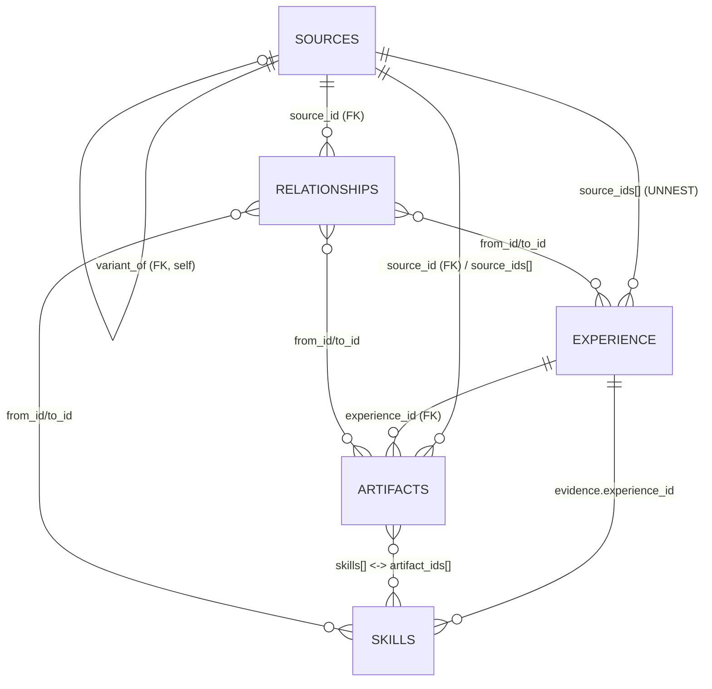

# Professional Knowledge Corpus — Schema v1

A reusable schema for indexing a professional knowledge corpus — career
timeline, skills, and portfolio artifacts — into DuckDB, optimized for AI
retrieval (RAG) and keyword matching. Follows the conventions of this
repo's domain corpus (DuckDB schemas, markdown bodies, a generic
relationship edge table).

> This file is the **generic design** only. No personal data, source
> material, or populated corpus is committed (see `.gitignore`).

## Design principle

A professional record and a debugging runbook share a deep shape:
*context → analysis → action → measurable result*. The corpus reuses that
structure — a portfolio artifact carries embedded `evidence` (the
measurable result), and skills link to the artifacts and roles that prove
them.

## Tables

| Schema | Table | Layer | Grain | Purpose |
|---|---|---|---|---|
| `corpus` | `sources` | Substrate | 1 / source file | Provenance, dedup, sensitivity gate |
| `corpus` | `experience` | Substrate | 1 / role | Career timeline spine |
| `portfolio` | `artifacts` | Proof | 1 / work product | Portfolio pieces (+ inline body) |
| `competency` | `skills` | Graph | 1 / skill node | Skill/competency graph |
| `meta` | `relationships` | Edge | 1 / edge | Generic cross-table graph |

`competency` is a **column value**, not a per-domain schema (deliberate
departure from the repo's `{{schema}}` template). Enum (extensible):
`integrated-communications`, `media-relations`, `social-media`,
`brand-strategy`, `thought-leadership`, `project-management`.

## DDL

```sql
CREATE SCHEMA IF NOT EXISTS corpus;
CREATE SCHEMA IF NOT EXISTS portfolio;
CREATE SCHEMA IF NOT EXISTS competency;
CREATE SCHEMA IF NOT EXISTS meta;

-- 1. corpus.sources — every source file (provenance / dedup / sensitivity)
CREATE TABLE IF NOT EXISTS corpus.sources (
  id           VARCHAR PRIMARY KEY,
  path         VARCHAR NOT NULL,
  file_type    VARCHAR CHECK (file_type IN ('doc','docx','pdf','txt','xlsx','htm')),
  archetype    VARCHAR CHECK (archetype IN ('cv','cover','jd','reference','sample','journalism','review','company-doc','topic')),
  employer     VARCHAR,
  content_hash VARCHAR,
  variant_of   VARCHAR REFERENCES corpus.sources(id),   -- self-ref: canonical of a near-duplicate
  sensitive    BOOLEAN DEFAULT FALSE,                    -- excluded from any export surface
  tier         VARCHAR CHECK (tier IN ('T0','T1','T2','T3')),
  ingested_at  TIMESTAMP,
  notes        VARCHAR
);

-- 2. corpus.experience — career timeline spine
CREATE TABLE IF NOT EXISTS corpus.experience (
  id              VARCHAR PRIMARY KEY,
  employer        VARCHAR NOT NULL,
  role_title      VARCHAR,
  start_date      DATE,
  end_date        DATE,                                  -- NULL = present
  employment_type VARCHAR CHECK (employment_type IN ('staff','consultant','founder','civic')),
  scope           VARCHAR,
  location        VARCHAR,
  summary         VARCHAR,
  competencies    VARCHAR[],                             -- enum values (UNNEST to filter)
  source_ids      VARCHAR[]                              -- -> corpus.sources.id (UNNEST join)
);

-- 3. portfolio.artifacts — the proof (body inline for RAG + FTS)
CREATE TABLE IF NOT EXISTS portfolio.artifacts (
  id            VARCHAR PRIMARY KEY,
  title         VARCHAR NOT NULL,
  artifact_type VARCHAR,
  competency    VARCHAR,                                 -- enum value
  experience_id VARCHAR REFERENCES corpus.experience(id),-- FK: role produced during
  employer      VARCHAR,
  client        VARCHAR,
  outlet        VARCHAR,
  role          VARCHAR,
  audience      VARCHAR,
  status        VARCHAR CHECK (status IN ('published','draft','unreleased','internal','sample')),
  published_at  DATE,
  url           VARCHAR,
  summary       VARCHAR,
  skills        VARCHAR[],                               -- -> competency.skills.id (UNNEST join)
  evidence      STRUCT(metric VARCHAR, value VARCHAR, context VARCHAR, confidence DOUBLE)[],
  content_md    VARCHAR,                                 -- full body inline (RAG + FTS)
  sensitive     BOOLEAN DEFAULT FALSE,
  source_id     VARCHAR REFERENCES corpus.sources(id),   -- FK: origin file
  source_ids    VARCHAR[]                                -- supporting files (UNNEST join)
);

-- 4. competency.skills — the skill/competency graph
CREATE TABLE IF NOT EXISTS competency.skills (
  id           VARCHAR PRIMARY KEY,
  competency   VARCHAR NOT NULL,                         -- enum value
  name         VARCHAR NOT NULL,
  kind         VARCHAR CHECK (kind IN ('skill','method','tool','outcome','role')),
  description  VARCHAR,
  evidence     STRUCT(employer VARCHAR, experience_id VARCHAR, what VARCHAR, result VARCHAR, artifact_id VARCHAR)[],
  aliases      VARCHAR[],                                -- keyword synonyms (matching surface)
  artifact_ids VARCHAR[]                                 -- -> portfolio.artifacts.id (UNNEST join)
);

-- 5. meta.relationships — generic edge table
CREATE TABLE IF NOT EXISTS meta.relationships (
  from_id   VARCHAR NOT NULL,
  to_id     VARCHAR NOT NULL,
  rel_type  VARCHAR NOT NULL CHECK (rel_type IN
              ('produced-during','demonstrated-at','proves-skill',
               'variant-of','references','resulted-in','mentored-by','same-employer')),
  source_id VARCHAR REFERENCES corpus.sources(id),
  PRIMARY KEY (from_id, to_id, rel_type)
);
```

## Canonical join map

| Relationship | From → To | Join key | Card. | Enforced |
|---|---|---|---|---|
| Artifact produced during role | artifacts → experience | `artifacts.experience_id = experience.id` | N:1 | FK |
| Artifact origin file | artifacts → sources | `artifacts.source_id = sources.id` | N:1 | FK |
| Artifact ⇄ skills | artifacts ⇄ skills | `UNNEST(artifacts.skills)=skills.id` ; `UNNEST(skills.artifact_ids)=artifacts.id` | M:N | UNNEST |
| Skill demonstrated in role | skills → experience | `UNNEST(skills.evidence).experience_id = experience.id` | M:N | UNNEST |
| Role substantiated by files | experience → sources | `UNNEST(experience.source_ids)=sources.id` | M:N | UNNEST |
| Variant canonicalization | sources → sources | `sources.variant_of = sources.id` | N:1 self | FK |
| Generic graph | any ⇄ any | `relationships.from_id/to_id = <table>.id` | M:N | edge row |

DuckDB enforces the scalar FKs; many-to-many links join via `UNNEST` or
through `meta.relationships`.

## Entity-relationship diagram



```
                       +---------------------------+
              variant_of|      corpus.sources       |  PK id
              (FK,self) +--+---------+---------+----+
                  ^--------+         |         |
                  |  source_ids[]    | source_id (FK)
                  |  (UNNEST)        | source_ids[]
        +---------+--------+         v
        | corpus.experience|   +-----------------------+
        |     PK id        |   |  portfolio.artifacts  | PK id
        +---+--------+-----+   +----------+------------+
            |        | experience_id (FK)  | skills[]
            |        +---------------------+    (M:N)  artifact_ids[] /
            | evidence.experience_id        |          evidence.artifact_id
            v                               v
        +-------------------------------------------+
        |            competency.skills              | PK id
        +-------------------------------------------+

  meta.relationships(from_id, to_id, rel_type, source_id -> sources.id)
       +---- generic M:N edges between ANY rows above ----+
```

## Retrieval surface (planned `meta.*` views)

- `meta.rag_index` — unified FTS over `artifacts.content_md` +
  `skills.description` + `experience.summary`.
- `meta.keyword_rank` — `skills.aliases` ranked by recency × evidence
  count × attached outcome.
- `meta.portfolio_by_competency` — portfolio grouped by discipline.
- `meta.skill_provenance` — skill → demonstrated-at → which artifact.

## Status

Schema locked v1. Populated corpus, ingest pipeline, and source material
are intentionally **not** in version control.
