# MetroGraph: A Regenerable, Self-Auditing Strategy Corpus

*A single synthesis of a nine-domain, 406-claim knowledge corpus — the market, the human-factors evidence, the product, the customer voice, the ecosystem, governance, the financial model, and the prescriptive strategy — together with the Strategy-OS engine and the mechanized honesty that produced them.*

*Generated 2026-06-29 from `_db/knowledge.duckdb`. The database is a gitignored, regenerable build artifact: `ingest init-db` + `ingest restore --label 2026Q2-complete` reconstructs every figure, table, and claim in this document.*

## Abstract

MetroGraph is a pre-revenue, metro-/schematic-style database-visualization tool whose product bet is "best-of-both AI + UI": a low-surface-area graph canvas with visible agent state that avoids the agent-vs-graph-chat confusion. This dissertation consolidates the 9-domain, 406-claim DuckDB strategy corpus and the Strategy-OS engine that produced it, and argues that the corpus's primary contribution is not the bet itself but the machinery that keeps the bet honest. The engine ingests sources, grades claims through a uniform gold layer, derives a typed 2,095-edge relationship graph, runs fixed-seed Monte-Carlo models, and re-grades every claim against cross-domain evidence — never letting an authored opinion masquerade as measured fact. Its sharpest output is the wedge re-evaluation: the 13 market claims underpinning MetroGraph's differentiation, each re-graded against HCI and Voice-of-Customer evidence to a derived ceiling of supported-by-proxy, weak-proxy, or contested, and each flagged pending-experimental because the MetroGraph behavioral-data tables are empty. The financial model is comps-and-assumption estimates with p10/p50/p90 spreads, not marks. The governance layer counts blocking compliance gaps; the competitive-intel layer dates rival moves that erode the wedge. The work closes with the exact pre-registered studies that would lift each proxy claim — roadmap items, never assumed done — and an honest accounting of what the corpus does and does not know.

**Verdict glyphs** (inline `[c#]` citations resolve in Appendix A): ✓ supported · ≈ equivalent · ◐ mixed · ~ disputed · ? speculative · ✗ refuted · ◑ supported-by-proxy · ○ weak-proxy · ⚠ contested.

[TOC]


---

## Part I — Thesis & Epistemic Stance

This dissertation argues for a product, and the first thing it owes the reader is a confession about what kind of argument it is allowed to make. MetroGraph is a bet. The corpus assembled around it — 406 claims drawn from 4,436 sources and wired together by 2,095 typed relationships across nine domains — does not exist to prove the bet correct. It exists to compute, and then display, exactly how strong the bet is currently entitled to be called, and to hold that ceiling against every temptation to round it up. The thesis is therefore double: MetroGraph's wedge is *defensible-in-hypothesis*, and it is *capped at supported-by-proxy*. These two statements are not in tension; they are the same honest finding stated from two sides.

### What MetroGraph is, and what the bet is

MetroGraph is a metro-map-style database-visualization tool: a node-and-edge graph canvas that renders a database the way a transit map renders a city, with schematic, legible lines instead of the organic tangle of a force-directed layout. It is built on Angular 17 with SignalDB, a reactive local-first store, and its longer vision is a data-defined UI in which every component becomes live-editable JSON — an interface you can reshape from inside itself.

The bet — the *wedge* — is a claim about a specific gap: that there is room for a tool genuinely best-of-both on AI and UI at once, with a surface area small enough to learn without training, that never makes the user wonder whether they are talking to the agent or to the graph. The failure mode it is designed against is concrete and documented in the market corpus as the "flight to chat": when a direct-manipulation UI confuses people, they retreat to the conversational interface and the visualization's advantage evaporates <sup>[c1]</sup>. MetroGraph's pitch is that visible agent state plus a schematic, manipulable canvas resolves that confusion rather than papering over it.

That is the bet. It is attractive, it is specific, and — this is the entire point of the corpus — it is, as of this writing, unproven on MetroGraph itself. The product is pre-revenue. It carries no behavioral telemetry. Not one of its users has been run through a controlled task. Everything that follows is an attempt to say as much as can honestly be said in that condition, and not one word more.

### The epistemic contract

The corpus enforces a single contract that every chapter inherits: **a claim is only as strong as its derived, cross-domain evidence grade, and the corpus's job is to compute and display that grade rather than to assert a conclusion.** Three commitments make the contract real rather than rhetorical.

First, *verdicts are reported exactly as the gold layer records them*, across the full spectrum from supported through refuted; the synthesis never upgrades a refuted or disputed claim into a supported one to make the story flow. Second, *evidence grades are derived, not authored* — the flag for whether a claim is primary-backed is computed from the evidence junction, so secondary evidence cannot be dressed up as primary, and a claim that is merely "supported-by-proxy" cannot quietly present itself as measured. Third, and most distinctively, *dissent is retained, not deleted*: a claim the evidence refutes is not removed but kept and reframed as a hypothesis awaiting a named experiment. The corpus would be smaller and more flattering if it threw its losers away. It keeps them on purpose, because a strategy that has hidden its own counter-evidence cannot be audited.

The verdict vocabulary the chapters speak in is therefore wide. Across the 406 claims, the gold layer distributes as follows.

| Verdict | Claims | Reading |
| --- | ---: | --- |
| supported | 236 | Evidence backs the claim (mostly by secondary proxy; only HCI and VoC carry any primary backing) |
| speculative | 74 | Inferred or quarantined; awaits verification |
| refuted | 38 | Evidence contradicts the claim — retained as a hypothesis |
| disputed | 37 | Evidence cuts both ways |
| TRUE / CONFIRMED | 13 | Governance facts about the shipped product's gaps |
| mixed | 5 | HCI findings that depend on the task |
| equivalent | 3 | Market comparisons that wash out |

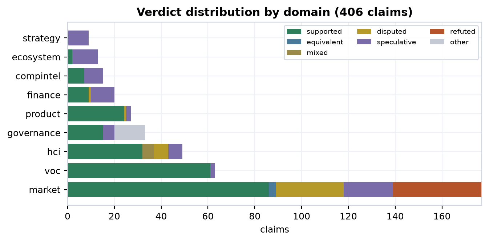

The figure above is not a scorecard of wins; read it as the shape of an honest argument. Seventy-five of the 406 claims are refuted or disputed and *still in the corpus*, each one a place where the evidence pushed back and was allowed to. A document that wanted only to sell would show a verdict distribution that was almost all green. This one does not, and that is the feature.

### The central honesty mechanism: the derived ceiling

The wedge is not one claim but thirteen, collected in the `strategy.wedge_reeval` layer. Each began life as a market claim with a verdict assigned by the market corpus on the strength of secondary literature. The synthesis layer then does something the market corpus could not: it re-grades each wedge claim against *cross-domain* evidence — what the HCI literature grounds or contradicts, what the Voice-of-Customer review-mining weakly grounds — and assigns a **derived cross-domain ceiling**, the cap on how strong the claim is allowed to be called. That ceiling takes one of three values: `supported-by-proxy`, `weak-proxy`, or `contested`.

The word *derived* is load-bearing. The ceiling is computed from the evidence edges, not chosen by the author, and it can sit *below* the market verdict. The keystone claim — that AI-UI parity is an exclusive, defensible position — is the cleanest illustration. The market corpus rated it **supported**, but on pure secondary evidence with no primary study behind it. Re-graded across domains, its only cross-domain attachment is a weak grounding from VoC review-mining, so its derived ceiling falls to **weak-proxy** <sup>[c2]</sup>. A reader who saw only the market verdict would walk away with "supported"; the honest, derived answer is "weak-proxy." That gap — between what a single domain will say in isolation and what the cross-domain algebra will certify — is the machine the whole dissertation is built to run.

Crucially, **no wedge claim's ceiling reaches "supported," and none reaches anything experimental.** The very best a wedge claim achieves is *supported-by-proxy*: the surrounding literature backs the underlying principle, but no study has tested that principle *on MetroGraph*. The thirteen claims fall out as follows.

| Wedge claim | Market verdict | Derived ceiling | Conf. |
| --- | --- | --- | ---: |
| ai-ui-parity-exclusive-wedge | supported | weak-proxy | 0.30 |
| flight-to-chat-when-ui-confuses-documented | supported | weak-proxy | 0.30 |
| schematic-maps-outperform-force-directed-db-exploration | refuted | weak-proxy | 0.30 |
| direct-manipulation-outperforms-conversation-graph-exploration | refuted | supported-by-proxy | 0.50 |
| force-directed-dominant-but-unoptimized-for-schematic | supported | supported-by-proxy | 0.50 |
| graph-visualization-clutter-at-scale | disputed | supported-by-proxy | 0.50 |
| information-foraging-predicts-metro-map-adoption | refuted | supported-by-proxy | 0.50 |
| progressive-disclosure-unlocks-schema-acquisition | refuted | supported-by-proxy | 0.50 |
| wayfinding-in-schematic-maps-transfers-from-transit | refuted | supported-by-proxy | 0.50 |
| agent-observability-through-visualization-improves-trust | disputed | contested | 0.35 |
| mixed-initiative-parity-prevents-transparency-backfire | disputed | contested | 0.35 |
| mixed-initiative-requires-visualization-to-prevent-opacity | refuted | contested | 0.35 |
| visual-affordances-enable-interaction-without-training | refuted | contested | 0.35 |

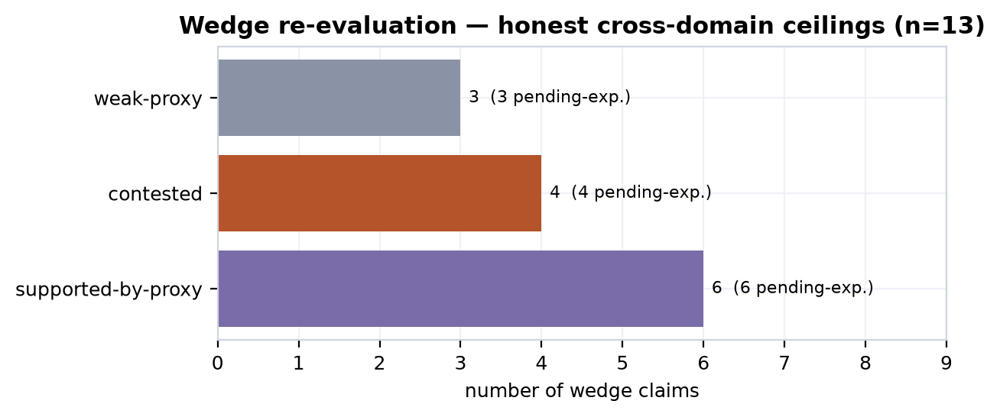

Three of these claims deserve naming now, because later chapters return to each. The claim that schematic maps outperform force-directed layouts for database exploration — intuitively the most central thing MetroGraph is betting on — carries a market verdict of **refuted** and a derived ceiling of only **weak-proxy**, grounded weakly by VoC and nothing more <sup>[c3]</sup>. The claim that direct manipulation beats conversation for graph exploration is also **refuted** at the market level, though cross-domain grounding from HCI lifts its ceiling to **supported-by-proxy** <sup>[c4]</sup>. And the claim that agent observability through visualization improves trust is **disputed**, landing at **contested**, because the HCI literature both grounds *and* contradicts it <sup>[c5]</sup>. These are not failures of the project; they are the corpus doing its job, refusing to let an appealing hypothesis cash itself as a result.

### Why every wedge claim is pending-experimental

One flag attaches to every single one of the thirteen wedge claims, regardless of verdict or ceiling: `pending_experimental = TRUE`. The reason is structural, and it is the honest center of the document. A grade can never climb above its derived ceiling because **the experiment that would lift it has not been run** — and we know it has not been run because the tables it would land in are empty. The MetroGraph behavioral-intake tables — `voc.interviews`, `voc.surveys`, `voc.usability_sessions`, `voc.ab_experiments` — hold zero rows, and `market.primary_studies` holds zero rows. That emptiness is not an oversight to apologize for; it *is the marker*. The corpus reads the absence of a study as the standing, mechanized statement "this has not been tested on MetroGraph," and stamps it onto every wedge claim automatically. The path upward is therefore not more argument but the specific, pre-registered experiments named against each claim — controlled A/Bs of schematic versus force-directed layout, preference-and-task tests of visual versus conversational agent control, usability studies of progressive disclosure — each with a target sample size and a destination table that is, today, empty.

The companion to the wedge is a set of nine derived strategy claims, each marked **speculative** and quarantined, that record where the competitive-intelligence layer sees a wedge feature being eroded: the canvas contested by 19 dated competitor moves <sup>[c6]</sup>, agent orchestration by 11 <sup>[c7]</sup>, the agent-typed nodes by 20 <sup>[c8]</sup>. These are inferences the engine *derived* and then deliberately refused to promote until verified — part of the same discipline: a machine-generated claim does not get to count as evidence simply because the machine generated it.

### The self-referential stance, and the road ahead

One last thing must be said plainly, because it shapes how the rest should be read. This is a strategy *about* MetroGraph, produced *by* an engine that MetroGraph's own owner built. The obvious failure mode of any founder's strategy document is that it launders the founder's optimism into the appearance of evidence. The engine is built to resist exactly that — its author. The derived-ceiling rule, the unauthored primary-backing flag, the retention of refuted claims, the empty-table marker that no amount of conviction can fill: each is a constraint the author imposed on the author. Whether it fully succeeds is itself a question the limitations chapter will hold to account. But the intent is on the record from the first page.

The chapters that follow are successive evidence passes over these same thirteen claims, each tightening the verdict and none permitted to inflate it. Part II explains *how* the grades are computed — the relationship algebra, the verification standards, the derivation of primary backing — satisfying the natural appetite this chapter is meant to leave. From there the wedge is weighed against market whitespace, against the HCI literature floor that both grounds and contradicts it, against the shipped reality of the product, against the customer voice that is mostly an absence, and against the competitive erosion eating at its features. The arc lands where the contract forces it to land: the ceiling is supported-by-proxy, the empty intake tables are the standing pending-experimental marker, and the only honest way up is the named roadmap of pre-registered studies — carried as forward work, never reported as done.

---

## Part II — Method: The Strategy-OS Engine

Part I promised that in this corpus a grade is *derived*, never asserted — that the line between what evidence supports by proxy and what only a not-yet-run experiment could prove would be mechanized rather than left to the author's discretion. This chapter describes the machine that keeps that promise. It is not a metaphor but a regenerable DuckDB database, a set of typed tables, a handful of idempotent pipeline commands, and a sequence of derivation steps that together compute every verdict and every figure the rest of the dissertation displays. A reader who finishes this chapter should be able to open any downstream chart — a market-whitespace bar, an HCI grounding edge, a wedge-ceiling glyph — and read it as the output of a function whose inputs and rules are inspectable, not as a conclusion the author wished to reach. The engine exists precisely to deny the author the ability to assert; it can only compute, grade, and surface.

### The corpus as a regenerable artifact

The substrate is a single DuckDB file, `_db/knowledge.duckdb`, populated by a Python ingest pipeline under `domains/_shared/ingest/`. The principle that governs everything else is that the database is a *build product*, not a source of truth. Truth lives in committed text — domain folders, extraction JSON, rule YAML, model YAML — and in committed parquet snapshots. Running `init-db` followed by `restore --label 2026Q2-complete` reconstructs the entire corpus from that committed state; the round-trip has been verified at 298 tables and roughly 15.6k rows. Nothing in the analysis depends on a database that exists on only one machine: delete the file and it rebuilds byte-for-byte from version control. This matters for honesty as much as for engineering, because a reviewer can regenerate the corpus and recompute every grade independently, so no verdict can quietly drift from its evidence between readings.

The architecture is domain-agnostic and auto-discovering. A "domain" is simply a folder under `domains/`, and dropping one in registers it everywhere — `init-db` creates its schema, regenerates the cross-domain `meta.*` views, and rebuilds the full-text-search index from the live domain list. Every domain inherits the same base schema (`sources`, `documents`, `concepts`, `commands`, `config_keys`, `failure_modes`, `relationships`, and crucially `claims`) and may declare extra tables of its own. The corpus spans nine analytical domains, whose table counts track how much structured machinery each required:

| Domain | Tables |
| --- | ---: |
| market | 36 |
| voc | 23 |
| strategy | 21 |
| finance | 20 |
| product | 20 |
| ecosystem | 19 |
| compintel | 19 |
| hci | 19 |
| governance | 19 |

Because `claims` is a *base* table present in every domain, the engine projects a single cross-domain view, `meta.all_claims`, that unions all 406 graded claims into one queryable gold layer. The synthesis domain, `strategy`, reads this union — and the relationship algebra below — strictly read-only; it never mutates another domain's verdicts. The conflation guard is enforced structurally, and the `market.claims` snapshot diff stays 0/0/0 across synthesis runs. The strategist may *read* the algebra and *re-grade against it* but cannot reach back to edit the evidence to suit a conclusion.

### The nine engine layers

On top of this substrate sit nine engine layers, each a set of `ingest` subcommands. All are backward-compatible and idempotent, so re-running them never corrupts state. The table names them in order; later sections deep-dive the layers that do the heavy lifting for the rest of the dissertation.

| Layer | Command(s) | What it computes |
| ---: | --- | --- |
| 1 | `evidence` | Builds the `claim_evidence` junction and `primary_studies`, then exposes the `v_claim_grade` view; `is_primary_backed` is computed here, never written by hand. |
| 2 | `snapshot` / `restore` / `diff` | Writes every data table to committed parquet, reloads it FK-safely, and tracks SCD-2 change between labels. |
| 3 | `model` / `sensitivity` / `forecast` | Runs fixed-seed NumPy Monte-Carlo from `_shared/models/*.yaml` into `model_runs`, with a Spearman tornado and forecast registration. |
| 4 | `embed` / `search` / `gaps` | Local fastembed vectors, an HNSW index, and BM25+vector hybrid retrieval with RRF fusion for dedup and gap-finding. |
| 5 | `reason` | Applies inference rules from `_shared/rules/*.yaml` to derive new relationship edges and new *speculative* claims carrying `derivations` provenance. |
| 6 | `verify` / `calibrate` | Assigns each claim a `verification_standard`, a Wilson confidence interval, and a freshness decay; scores predictive claims by Brier loss against the forecast log. |
| 7 | `render` | Projects `render_blocks ⋈ artifact_blocks` into a non-divergent family of Markdown artifacts. |
| 8 | `watch` | Scans the temporal layer for post-cutoff competitor moves that erode a wedge feature, raising alerts without mutating the synthesis. |
| 9 | `decide` | Solves an exact 0/1 knapsack over recommendations within an effort budget, producing a committed action set rather than a ranking. |

Every figure in this dissertation is a query against the outputs of these layers. No slide exists outside the machine.

### The typed relationship graph as algebra

The single most important structure for reading the rest of the work is the relationship graph. Across the corpus the engine holds 2,095 typed edges spanning 21 relationship types, and this graph is exactly the algebra the synthesis layer reads when it re-grades a claim.

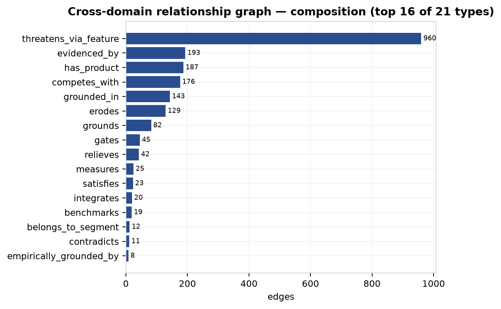

The edge *types* carry the argument's logical connectives. A `grounds` edge from the HCI literature attaches empirical support to a market or wedge claim; a `contradicts` edge attaches refutation; an `erodes` edge from competitive intelligence records a dated competitor move against a feature MetroGraph claims as differentiation; a `gates` edge from governance marks a compliance blocker between the product and a segment; a `measures` edge from product ties a claim to a shipped capability. Because the relationships are typed and directional, the synthesis does more than count citations — it can ask whether a claim is grounded but also eroded, supported by literature but gated by compliance, and let those forces net out into a verdict. This is what it means to say a claim is only as strong as its derived, cross-domain evidence grade: the grade is literally a function over the edges incident to the claim.

### Evidence grading: is_primary_backed is derived, never authored

The keystone of mechanized honesty is the rule that a claim cannot declare its own evidentiary tier. The `v_claim_grade` view computes `is_primary_backed` from the `claim_evidence` junction: a claim reads as primary-backed only when it connects to an actual primary study. Secondary evidence cannot masquerade as primary, and a claim that is well-supported but lacks any primary link reads honestly as *supported-by-proxy* — the wedge honesty cap. The author can pile up secondary citations and the grade will not rise above proxy, because the function that sets the tier does not read the author's confidence; it reads the evidence table.

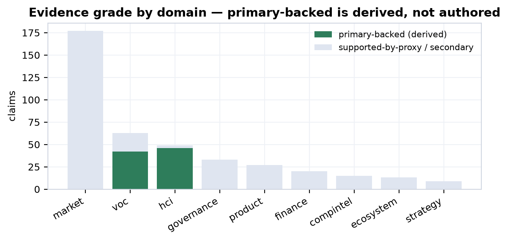

The result is stark, and the engine surfaces the starkness rather than hiding it. Only two domains carry any primary backing at all: HCI, where 46 of 49 claims are primary-backed by 21 catalogued primary studies, and VoC, where 42 of 63 claims rest on review-mining. Everywhere else — market, product, finance, ecosystem, compintel, governance, and strategy — the primary-studies count is effectively zero and claims are secondary by construction. The evidence-class tallies make the same point from the raw side: HCI contributes 85 primary and 74 secondary evidence rows and VoC 42 primary, while market contributes 240 secondary rows and zero primary, and product just 17 secondary. The corpus-wide near-emptiness of `primary_studies` is not a defect to paper over; it is the finding. And the VoC "primary" tier carries its own caveat the engine respects: review-mining establishes that a *user said* something, not that MetroGraph measurably fixes it. The standing pending-experimental marker is the set of empty intake tables — `voc.interviews`, `voc.surveys`, `voc.usability_sessions`, `voc.ab_experiments`, and `market.primary_studies` all sit at zero rows. Those zeros are visible, queryable, and load-bearing: they are what cap the wedge.

### Confidence, freshness, and the forecast loop

Layer 6 attaches three quantitative disciplines to each claim. A Wilson confidence interval converts the supporting-evidence ratio into `confidence_low`/`confidence_high` bounds, so a claim backed by two sources and one backed by twenty do not read as equally certain. A freshness decay marks claims `stale` as their evidence ages, so the corpus cannot quietly coast on dated sources. And each claim is tagged with a `verification_standard` — *descriptive* (what is), *evaluative* (how good), or *predictive* (what will happen) — because the bar for "supported" differs by kind.

Predictive and speculative claims feed the forecast loop. The engine registers each as a datable `forecast_log` row, deriving a predicted probability from confidence and a `resolves_by` horizon. Sixty-five forecasts are currently logged and — honestly — zero are resolved, so the mean Brier score is null. The corpus is not yet calibrated because the future it predicts has not yet arrived; outcomes will be filled in by `resolve`, never auto-assumed. This is the same emptiness as the intake tables in a different register: the apparatus to score predictions exists and is wired up, but it has nothing to score yet, and it says so.

### Reasoning: quarantined, speculative derivations

The reasoning layer is where the engine generates new claims, and also where the honesty discipline is most easily mistaken. Rules in `_shared/rules/*.yaml` derive edges (`transitive`, `sql_edge`) and claims (`sql_claim`) from existing structure, attaching a `derivations` provenance record to each. The `derive-contested-wedge` rule, for instance, reads the compintel erosion edges and emits a contested-wedge claim for each wedge feature under sustained competitive attack. It produced nine such claims, each with a `confidence_out` between 0.40 and 0.50 — exactly the band of an inference, not a finding.

Two are featured here. The rule infers that the canvas wedge is contested because nineteen dated competitor moves erode it <sup>[c6]</sup>, and that agent orchestration is contested because eleven dated moves erode it <sup>[c7]</sup>. Both carry the verdict *speculative*. They are not findings but quarantined hypotheses the engine generated and then refused to promote. A derived claim stays speculative until Layer 6 verification independently promotes it on its own evidence — derivation buys a claim a place in the queue, not a grade. The reader should treat every `claim.derived.*` id throughout this dissertation the same way: as the machine reasoning aloud under quarantine, never as a result.

### Models are estimates, not measurements

Layer 3 runs Monte-Carlo simulations with a fixed seed of 42 over 10,000 draws, so any reader can rerun and reproduce the distribution exactly. Two runs anchor the financial and market chapters:

| Model | Output | p10 | p50 | p90 |
| --- | --- | ---: | ---: | ---: |
| `finance-ltv-cac` | LTV:CAC ratio | 2.56× | 8.47× | 28.2× |
| `market-som` | SOM (USD) | $37.6M | $93.6M | $226.3M |

The width of these intervals is the point. MetroGraph is pre-revenue with no behavioral telemetry, so every model input is a comparable or an assumption carrying its own uncertainty, and the Monte-Carlo propagates that uncertainty into honestly wide outputs. The LTV:CAC median clears the 3× SaaS-health line but the p10 tail does not — and the engine prints both. These are option-value bounds, not marks or guarantees, and the named experiments that would replace assumptions with measurements are roadmap items, not inputs that will inevitably arrive.

### Render and the self-auditing glyph

The final discipline is presentational. The render layer projects shared metrics into a non-divergent family of artifacts, so a figure that appears in both the investor deck and the strategy memo is byte-identical — there is no opportunity to quietly soften a number for one audience. More important, every rendered figure carries a verdict glyph encoding its evidence tier: a proxy-only wedge cannot render as measured, and a modeled estimate cannot render as observed. The glyph is computed from `v_claim_grade`, not chosen by the author. This is why the same thirteen wedge claims can be carried through ten downstream chapters and tightened against market, literature, product, voice, and competition without ever inflating: at each pass the grade is recomputed by the machine, and the machine is built so that *supported-by-proxy* is the ceiling until an empty intake table fills. The rest of the dissertation is the reading of that machine's output.

---

## Part III — The Market

The market is the largest single body of evidence in the corpus — 177 home claims spanning sizing, segmentation, competition, features, pricing, and capital flow — and it is also the body with the weakest provenance. Every one of those 177 claims carries `is_primary_backed = FALSE`. No MetroGraph behavioral telemetry sits behind any market figure: the segment sizes are analyst aggregates, the SOM is a Monte-Carlo draw over committed assumptions, the feature-pain scores are design-documentation estimates, and the competitive matrix is desk research over public signals. The market layer is therefore best read not as a measurement of an opportunity but as the *shape* of a bet — where the whitespace plausibly is, how large the envelope could be, and where capital is massing. It hands all of that to the later chapters as input to be grounded or contradicted, never as a verdict. This chapter applies the grading apparatus of Part II to that input and reports the result exactly, including the 38 refuted and 29 disputed verdicts the market corpus itself produces.

### The modeled envelope: TAM, SAM, and a SOM that is not revenue

The corpus indexes thirty distinct total-addressable-market figures, all analyst-sourced, ranging across the database-analytics, low-code, and graph-database categories and projecting out to 2035. The near-term anchors are an $81.9B database-analytics market in 2026 and a $44.5B low-code market in the same year, with a $5.6B graph-database slice; netting overlap, the corpus settles on a roughly $100B supported envelope as its modeling input, with the longest-dated analyst projections reaching $394.1B by 2034 <sup>[c9]</sup>. Stacking the three category markets and applying a 0.5% penetration target yields the headline the business-model canvas uses: a $500M ARR opportunity within seven to ten years <sup>[c9]</sup>.

That headline is a strategic assumption, not a forecast, and the corpus grades it as one: `supported` at `analyst-report` grade with confidence 0.67. The attached skeptic notes are explicit that the arithmetic holds only if MetroGraph captures share across all three categories simultaneously — the graph-database segment alone is far too small to carry it — and that no comparable-company trajectory in the corpus validates the 0.5% figure <sup>[c9]</sup>. To avoid pretending the point estimate is firmer than it is, the corpus does not report a single SOM number. It runs a fixed-seed (seed 42, 10,000-draw) Monte-Carlo over three committed assumption distributions — a triangular TAM centered on $100B, a normal SAM share with a p50 of 18% reachable by a graph-centric specialized tool, and a lognormal obtained-penetration share with a p50 of 0.5% — and reports the full output distribution.

| SOM percentile | Modeled value | Reading |
| --- | --- | --- |
| p10 | $37.6M | conservative obtained share |
| p50 | $93.6M | median modeled outcome |
| p90 | $226.3M | optimistic obtained share |
| mean | $119.0M | right-skewed; σ ≈ $94.8M |

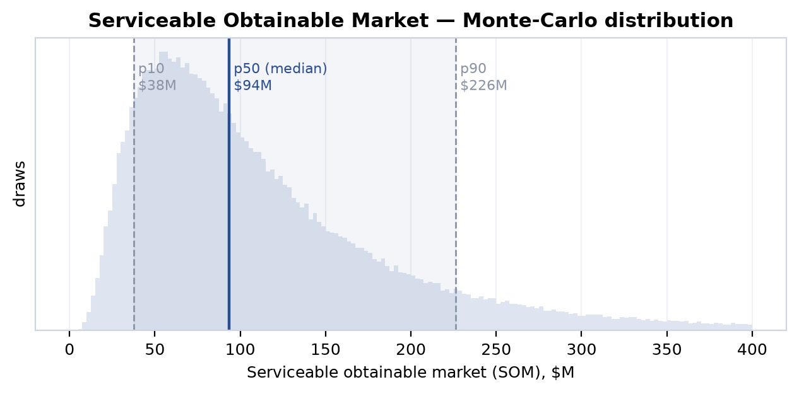

The spread is the point. A p10-to-p90 range from $37.6M to $226.3M — a sixfold span — is the honest signature of a pre-revenue estimate built from analyst comps and assumption distributions rather than from bookings. None of these figures is bookable revenue or a guarantee; they bound an option value under stated uncertainty, and the dominant driver of that uncertainty — as Part IX's sensitivity analysis confirms — is the obtained-penetration share, the very assumption with the thinnest empirical support. The SOM is the first illustration of the chapter's discipline: where the underlying data is secondary and modeled, the output is reported as a distribution with its uncertainty visible, not as a number with a decimal point implying precision it does not have.

### Beachhead segments and the pain hierarchy

The corpus decomposes the envelope into twelve role-, use-case-, and company-size segments, each tagged with willingness-to-pay, fit, and a beachhead/expansion priority. The largest addressable segment by both headcount and economic scale is Data Engineers: 1.1 million professionals globally, a $105.4B market in 2026, growing at 15.12% CAGR, with high willingness-to-pay and high fit <sup>[c10]</sup>. This is the wedge's primary beachhead, joined by the smaller, faster-growing Analytics Engineers segment ($18B, 22% CAGR) and a set of high-fit niches.

| Segment | Type | Size (USD) | CAGR | WTP | Fit | Priority |
| --- | --- | --- | --- | --- | --- | --- |
| Data Engineers | role | $105.4B | 15.1% | high | high | beachhead |
| Analytics Engineers | role | $18.0B | 22.0% | high | high | beachhead |
| CDOs & Data Leadership | role | $8.5B | 25.0% | high | high | beachhead |
| Graph & Knowledge Graph Users | use-case | $5.6B | 31.9% | high | high | beachhead |
| NoSQL/SQL Startups | company-size | $3.0B | 35.0% | medium | high | beachhead |
| Enterprise Data Teams | company-size | $63.9B | 43.3% | high | high | expansion |
| Low-Code / No-Code Teams | use-case | $45.4B | 20.0% | medium | medium | expansion |
| Data Science & ML Teams | role | $220.9B | 20.4% | high | medium | expansion |
| Real-Time Analytics & Streaming | use-case | $14.0B | 12.0% | high | medium | expansion |
| Business Analysts / BI Users | role | $10.2B | 9.1% | high | medium | expansion |
| Data Governance & Quality Teams | use-case | $3.4B | 21.9% | high | high | expansion |
| Data Mesh / Distributed Data | use-case | $1.95B | 17.6% | high | high | expansion |

The beachhead logic is deliberately narrow: the corpus prefers high-fit segments with concrete schema-complexity and data-quality pain over the headline-largest ones. The $220.9B Data Science & ML segment is the biggest number in the table, but it rates only medium-fit and sits in expansion; the bet is placed instead on Data Engineers and Analytics Engineers, whose daily work — navigating complex schemas and DAGs — is the pain the wedge claims to address. That the underlying pain claim is graded honestly is itself instructive. The assertion that analytics and data engineers suffer information overload on schema navigation, and that MetroGraph's metro-map layout reduces the working-memory burden, is rated only `disputed`, at `peer-reviewed` grade: the literature supports the existence of the load, but the corpus will not grant that this specific layout relieves it absent a study <sup>[c11]</sup>. The fastest-growing beachhead, Graph & Knowledge Graph Users (31.9% CAGR), is likewise only `disputed` despite its attractive growth, because the segment's emergent status makes its sizing soft <sup>[c12]</sup>.

### The feature-pain taxonomy and the agentic whitespace

The corpus catalogs 110 product features, each scored for customer pain (0–1), Kano class, HCI relevance, and table-stakes status. The high-pain band (≥0.8) is dominated by canvas and visualization capabilities — the exact territory the wedge targets — but the structure of that band carries the chapter's most important market finding, and it rewards a careful reading rather than a single headline.

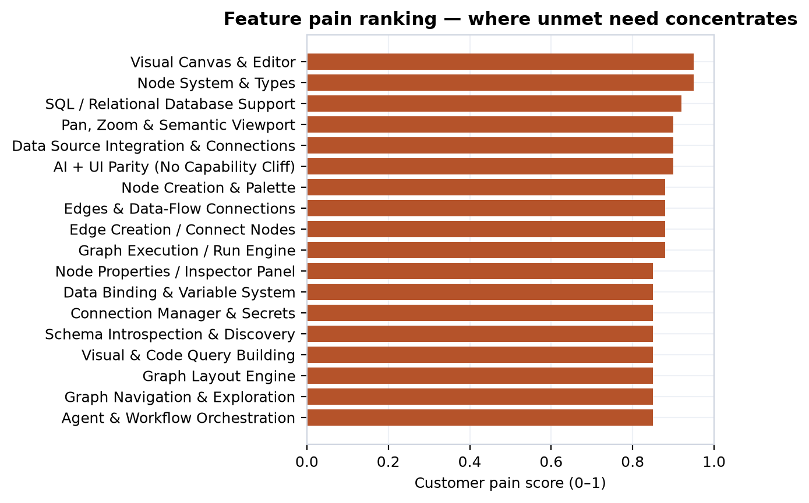

| Feature | Category | Pain | Kano | Table stakes? |
| --- | --- | --- | --- | --- |
| Visual Canvas & Editor | canvas | 0.95 | basic | yes |
| Node System & Types | nodes | 0.95 | basic | yes |
| SQL / Relational DB Support | data-source | 0.92 | basic | yes |
| Pan, Zoom & Semantic Viewport | canvas | 0.90 | basic | yes |
| AI + UI Parity (No Capability Cliff) | ai-assist | 0.90 | delighter | no |
| Graph Execution / Run Engine | agent-orchestration | 0.88 | basic | yes |
| LLM Agent Node | nodes | 0.85 | basic | no |
| Agent & Workflow Orchestration | agent-orchestration | 0.85 | performance | no |
| Agentic Loop Visualization | agent-orchestration | 0.85 | basic | no |
| Execution Logs & Step Debugging | observability | 0.85 | performance | no |
| Metro-Map / Schematic Orthogonal Layout | graph-layout | 0.82 | delighter | no |
| Recursive Inspect & JSON Drill-Down | data-binding | 0.82 | delighter | no |

The top of the table is table-stakes: a visual canvas, a node system, SQL support, and pan/zoom are basic Kano features at 0.90–0.95 pain that every credible competitor must have. The wedge is not there. It lives in two cells lower down. The first is **AI + UI parity** (0.90 pain, delighter): the claim that MetroGraph is the only graph-building tool offering full parity between what the AI can do and what the UI can do, closing the "flight-to-chat" failure mode where users abandon structured graph interfaces for chat proxies <sup>[c2]</sup>. The second is **Agentic Loop Visualization** (0.85 pain): an unserved whitespace cell with, per the corpus, zero competitive products implementing transparent agent-execution visibility <sup>[c13]</sup>.

Both are graded `supported` — but at `vendor-claim` grade with confidence 0.67, and the nuance fields are unsparing about what that means. The AI+UI-parity exclusivity rests on MetroGraph being the *only product explicitly tagged* with the feature; n8n earns comparable A-grades on adjacent high-pain features, so the "exclusive" reading may reflect tagging incompleteness rather than genuine competitive separation, and validating the parity claim requires end-user testing <sup>[c2]</sup>. The agentic-loop-visibility whitespace is real in the sense that no competitor in the database carries the tag, but its 0.85 pain score is derived from feature-design documentation, not from user interviews, feature-request data, or any demand signal — it is an opportunity hypothesis requiring end-user testing to confirm criticality <sup>[c13]</sup>. The whitespace is genuine; the *demand* for filling it is asserted, not measured. This is precisely the canvas/agent whitespace the chapter hands forward to Part IV: a high-pain, low-coverage region whose existence the market evidences but whose value only an HCI study or a customer can confirm.

### The competitive set: 213 companies, 327 rounds, and where capital concentrates

The corpus indexes 213 companies across twelve categories and 327 financing rounds, and the capital map matters because it locates the threat: the converging features — canvas plus agent orchestration — are exactly where the best-funded incumbents can outspend a pre-revenue entrant.

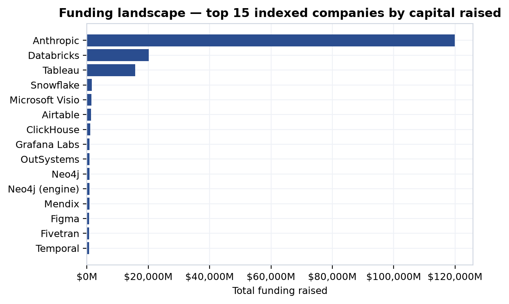

| Category | Companies | Total funding |
| --- | --- | --- |
| data-orchestration | 34 | $26.8B |
| foundation-model / AI layer | 30 | $120.5B |
| internal-tools / low-code | 25 | $4.0B |
| rag-agent-builders | 20 | $0.45B |
| diagramming | 18 | $3.1B |
| data-bi-notebook | 18 | $17.2B |
| graph-db-visualization | 16 | $0.84B |
| node-graph-libraries | 14 | — |
| db-schema-modeling | 13 | $0.08B |
| graph-databases | 12 | $1.07B |
| workflow-automation | 12 | $0.81B |
| db-viz | 1 | — |

The concentration is stark. The AI-layer category — driven almost entirely by Anthropic, whose indexed funding of ~$119.9B and recent $65B Series H (May 2026) and $30B Series G (Feb 2026) dwarf everything else — and the data-orchestration category (Databricks at $20.2B, Snowflake, Fivetran, dbt Labs) hold the overwhelming majority of capital. The categories nearest MetroGraph's actual product — graph-db-visualization ($0.84B), db-schema-modeling ($0.08B), and db-viz (a single indexed company) — are the most lightly capitalized in the set. The reading is double-edged: the immediate product neighborhood is under-funded whitespace, but the adjacent, far-better-capitalized orchestration and AI incumbents are converging on the same canvas/agent surface from above. Capital concentration is not a moat for MetroGraph; it measures how hard the well-funded neighbors could push on the converging features if they choose to. Part X's competitive-erosion timeline tracks exactly that drumbeat.

The corpus also encodes twenty head-to-head competitor analyses, every one rated `high` threat and `direct`. The recurring "we-win-on" pattern is database-first, schema-aware visualization and orchestration clarity; the recurring "they-win-on" pattern is ecosystem breadth, open-source mindshare, polish, and price. Activepieces wins on 700+ integrations, a 4.8/5 G2 rating, and a $25/mo entry; Airbyte and dbt Labs win on open-source democratization and ecosystem dominance (4,000+ packages for dbt); Airtable wins on a 500K-plus user base and brand. Against ERD-focused tools (ChartDB, DrawSQL, Azimutt), MetroGraph's claimed edge is orchestration and agent-state rendering rather than static schema design — a different user task. The honest summary is that MetroGraph's differentiation is consistently *narrative* (schema-native clarity, agent visibility) while competitors' advantages are consistently *shipped* (integrations, communities, ratings, install base).

### Competitor UX teardown

Beneath the company-and-capital view sits a finer competitor analysis the corpus rarely surfaces in prose: a structured UX teardown of competitor interfaces graded on Human-Computer-Interaction cost. It comprises 99 catalogued UX patterns, 85 annotated screens, and 50 reconstructed task flows, each assigned an A–D (occasionally F) HCI-cost tier — the same surface-area logic the feature taxonomy uses, turned on competitors' shipped UIs. Two of its signals survive grading. The screen corpus supports the finding that 23.5% of observed graph/workflow screens require four or more simultaneous panes — canvas, inspector, layout controls, property panel — to reach core functionality, with Miro, Gephi, and Lucidchart running at five-to-six panes <sup>[c14]</sup>; the flow corpus supports a click-depth signal, that advanced low-code workflows take 31–52 clicks to complete, with one n8n nested-flow-plus-error-handling scenario costing 52 clicks across 15 steps <sup>[c15]</sup>. A companion estimate that 32% of the 50 analyzed flows (16 of 50) carry "high" dropout risk is graded only `speculative`, because the corpus cannot tie the rating to any measured abandonment <sup>[c16]</sup>. (The headline three-plus-pane statistic is itself revisited as refuted in the next section, on its own re-count.)

The teardown's weakness is the one that recurs across the whole market layer: HCI cost is assigned by reviewers, not measured against users, so several of its sharper claims are `refuted` and must be read as hypotheses about competitor weakness rather than established findings. The assertion that MetroGraph achieves A-grade quality at A-grade HCI cost across the eight highest-pain features — matching or beating n8n, Make, and Zapier at equivalent surface-area burden — is **refuted** at vendor-claim grade, precisely because the HCI-cost grades were never validated in a user study <sup>[c17]</sup>. Three competitor-friction patterns fall the same way: that layout-algorithm access is scattered across right-click menus, panels, toolbars, and dialogs in a discoverability failure is **refuted** for lack of corpus evidence <sup>[c18]</sup>; the "low-code paradox" — that configuration UX simply becomes a new code language as visible code shrinks — is **refuted** <sup>[c19]</sup>; and the claim that real-time collaboration breaks down into async-feedback friction is **refuted** outright, since the corpus's own sources document Hex, Figma, Miro, and Retool shipping exactly the real-time collaboration the claim said they lacked <sup>[c20]</sup>. The teardown sub-corpus is real and its pane-count and click-depth measurements are usable; its qualitative HCI-cost verdicts are hypotheses about competitor pain that only an instrumented usability study — not a reviewer's tier — could confirm.

### Pricing and business-model patterns

The pricing sample (25 indexed tiers) shows a market anchored at free and climbing in tight per-seat increments. A large fraction of indexed tiers are $0 — community editions and cloud free tiers from Microsoft, Metabase, Appsmith, Zapier, Budibase, Neo4j, Airtable, and Google — and paid entry tiers cluster between $5 and $20 per user per month (Budibase Cloud Pro $5, Retool Cloud Standard $10, Microsoft Pro $14, Metabase Cloud Pro $20). The business-model canvas reads this as a freemium-to-enterprise motion: a generous free tier for analysts and citizen developers, self-service expansion, and a sales-assisted enterprise tier for governance, agent execution, and cost tracking. The revenue-model narrative proposes a hybrid creator-plus-user structure ($50/creator + $5/user, referenced from Budibase) and cites the Gartner expectation that 70% of B2B buyers will prefer usage-based over per-seat pricing by 2026 — a relevant pattern because agent/task billing introduces cost cliffs that pure per-seat pricing hides.

Both specific pricing claims are graded down. The Budibase-parity hybrid model is `disputed` at `vendor-claim` grade — a plausible reference, not a validated price point <sup>[c21]</sup> — and using Retool's $82M ARR as a per-seat pricing floor is likewise `disputed`, since proposing 1.5× Retool's seat pricing assumes a value-per-seat MetroGraph has not demonstrated <sup>[c22]</sup>. The freemium beachhead motion itself — the assumption of a 60% trial-to-paid conversion among data-engineer segments — is outright `refuted` at `analyst-report` grade, because the 60% figure conflates trial-start rate with conversion <sup>[c23]</sup>. The business model is coherent as a hypothesis; the corpus refuses to let any of its specific numbers read as established.

### Go-to-market & channel hypotheses

The motion beyond freemium is a layer of partnership, co-sell, and distribution bets — a 28-row partners table feeding the claims the corpus tags as go-to-market — and the verdict distribution across them is the chapter's bluntest reminder that channel strategy here is hypothesis, not traction. Of the fourteen go-to-market claims, six are `disputed`, three `refuted`, two `speculative`, and only three reach `supported` — and all three of those top out at confidence 0.67. There is no executed partnership, no signed co-sell agreement, and no channel revenue behind any of them; they are desk-research mappings of where a distribution motion *could* plausibly attach, graded against analyst and vendor signals rather than against a pipeline.

The most-supported channel hypotheses are the conventional ones. A Neo4j partnership — co-selling MetroGraph as the preferred visualization layer for GraphRAG and semantic-search workflows across Neo4j's 15-plus-tool visualization ecosystem — is `supported` at `analyst-report` grade, though the nuance flags the co-sell arrangement as an assumed model with no signed agreement <sup>[c24]</sup>. An enterprise direct-sales channel through Gartner peer communities, sized to the 120–180-day procurement cycles typical of $50K-plus data-infrastructure deals, is likewise `supported`, again at 0.67 <sup>[c25]</sup>. The headline co-GTM wedge — cloud-data-platform partnerships (Databricks, Snowflake, BigQuery, Redshift) as the primary route into the $63.9B Enterprise Data Teams segment via joint marketplace positioning — is only `disputed`: the partner *category* is real, but the specific co-GTM motion is unverified and the Databricks-Snowflake pairing is implied by the data-platform-war narrative rather than evidenced <sup>[c26]</sup>.

The remaining channel bets read as a catalog of plausible-but-ungrounded ecosystem plays. A Figma plugin for design-system visualization <sup>[c27]</sup>, a Google Drive integration positioning MetroGraph as a workspace-embedded semantic layer <sup>[c28]</sup>, GitHub open-core distribution to drive peer discovery in low-code communities <sup>[c29]</sup>, an ArangoDB partnership to expand the ICP beyond single-mode graph databases <sup>[c30]</sup>, and vertical-SaaS white-label embedding (Toast, Veeva, ServiceTitan) to reach an $8–15B embedded market <sup>[c31]</sup> are all `disputed` — directionally sensible, occasionally analyst-anchored, but unconfirmed. Two are outright `refuted`: the n8n partnership premised on a specific "60% cost advantage versus Zapier" that no source actually substantiates <sup>[c32]</sup>, and the system-integrator motion (Accenture, Deloitte) projected to yield 15–25% of ARR in implementation-services revenue, which the corpus rejects against MetroGraph's actual integration complexity and adoption stage <sup>[c33]</sup>. The honest summary is that the go-to-market layer beyond freemium is almost entirely a set of distribution *hypotheses*: the partnership and channel bets are graded disputed or refuted far more often than supported, and never above proxy-grade confidence.

### The refuted and disputed wedge claims — exactly as graded

The market verdict distribution is the chapter's honesty test, and the corpus passes it by retaining dissent rather than deleting it: of 177 claims, 86 are `supported`, 38 `refuted`, 29 `disputed`, 21 `speculative`, and 3 `equivalent`. The refuted and disputed verdicts are not noise to be smoothed over. Several strike directly at the wedge's most attractive stories, and they must be reported as-is.

The strongest version of the metro-map thesis — that schematic, transit-style layouts *outperform* force-directed layouts for database-schema exploration — is **refuted** at `analyst-report` grade <sup>[c3]</sup>. The companion cognitive claims fall with it: that users *transfer wayfinding knowledge* from public transit to navigating schemas-as-metro-maps is **refuted** at `expert` grade <sup>[c34]</sup>; that the metaphor provides higher information scent is **refuted** <sup>[c35]</sup>; that Information Foraging Theory predicts users will *prefer* metro maps is **refuted** <sup>[c36]</sup>; and that visible affordances let users interact correctly *without training* is **refuted** at `peer-reviewed` grade <sup>[c37]</sup>. Even the softer brand-differentiation framing of the same layout — that the metro-map feature reduces cognitive load versus force-directed graphs in large schemas — is only **disputed**, at `peer-reviewed` grade <sup>[c38]</sup>. The related claim that direct manipulation outperforms conversational chat for graph exploration is also **refuted** at `peer-reviewed` grade <sup>[c4]</sup>.

These are not failures of the wedge; they are the corpus correctly declining to assert layout superiority on secondary evidence. None of them is disproven — they are hypotheses that the market layer, being pure-secondary, cannot establish. Each one names the experiment that could raise its ceiling: a controlled path-finding/subgraph task comparing schematic against force-directed layouts on real schemas; a wayfinding-transfer study with transit-literate and transit-naive cohorts; a first-use affordance study measuring task success without instruction. Part IV inherits exactly these claims and weighs them against the HCI literature floor, where the same questions recur — there, the verdict on schematic-versus-force-directed is `mixed`, and force-directed in fact wins on certain path-finding and subgraph tasks, which is why the market's `refuted` is the honest input rather than an embarrassment to be hidden.

Even the headline pane-count statistic is refuted on its own data. The claim that 40% of analyzed visualization screens have three-plus panes is **refuted** at `review-mining` grade, because re-counting found ~56% exceed the threshold — and, more importantly, because pane density does not correlate with measured task-failure rates in the corpus, so the split-attention cognitive penalty remains theoretically predicted rather than empirically demonstrated <sup>[c39]</sup>. The market can count panes; it cannot show they cause failure.

### The standing pending-experimental marker, and what the market hands forward

Underwriting every verdict in this chapter is one structural fact: `market.primary_studies = 0`. There is not a single primary study behind any market claim. The most favorable verdict a market claim can earn is therefore supported-by-proxy — a secondary, analyst, or modeled basis dressed in the corpus's honest grading — and the emptiness of the primary-studies table is itself the standing marker that the experimental work has not been done. This is the same emptiness that recurs in the voice-of-customer intake (zero interviews, surveys, usability sessions, or A/B experiments); the two empty tables together are the corpus's mechanized pending-experimental flag, and they are why the wedge's cross-domain ceiling is capped exactly where the later re-grade puts it.

The chapter's deliverable to the rest of the dissertation is thus precise. It establishes a real, lightly-served whitespace — canvas/visualization capabilities at ≥0.8 pain and an agentic-loop-visibility cell with zero competitive coverage — and a defensible beachhead in the 1.1M-strong, $105.4B Data Engineers segment <sup>[c10]</sup> <sup>[c13]</sup>. It quantifies the bet as a modeled distribution (p50 $93.6M SOM, p10–p90 spanning $37.6M–$226.3M) rather than a number, and it locates the competitive threat in the well-capitalized orchestration and AI incumbents converging from above. And it hands forward the wedge's most appealing but unproven claims — layout superiority, wayfinding transfer, affordances-without-training, AI+UI-parity exclusivity — flagged exactly as the data flags them: refuted, disputed, or supported-only-by-proxy, every one a hypothesis pending a named experiment. The market is the input to the cross-domain re-grade, not the last word. Part IV now takes the canvas/agent whitespace and the unproven layout-and-affordance claims and tests them against the one domain that does carry primary backing — the HCI literature floor — to see how far, and in which direction, the empirical evidence actually moves them.

---

## Part IV — HCI Evidence: The Empirical Floor

Part III handed forward a set of market wedge hypotheses — that metro-style schematization eases comprehension, that high information scent keeps users on the canvas instead of fleeing to chat, that visible agent state calibrates trust — and showed that within the market domain those hypotheses carry no primary backing of their own. They are whitespace bets, graded against feature-pain and competitor data, never against a study. This chapter asks the question the market layer could not answer for itself: does the published human-computer-interaction literature *support* those bets, *contradict* them, or split? The answer matters disproportionately, because HCI is the only synthesis domain in the corpus — alongside the review-mining of Voice-of-Customer — that carries any derived primary backing at all. It is, in the literal sense the corpus computes, the empirical floor under the wedge. That floor is real. It is also context-dependent, partly hostile to the wedge, and — crucially — silent about MetroGraph itself.

### Why HCI is the empirical floor

Of the 49 HCI claims in scope, 46 are derived as primary-backed: each attaches, through the evidence junction, to one or more published controlled experiments, RCTs, meta-analyses, or eye-tracking studies in the corpus's study table. No other synthesis domain comes close. Market, product, finance, governance, ecosystem, compintel, and strategy all carry zero primary-backed claims by construction — their grades rest on comps, taxonomies, design reasoning, and cross-domain inheritance, never on a study that measured the effect. Only VoC review-mining (42 of 63) shares the primary tier, and even there "primary" means a user *said* something, not that an experiment *measured* it.

The single most important honesty move in this chapter is to hold the meaning of "primary-backed" steady. The flag `is_primary_backed` is *derived, never authored*: the engine sets it by checking whether a claim has a real study edge into `primary_studies`, so a claim cannot self-promote by assertion. But what those studies measured is generic visualization and decision-making on lab tasks — Ghoniem's node-link-versus-matrix readability experiment, Purchase's aesthetics studies, Cleveland and McGill's encoding hierarchy, Pirolli and Card's foraging work, the automation-bias corpus from Mosier through Parasuraman. None of them studied MetroGraph. Primary backing here therefore certifies that *the underlying perceptual or cognitive effect is real in the literature*, and nothing more. It is not — and the corpus is built so that it can never be mistaken for — evidence that MetroGraph delivers that effect. That gap, between a study on a generic schematic layout and MetroGraph's specific implementation, is the entire reason the wedge ceiling lands at supported-by-proxy rather than supported.

### The grounding structure: 82 grounds, 11 contradicts

The HCI literature attaches to the market and wedge claims through 93 typed edges: 82 of type `grounds`, where the literature supports the claim, and 11 of type `contradicts`, where it refutes or undercuts it. This is the algebra the synthesis layer reads to set each wedge claim's ceiling, summarized in the figure below.

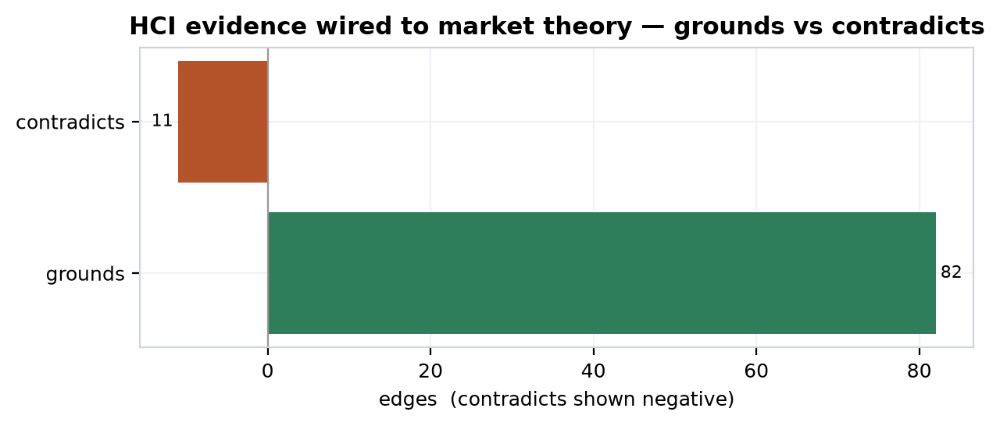

Grounding outnumbers contradiction roughly eight to one, which is why the floor is, on balance, pro-wedge. But the ratio flatters the picture if read alone, because the verdict distribution *inside* the 49 claims tells the more honest story:

| Verdict | Claims | Primary-backed |
| --- | ---: | ---: |
| supported | 32 | 29 |
| disputed | 6 | 6 |
| speculative | 6 | 6 |
| mixed | 5 | 5 |
| **total** | **49** | **46** |

Two things stand out. A clean majority — 32 of 49 — are supported, and all but three of those are primary-backed, so the floor genuinely holds. But every one of the 11 disputed-or-mixed claims is also primary-backed, which means the dissent is not soft hand-waving; it is conflict *between* well-run studies. The literature is internally divided on exactly the questions the wedge most needs settled, and the corpus does not resolve that division by fiat — it carries it forward as the difference between a supported-by-proxy ceiling and a contested one.

### Pro-wedge grounding: where the literature carries the bet

The supported tier is where the wedge finds its strongest external backing. The headline claim is that schematic metro-map layouts improve graph comprehension and task performance versus force-directed and other unschematized layouts, through topological clarity, reduced clutter, and consistent spatial encoding <sup>[c40]</sup> — an RCT-backed claim with a high agreement score (0.87) and the most supporting studies in the set (six). Immediately beside it sits the cleanest causal result in the chapter: MetroSets, which applies metro-map schematization to abstract set data, significantly outperformed EulerView and LineSets on element- and set-based query tasks, at p<.001 with a 22% accuracy advantage on large datasets <sup>[c41]</sup>. This is the load-bearing analogue for the wedge — a peer-reviewed experiment showing that the *schematization principle itself* delivers measurable comprehension gains. It says nothing about MetroGraph; it says the bet is not fantasy.

The supporting cast spans every limb of the wedge:

| Claim | Verdict | Grade | Agreement | n studies |
| --- | --- | --- | ---: | ---: |
| Metro schematization improves comprehension <sup>[c40]</sup> | supported | RCT | 0.87 | 6 |
| MetroSets superior set visualization <sup>[c41]</sup> | supported | RCT | 0.93 | 4 |
| Color coding improves metro-map wayfinding <sup>[c42]</sup> | supported | controlled-exp | 0.92 | 4 |
| Cognitive load scales with graph complexity <sup>[c43]</sup> | supported | RCT | 0.88 | 4 |
| Edge-crossing minimization cuts cognitive load <sup>[c44]</sup> | supported | RCT | 0.85 | 4 |
| Force-directed comprehension scales poorly (>30 nodes) <sup>[c45]</sup> | supported | controlled-exp | 0.80 | 3 |
| Direct manipulation beats chat on task completion <sup>[c46]</sup> | supported | controlled-exp | 0.78 | 3 |
| Progressive disclosure improves comprehension <sup>[c47]</sup> | supported | controlled-exp | 0.75 | 3 |
| Visualization of agent state reduces automation bias <sup>[c48]</sup> | supported | controlled-exp | 0.72 | 3 |
| Wayfinding metaphor transfers transit knowledge <sup>[c49]</sup> | supported | controlled-exp | 0.70 | 2 |

Read across, this is a coherent pro-wedge floor. Schematization, orthogonal constraint, and edge-crossing minimization all reduce comprehension cost; force-directed layouts degrade past roughly 30 nodes <sup>[c45]</sup> while cognitive load rises with complexity even on small graphs <sup>[c43]</sup>. Direct manipulation produces significantly faster task completion than conversational chat for localized editing and exploration <sup>[c46]</sup>, and information scent — Pirolli and Card's foraging construct — predicts navigation efficiency, with high-scent layouts beating low-scent force-directed ones <sup>[c50]</sup>. On the agent-transparency front, visualizing agent actions and reasoning increased appropriate reliance by 28.5% in perceived usefulness and reduced automation bias <sup>[c48]</sup>, with a companion finding that intent visualization produced 22.6% more explicit user disagreements with the agent — engagement, not passive acceptance <sup>[c51]</sup>.

One honesty note surfaces inside the supported tier itself. Three of the 32 supported claims are *not* primary-backed: information scent predicting navigation <sup>[c50]</sup>, the Hutchins–Hollan–Norman directness argument <sup>[c52]</sup>, and the hybrid-multimodal claim <sup>[c53]</sup>. These rest on expert framing or thin secondary support rather than a controlled study. They are supported, but they sit a half-step below the RCT-grounded claims, and the corpus marks that difference rather than smoothing it over.

### The contradicting and mixed evidence

The floor is not uniformly friendly. Eleven `contradicts` edges and eleven disputed-or-mixed verdicts mark where the literature pushes back on the wedge — and the corpus surfaces them rather than burying them.

The sharpest contradiction is structural. Force-directed layouts *outperform* orthogonal and hierarchical layouts across path-finding, subgraph identification, and clique-detection tasks <sup>[c54]</sup> — the exact tasks where a metro/orthogonal aesthetic might be assumed to win. This claim is itself supported and primary-backed, so the wedge's core layout premise meets a credible, well-evidenced rival on a meaningful slice of tasks. Reinforcing the discomfort, matrix representations beat node-link diagrams on most comprehension tasks once a graph exceeds about 20 vertices, node-link retaining the edge only for path-finding <sup>[c55]</sup> <sup>[c56]</sup>. Together these say the wedge's preferred representation is not universally superior: it wins some tasks and loses others, and at scale a non-metro representation may dominate outright.

The metro-versus-force-directed question for database exploration specifically — the claim that most directly underwrites the product — lands at **mixed**, not supported: schematic maps may outperform force-directed layouts for schema exploration through topological clarity and mental-model stability, but the studies do not converge <sup>[c57]</sup>. And the narrower brand-differentiation claim, that metro-style orthogonal layout reduces cognitive load versus force-directed in graphs over 30 nodes, is graded **disputed** <sup>[c58]</sup> — it generates three of the eleven contradicting edges by itself, pushing against the force-directed, orthogonal-layout, and graph-cognitive-load theory bases.

| Contradicting / mixed claim | Verdict | What it undercuts |
| --- | --- | --- |
| Force-directed outperforms orthogonal on multiple tasks <sup>[c54]</sup> | supported | Metro/orthogonal layout superiority |
| Matrix beats node-link above ~20 nodes <sup>[c55]</sup> | supported | Node-link metro canvas at scale |
| Schematic maps vs force-directed for DB exploration <sup>[c57]</sup> | mixed | The core product premise |
| Metro-map layout reduces cognitive load >30 nodes <sup>[c58]</sup> | disputed | Brand-differentiation bet |
| Layout stability in dynamic graphs <sup>[c59]</sup> | disputed | Mental-map preservation |
| Mental-map stability reduces load <sup>[c60]</sup> | mixed | Stable spatial encoding |
| Transparency–trust calibration <sup>[c61]</sup> | disputed | Agent-observability bet |
| Mental models correlate with performance <sup>[c62]</sup> | disputed | Transparency-improves-trust bet |
| Visual affordances aid discovery <sup>[c63]</sup> | disputed | Affordances-reduce-training bet |
| Agent-transparency automation-bias paradox <sup>[c64]</sup> | disputed | Visible-agent-state bet |

The most consequential contradiction is the transparency paradox, which deserves its own statement because it threatens the wedge's third pillar from the inside. The supported finding is that visible agent state reduces automation bias <sup>[c48]</sup>; the disputed counter-finding is that transparency can *amplify* automation bias when users ascribe greater capability and authority to a system precisely *because* it offers detailed rationales <sup>[c64]</sup>. The studies behind the paradox are pointed: explanations raised acceptance of AI decisions even when those decisions were wrong, without improving task accuracy, across more than 1,500 participants; confidence scores alone sometimes calibrated trust as well as full explanations; and longer explanations degraded users' ability to simulate system behavior. So the very design move the wedge relies on — show the agent's reasoning to keep the human in the loop — has a credible literature in which it backfires unless paired with uncertainty indicators, skepticism cues, and explicit reliability boundaries. The corpus does not pick a side; it records both as primary-backed and lets the conflict set the ceiling. These two claims, plus the trust-calibration <sup>[c61]</sup> and mental-model <sup>[c62]</sup> disputes, generate the remaining contradicting edges into the agent-observability and transparency-backfire market claims.

### The proxy gap: why literature grounding yields supported-by-proxy, never supported

Here is the distinction the whole chapter turns on. The HCI literature grounds the wedge *in general, on lab tasks*. It establishes that schematization, edge-crossing minimization, direct manipulation, information scent, and transparency are real, measurable effects under controlled conditions. It says nothing — not one row — about whether *MetroGraph's specific implementation* of those principles delivers the effect for *MetroGraph's specific users* on *their* databases. A study showing a generic orthogonal layout beats a generic force-directed one is grounds for the hypothesis that MetroGraph's layout will help; it is not a measurement of MetroGraph. That distance is the proxy gap, and from the literature side it is irreducible.

The corpus encodes the gap structurally in its design-hypothesis layer. Every wedge-relevant HCI hypothesis carries an explicit status, and the statuses form an honest ladder. Some are `grounded` or `grounded-by-theory`, where the literature supports the mechanism; a parallel set is flagged `untested-for-metro-graph` — the metro-map-layout-advantage hypothesis, the progressive-disclosure-schema-acquisition hypothesis, the visual-affordances-reduce-training hypothesis, the stable-spatial-encoding-transfer hypothesis, each tied to a market wedge claim and each accompanied by a fully specified experiment (sample size, conditions, NASA-TLX and eye-tracking measures) that *would* close the gap but has not been run. The `grounded-by-theory` rows go further and name MetroGraph features directly — infinite-canvas regions, 300–500ms animated transitions, metro-semantics information scent — yet still cap at theory, because theory is all the literature can provide.

This is exactly why the market verdicts handed up from Part III read the way they do. The market claim that schematic maps outperform force-directed layouts for database exploration is **refuted** at the market layer <sup>[c3]</sup>; that direct manipulation outperforms conversation for graph exploration is **refuted** <sup>[c4]</sup>; that information foraging predicts metro-map adoption is **refuted** <sup>[c36]</sup>; that visual affordances enable interaction without training is **refuted** <sup>[c37]</sup>; and the agent-observability and transparency-parity claims are **disputed** <sup>[c5]</sup> <sup>[c65]</sup>. The HCI floor does not overturn those verdicts. It cannot, because grounding a mechanism in the literature is not the same as demonstrating it in the product. What HCI does is set the *ceiling*: a market claim that the literature grounds and does not contradict can rise to supported-by-proxy, and no higher; a market claim the literature splits on stays contested. Literature grounding is the floor and the proxy gap is the cap, simultaneously.

### From split literature to contested vs supported-by-proxy ceilings

The mapping from the verdict distribution to the wedge ceilings is mechanical, which is the point — it is computed, not argued. The 32 supported HCI claims, where well-run studies agree and no credible study dissents, supply clean `grounds` edges and lift their corresponding market claims to a **supported-by-proxy** ceiling: the mechanism is real in the literature, the product instance is unproven, so the claim is supported *through a proxy* and pending the MetroGraph-specific experiment. The 11 disputed-and-mixed claims supply both `grounds` and `contradicts` edges into the same neighborhoods, and where the contradiction touches a wedge claim — the transparency paradox into agent-observability, the force-directed-superiority and brand-differentiation conflict into layout, the affordance-discovery dispute into training-free interaction — the ceiling drops to **contested**. The six speculative claims (the older Ghoniem/Cleveland/Mackinlay-style results re-entered as strategic-category claims) sit one rung lower still, primary-backed but not yet integrated into the supported floor. No wedge claim anywhere in this chapter's reach is lifted to plain "supported." The literature is not permitted to validate the product; it is only permitted to bound how strong the product's claim may honestly be.

### The dormant evidence layer: zero MetroGraph-specific studies

The corpus records roughly two dozen primary studies behind the HCI claims — Cleveland and McGill (n=44), Sweller and Chandler (n=48), Heer and Robertson (n=20), the Güven cognitive-load scaling study (n=40), the Mayer multimedia meta-analysis (591 effects), and the rest. Every one of them studies *generic* visualization or human-automation interaction. The count of studies run *on MetroGraph* is zero. There is no behavioral telemetry, no usability session, no A/B experiment, no eye-tracking trace from a MetroGraph user — the product is pre-revenue and uninstrumented, so the MetroGraph-specific evidence layer is empty. That emptiness is not an oversight to be apologized for; in this corpus it is a first-class signal, the standing pending-experimental marker that holds every wedge claim at its proxy ceiling. The empty MetroGraph study set sits alongside the empty VoC intake tables (interviews, surveys, usability sessions, A/B experiments, all at n=0) and the empty `market.primary_studies` as the consistent, mechanized admission that the bold bet has not yet been measured on the actual product.

The only path upward is the one the design-hypothesis rows already write out: the `untested-for-metro-graph` experiments — metro versus force-directed on real schema tasks, progressive disclosure on mental-model formation, affordance strength on training-free success, animated-transition timing on object constancy — each pre-specified, each waiting. Until one of them runs and returns data, the HCI floor does exactly what an honest empirical floor should: it carries the wedge as far as defensible-in-hypothesis, grounds it where the literature agrees, flags it where the literature fights, and refuses to let any of it read as proof. Part V inherits this proxy-support structure to re-grade the product's shipped features against the same ceiling — supported-by-proxy where a feature instantiates a grounded mechanism, contested where it instantiates a disputed one, and never validated until the named study exists.

---

## Part V — Product & the Wedge

Part IV left us with a precise, uncomfortable shape: the HCI literature *grounds* the wedge in some places and *contradicts* it in others, and where it grounds, it does so only by proxy — through laboratory tasks on other artifacts, never through MetroGraph itself. That proxy-support is real, but it is a floor, not a verdict. This chapter turns from the literature to the artifact. If the wedge is a bet about how a metro/schematic database visualization with visible agent state will behave in users' hands, the first honest question is not "does the literature agree?" but "does the thing even exist, and which parts of it?" We answer by code inspection — reading the MetroGraph repository and cataloguing what is implemented, what is partial, and what is only specified. The evidence grade for everything here is therefore *capability*, not *efficacy*: code-inspection and spec can tell us a feature is present in the source tree, never that it works well, and certainly never that the wedge effect it is meant to produce is real. Holding that distinction is the whole discipline of the chapter.

### What is actually shipped

The shipped surface is the dashboard-and-canvas core; across the feature taxonomy MetroGraph's status mix is 19 shipped, 6 planned, and 2 in-progress. What works today is a coherent editing surface — an interactive visual canvas with drag/drop layout, a typed node/container system with a creation palette and LeaderLine-rendered edges, a reactive data-binding spine, MongoDB data-source integration with schema introspection, and a multi-viewer properties inspector — sitting atop the two features the wedge leans on directly: a deterministic auto-layout engine built on a recursive rectangle-packing service tuned for 10/100/1000+ node counts <sup>[c66]</sup>, itself instrumented by a render-time/plot service that tracks render lag and packing time across those scales <sup>[c67]</sup>. The table below carries the per-feature inventory; every row's grade is *capability* — present in the source tree — not efficacy.

| Feature (shipped) | Evidence grade | Market feature cell |
| --- | --- | --- |
| Visual Canvas & Editor | code | market.feature.canvas |
| Node System & Types | code | market.feature.nodes |
| Node Creation & Palette | code | market.feature.nodes-creation |
| Edges & Data-Flow Connections | code | market.feature.edges |
| Edge Creation / Connect Nodes | code | market.feature.edges-creation |
| Data Binding & Variable System | code | market.feature.data-binding |
| Data Source Integration | code | market.feature.data-source |
| Schema Introspection & Discovery | code | market.feature.schema-introspection |
| Node Properties / Inspector | code | market.feature.nodes-properties |
| Graph Navigation & Exploration | code | market.feature.graph-exploration |
| Manual Positioning & Snap-to-Grid | code | market.feature.graph-layout-manual |
| Pan, Zoom & Semantic Viewport | code (efficient) | market.feature.canvas-pan-zoom |
| Multi-Selection & Bulk Editing | code-inspection | market.feature.canvas-multi-select |
| Auto-Layout & Rectangle Packing | code-inspection | market.feature.canvas-grouping |

Two shipped items deserve emphasis because the wedge leans directly on them. Auto-layout via rectangle-packing is the closest thing in the current build to the "schematic" half of the metro thesis: deterministic, space-filling, non-overlapping placement — the antithesis of force-directed sprawl. The observability layer is the closest thing to the "visible agent state" half: an execution-logs and step-debugging feature with error tracking and summary visualization <sup>[c68]</sup>, backed by stack-trace visualization, error grouping, and error-summary components <sup>[c69]</sup>. But note the honest seam: the observability feature is classified *in-progress*, and what actually ships is error/execution logging, not the live agent-orchestration view the wedge ultimately requires.

### What is not shipped, and is wedge-critical

The six planned features and two in-progress ones are precisely the capabilities the bold bet most depends on, and every one carries an evidence grade of `pending-experimental` or sits unactivated in code. Agent and workflow orchestration — the execution engine that would make MetroGraph a control surface for live agents rather than a static graph editor — is *planned*. So is force-directed/organic layout, and so are accessibility (WCAG 2.1 AA), real-time collaboration, git integration with branch/merge, and a keyboard-shortcut/command palette. These are not peripheral polish. Agent orchestration is the entire "visible agent state" proposition; accessibility and keyboard control are the difference between a demo and a tool an analyst lives in all day; and collaboration plus git are table stakes for the enterprise segment the finance and governance chapters scope.

| Feature (not shipped) | Status | Evidence grade | Wedge role |
| --- | --- | --- | --- |
| Agent & Workflow Orchestration | planned | pending-experimental | the "visible agent state" half of the thesis |
| Force-Directed / Organic Layout | planned | pending-experimental | the comparison baseline metro layout must beat |
| Accessibility (WCAG 2.1 AA) | planned | pending-experimental | daily-driver / enterprise gate |
| Real-Time Collaboration | planned | pending-experimental | enterprise table stakes |
| Git Integration & Branch/Merge | planned | pending-experimental | versioning table stakes |
| Keyboard Shortcuts & Command Palette | planned | pending-experimental | power-user efficiency |
| Execution Logs & Step Debugging | in-progress | code | observability spine |
| Visual & Code Query Building | in-progress | code | data-access path |

That `pending-experimental` grade is not an accident of vocabulary. It is the same marker the corpus uses everywhere it has a hypothesis but no measurement, and here it tags the wedge-critical features twice over: they are neither shipped nor studied.

### The product vision: every component a live-editable JSON object

What exists beyond the feature list is an unusually coherent architectural vision, and the wedge's plausibility rests partly on it. The organizing idea is that every component is a live-editable JSON object whose position and size are governed by a signal-aware dimension system; editing the JSON at any level updates state reactively through Angular signals <sup>[c70]</sup>. The layout engine is a signal-backed StateService that maps `[entityID][key] → signal(value)`, with a DimensionService lens tracking width/height/top/left for every positioned element so that changes trigger `computed()` consumers and causality effects <sup>[c71]</sup>. Editability is declarative: a `ViewerMeta`/`FieldMeta` symbol attached to objects specifies field-level editors (text, number, toggle, select, readonly), and edits are recorded in an EditorService and propagated to parent object state <sup>[c72]</sup>. The thirty-component spine is internally consistent and, by the code-inspection grade, real — DashboardComponent at the root viewport, ContainerComponent as the stateful base class, DocumentComponent wrapping JSON objects, ObjectComponent and KeyValueViewerComponent rendering entries, the typed viewers, DragComponent/ResizeComponent wiring CDK gestures into DimensionService, and a CausalityService that uses a DAG to fire effects only after all upstream causes complete. This matters for the wedge because it is the substrate that *could* host the metro layout and the agent view. But the honesty flag stands: a coherent substrate is a capability claim. It says the architecture admits the wedge; it does not say the wedge works.

### Honest in-product gaps

Three gaps are visible in the code itself, and the corpus records them as such. Visual query building is *disputed*: the service infrastructure (MongoService) exists but the UI component is not activated <sup>[c73]</sup>, and even though the corresponding in-progress feature is recorded as supported at the spec level <sup>[c74]</sup>, the honest read is partial. Export/download is *speculative-not-found*: no serialization or file-export mechanism appears anywhere in the codebase <sup>[c75]</sup>. Undo/redo is likewise absent, with no history management or transaction-reversal machinery <sup>[c76]</sup> — notable because the EditorService already records every change with path and previous value, so the substrate for undo exists even though the feature does not. These are reported as findings, not failures; they are the kind of gap that turns directly into roadmap.

### The `measures` edges: product features wired to market pain

The corpus does not leave the product and market chapters disconnected. Twenty-five `measures` edges, each at confidence 0.7, link a product feature node to the market feature-pain cell it is meant to address — `feat.canvas → market.feature.canvas`, `feat.edges → market.feature.edges`, `feat.agent-orchestration → market.feature.agent-orchestration`, `feat.force-layout → market.feature.graph-layout-force-directed`, and so on across the full taxonomy. The uniform 0.7 confidence is itself an honesty signal: it marks a design-time mapping ("this feature is intended to relieve this pain"), not a measured relief. Crucially, the edges run from *planned* features as readily as from shipped ones, so the mapping records intent independent of delivery — which is exactly why the wedge re-evaluation must gate on shipped status rather than on the existence of an edge.

### The wedge re-evaluation: thirteen claims, capped

Here the chapter's argument lands. The strategy layer takes the thirteen wedge claims — each of which entered the corpus with a *market* verdict derived from pure-secondary evidence — and re-grades each against the cross-domain algebra, producing a derived `cross_domain_ceiling` and, for every single one, `pending_experimental = TRUE`. The figure shows the result in full.


| Wedge claim | Market verdict | Cross-domain ceiling | Proxy support | Conf. |
| --- | --- | --- | --- | --- |
| agent-observability improves trust <sup>[c5]</sup> | disputed | contested | hci:grounds / hci:contradicts | 0.35 |
| AI-UI parity prevents transparency backfire <sup>[c65]</sup> | disputed | contested | hci:grounds / hci:contradicts | 0.35 |
| mixed-initiative requires visualization vs opacity <sup>[c77]</sup> | refuted | contested | hci:grounds / hci:contradicts | 0.35 |
| visual affordances enable interaction without training <sup>[c37]</sup> | refuted | contested | hci:grounds / hci:contradicts | 0.35 |
| direct manipulation outperforms conversation <sup>[c4]</sup> | refuted | supported-by-proxy | hci:grounds | 0.50 |
| force-directed dominant but unoptimized for schemas <sup>[c78]</sup> | supported | supported-by-proxy | voc:grounds_by_proxy | 0.50 |
| graph-viz clutter at scale <sup>[c79]</sup> | disputed | supported-by-proxy | hci:grounds / voc:weakly_grounds | 0.50 |
| information-foraging predicts metro adoption <sup>[c36]</sup> | refuted | supported-by-proxy | hci:grounds | 0.50 |
| progressive disclosure unlocks schema acquisition <sup>[c80]</sup> | refuted | supported-by-proxy | hci:grounds | 0.50 |
| wayfinding transfers from transit knowledge <sup>[c34]</sup> | refuted | supported-by-proxy | hci:grounds | 0.50 |
| AI-UI parity is an exclusive wedge <sup>[c2]</sup> | supported | weak-proxy | voc:weakly_grounds | 0.30 |
| flight-to-chat when UI confuses <sup>[c1]</sup> | supported | weak-proxy | voc:weakly_grounds | 0.30 |
| schematic maps outperform force-directed <sup>[c3]</sup> | refuted | weak-proxy | voc:weakly_grounds | 0.30 |

Read the table as the thesis in miniature. Four claims sit at *contested* — the HCI literature both grounds and contradicts them, so the honest ceiling reflects genuine dissent, not endorsement. Six reach *supported-by-proxy*, the highest grade any wedge claim attains; this is the cap, and it means strictly "other work on other artifacts points this way," never "demonstrated on MetroGraph." Three rest at *weak-proxy*, leaning only on review-mining where a user merely *said* something adjacent. The deliberate refusals to inflate are the tell: claims the market chapter marked *supported* — the exclusive-wedge claim and the flight-to-chat claim — are not waved through, because their only backing is weak VoC proxy, so cross-domain grading pulls them down to weak-proxy; and claims marked *refuted* are not deleted but reframed as hypotheses pending a named test. Every row, regardless of ceiling, carries `pending_experimental = TRUE`, because the mechanism that would lift any of them — a behavioral study run on MetroGraph — does not yet exist. Each row also names the specific experiment that would raise it: pre-registered A/Bs of metro vs. force-directed on schema-comprehension and path-finding (n≥40 within-subject), preference/task-success tests of visual vs. chat agent control (n≥40), and usability studies of progressive-disclosure variants (n≥30) — each annotated with the intake table it would land in (`voc.ab_experiments`, `voc.usability_sessions`, `hci.primary_studies`), every one of which is currently empty.

### The dormant benchmarks: emptiness as the marker

That emptiness is not a gap in the writing; it is recorded data. The product layer carries five dormant benchmark rows — click-depth for layout controls, an HCI cost grade for critical features, pane-count cognitive load, user-interaction-without-training success rate, and visual-surface-area reduction — each with `value = null`, `method = pending-experimental`, and `is_dormant = true`. These are the standing pending-experimental marker made concrete: placeholders for measurements not yet taken, not low or zero results. The contrast with what the codebase *can* measure is instructive. MetroGraph already emits code-measured constants — 30 Angular components, 10 production and 11 development dependencies, a 10-level max nesting depth, viewer widths bounded at 20–500px, bundle-size and component-style thresholds — and it carries live-but-unpopulated performance benchmarks (render-lag ratio, resize duration, packing time at 10/100/1000+ nodes). The product can count itself precisely. What it cannot yet do is observe a user. The dormant rows are exactly the variables the wedge's truth depends on, sitting empty, waiting for the named experiments.

### Handoff

This chapter confirms that the artifact admits the wedge — the canvas, the packing engine, the signal-backed JSON substrate, and an observability spine are shipped or coherent in spec — while the wedge-critical capabilities, agent orchestration above all, remain planned, and every one of the thirteen wedge claims is capped at supported-by-proxy or below with a pre-registered experiment named as the only path up. The shipped/planned status is now seeded into the synthesis layer as the gate on what may be recommended. But code inspection answers only the capability question. It cannot tell us whether the pains these features target are pains real users actually feel. That is the question Part VI must take up: do customers, in their own words, corroborate the problems MetroGraph is built to solve — and does the standing emptiness of the VoC intake tables leave even that corroboration at the level of proxy?

---

## Part VI — Voice of the Customer

Part V closed with the product's own ledger of pains-addressed: a set of claims about what MetroGraph's metro-schematic canvas and visible agent state are *meant* to fix. That ledger is a designer's hypothesis about user suffering. This chapter asks the obvious empirical question — do real users, in the wild, actually voice those pains? — and answers it with the one method available to a pre-revenue tool that nobody has yet used: review-mining. Voice of the Customer (VoC) is the second and last domain in the corpus to carry any primary backing (42 of 63 claims, alongside HCI's 46 of 49). Everything that follows rests on that backing, and everything that follows is fenced by the same hard limit: review-mining tells us a user *said* something about a *competitor's* tool. It does not, and cannot, tell us that MetroGraph fixes it.

### What VoC "primary" backing means — and what it does not

The corpus's entire honesty discipline turns on the word *primary*, so it is worth pinning down. In this engine `is_primary_backed` is a derived flag, never authored — a claim earns it only when a junction table ties it to an underlying study or artifact. For VoC, that artifact is a mined review: a forum post, a G2 or Gartner rating, a GitHub issue, a vendor changelog, an academic usability finding. When a data engineer writes that they "lose track while navigating hundreds of lines of SQL searching for foreign key relationships," that is a real, datable, attributable utterance — and so the claim it grounds is genuinely primary-backed in the review-mining sense. The domain's evidence class is exactly this: 42 rows, all `primary_kind = review-mining` voc.evidence_mix.

The referent of every one of those utterances, however, is *another product*. The reviews mine pain with dbdiagram, Azimutt, n8n, Flowise, Dify, Metabase, Fivetran, and Cursor — never with MetroGraph, which has no users to review it. VoC backing therefore establishes that a category of pain is *real and recurrent among the target population*, and is silent on whether MetroGraph's specific design resolves that pain. This gap caps every downstream edge, and it is the reason VoC can only ever *weakly* ground the wedge.

### The corroborated pain themes

With that fence in place, the signal is strong and consistent. Mining surfaced a coherent set of pain themes, several corroborated by eight or more independent sources, clustering into two families: visualization/canvas pains (the schema-explorer's world) and agent-observability pains (the workflow-builder's world) — precisely the two surfaces MetroGraph's wedge spans.

| Theme | Polarity | Freq. | Proxy strength | Representative voice |
| --- | --- | --- | --- | --- |
| Force-directed "hairball" clutter at 50+ tables; large diagrams abandoned | neg | 8 | supported-by-proxy | "no one ever really used it, it was unusable" (Dataedo) |
| Execution logic opaque by default; reasoning/intermediate state invisible | neg | 8 | HIGH | "keeping track of what these LLM applications are doing behind the scenes" (Flowise) |
| Visualization cuts cognitive load vs text-only schema | pos | 5 | supported-by-proxy | "40% fewer design flaws and 3x faster onboarding" (DB Designer) |
| Silent semantic failure — looks like success, is wrong | neg | 5 | HIGH | "fail in ways that look like success... syntactically valid but semantically wrong" (Arize) |
| Segmented/grouped views convert abandonment into regular use | pos | 4 | supported-by-proxy | "the areas feature... was a game changer" (ChartDB) |
| Usability cliff at 50–80 tables without decomposition | neg | 4 | weak-proxy | "80 tables and weird history" (ChartDB); "40+ tables... cognitive overload" (Medium) |
| Logs/UI/system signals uncorrelated; root cause hard to trace | neg | 4 | HIGH | "you only get fragments... logs that don't correlate to a specific run" (n8n) |
| Step-by-step node inspection transforms debugging | pos | 4 | HIGH | "click on any node and see exactly what data flowed through it" (Dify) |
| Mode-switching/navigation friction drives flight to chat | neg | 2 | weak-proxy | "constantly switch between the 'Drag tool' and 'Select tool'" (Azimutt) |

Canvas clutter is the most heavily corroborated negative theme. Users repeatedly describe large, unorganized schema diagrams as not merely ugly but *abandoned* — created once and never referenced <sup>[c81]</sup>. The same behavior recurs in workflow canvases, which become "visually cluttered and navigationally difficult at 40+ nodes" without a minimap or overview <sup>[c82]</sup>. The mechanism behind both is fragmentation: inspector panels, sidebars, and property dialogs scattered across the interface impose a cognitive tax of memorizing "interface geography rather than focusing on task logic" <sup>[c83]</sup>, a pattern the reviews call endemic to low-code platforms generally <sup>[c84]</sup>.

On the agent side, the dominant theme is opacity. Standard execution logs capture code-level operations but omit reasoning, decision rationale, and intermediate thought <sup>[c85]</sup>; most platforms log only inputs and final outputs, not the tool selections or parameter decisions that would explain *why* an agent acted <sup>[c86]</sup>. The consequence is twofold. First, debugging becomes impossible against opaque execution even when the system returns a success code <sup>[c87]</sup>, because, as the Arize research puts it, "the error lives in the reasoning and not necessarily in the code execution." Second — and this is the trust-eroding finding — agentic systems "fail in ways that look like success," producing well-formed but semantically wrong outputs that standard error monitoring cannot catch <sup>[c88]</sup>, <sup>[c89]</sup>. Black-box behavior of this kind is reviewed as actively trust-destroying <sup>[c90]</sup>.

The pain is not symmetric across personas. Data and analytics engineers register it most sharply: they "explicitly distrust chat-only agent platforms because they cannot verify data lineage, transformation logic, or agent decision paths," and treat observability and deterministic traceability as "non-negotiable for production workflows" <sup>[c91]</sup>. This is the demand-side mirror of MetroGraph's visible-agent-state bet — but, again, voiced about other products.

### The flight-to-chat behavior and the scalability threshold

Two themes deserve singling out because they map directly onto wedge claims. The first is *flight to chat*: when a visualization or graph UI is confusing, users do not patiently learn the visual interface — they abandon it and fall back to ChatGPT or Claude as a schema-exploration proxy <sup>[c92]</sup>. The proximate cause, in the reviews, is interface friction — constant tool-switching between drag, select, and pan modes, paired with weak information scent — which pushes users toward chat-based agents instead <sup>[c93]</sup>. This corroborates the market-domain wedge claim that flight-to-chat-when-UI-confuses is a documented phenomenon <sup>[c1]</sup>: it confirms the *behavior is real in the category*, not that MetroGraph's unified low-friction canvas prevents it.

The second is the scalability cliff. Schema-visualization tools show a clear usability break between 50 and 80 tables; beyond it, unorganized layouts become "practically unusable without hierarchical decomposition, filtering, or focused subgraph views," with commercial vendors explicitly treating "80 tables stays navigable" as a design limit <sup>[c94]</sup>. Independent academic and patent sources put a softer ceiling at 200 nodes for raw force-directed comprehensibility, and the force-directed clutter finding is itself corroborated by review-mining <sup>[c95]</sup>. This weakly grounds the market wedge claim about the dominance-but-suboptimality of force-directed layouts for schemas <sup>[c78]</sup>. It bears more awkwardly on the related market claim about graph-visualization clutter at scale <sup>[c79]</sup>, which the market domain currently grades *disputed*: that claim pins the clutter onset at >30 nodes, whereas this very demand-side evidence puts the practical cliff far higher, at 50–80 tables. VoC therefore corroborates the general clutter-at-scale phenomenon only weakly while actively contesting the disputed claim's specific threshold — the precise onset remains a hypothesis pending the named scalability experiment, not a settled figure. Crucially, the demand-side evidence stops at the *problem*; whether the metro/schematic layout is the *solution* is an HCI-floor and roadmap question, not a VoC verdict.

### The mixed-initiative finding: both chat and visual

The single most strategically important VoC finding is also the most carefully fenced. Mining the praise side of the corpus — not just the pains — shows that the best-performing tools offer *both* conversational AI and visual editing/transparency, neither pure-chat nor pure-visual, letting users specify intent naturally while retaining visual control over generated artifacts and agent execution <sup>[c96]</sup>. This is direct demand-side support for the AI+UI parity thesis that anchors the wedge <sup>[c2]</sup>. The praise for per-node debugging — "I could click on any node and see exactly what data flowed through it" — and the distrust of opaque chat-only agents <sup>[c97]</sup> point the same way: users want the natural-language affordance *and* the verification surface.

The honesty caveat is unavoidable, and the data states it plainly: the reviews also show that code-first tools (DBML syntax) appeal to developers but repel visual thinkers, while drag-drop tools do the reverse — *no existing tool successfully bridges* the two paradigms. The market domain reads that non-existence as evidence *for* the parity positioning being open whitespace, but grades it only weak-proxy. The mixed-initiative finding tells us the market *wants* parity. It does not tell us MetroGraph *delivers* it.

### Minimalist UI and monolithic-diagram avoidance as demand signal

Beneath the headline themes runs a quieter behavioral signal that bears directly on MetroGraph's low-surface-area design choice. Users actively seek out and praise minimalist, clean interfaces — Activepieces, the Zapier trigger-action model, Lindy — as superior to feature-rich but cluttered alternatives, indicating a genuine market preference for surface-area reduction <sup>[c98]</sup>. The complement is avoidance: monolithic diagrams of 50+ tables go unused, with users defaulting to querying blindly, sketching on whiteboards, or fleeing to chat, while focused, hierarchically organized views get adopted and referenced <sup>[c81]</sup>. Grouped and segmented views are repeatedly the difference between abandonment and adoption — the "areas feature" called a "game changer" <sup>[c99]</sup> — and stable spatial encoding is what lets users build durable mental models in the first place <sup>[c100]</sup>. The demand for low-surface-area, segmentable, spatially-stable design is real. Whether MetroGraph's particular realization satisfies it is, once more, untested.

### Personas and the evidence mix

The reviews resolve into seven personas spanning both surfaces — the schema/graph explorers (Data Engineer, Analytics Engineer, Developer Onboarding, Data Team Lead) and the agent/workflow operators (AI Operations Engineer, Low-Code Builder, Workflow Automation Engineer). Their jobs-to-be-done and switching triggers read as a near-verbatim restatement of MetroGraph's two wedge surfaces: "visualization becomes unreadable beyond 50 tables" and "node-by-node execution state inspection without full workflow reruns." That alignment is encouraging and entirely demand-side.

The verdict mix is honest about how much of this is settled versus speculative:

| Verdict | Claims | Primary-backed |
| --- | --- | --- |
| supported | 61 | 40 |
| speculative | 2 | 2 |
| **total** | **63** | **42** |

Sixty-one of sixty-three claims are *supported* — but "supported" here means "well-corroborated as a category pain," not "validated on MetroGraph." The two speculative claims (Airflow RBAC complexity, Retool multi-tenant gaps) are the honest residue: single-source, low-grade, retained as hypotheses rather than scrubbed.

### The dormant intake tables — the standing pending-experimental marker

This is the chapter's load-bearing honesty statement. The VoC domain ships four intake tables purpose-built to hold *real MetroGraph user evidence* — and all four are empty:

| Intake table | Rows | What would fill it |
| --- | --- | --- |
| `voc.interviews` | 0 | structured interviews with MetroGraph users |
| `voc.surveys` | 0 | quantified preference/satisfaction surveys |
| `voc.usability_sessions` | 0 | moderated task-completion sessions on MetroGraph |
| `voc.ab_experiments` | 0 | controlled A/B tests of the metro canvas |

These zeros are not an oversight; they are the instrument. The schema reserves exactly the slots where first-party MetroGraph evidence will land, and their emptiness is the corpus's standing, mechanized marker that no such evidence yet exists. Review-mining fills the *secondary* intake; these **four empty VoC intake tables**, plus the empty `market.primary_studies`, are where the pending experiments resolve — and this chapter is their canonical home: later parts refer back to "the four empty VoC intake tables and `market.primary_studies` (Part VI)" rather than re-tabulating them. They are the demand-side twin of the wedge claims' `pending_experimental = TRUE` flag — and the named roadmap of pre-registered studies (Part X) is precisely the work that would convert these zeros into rows.

### Why VoC can only weakly ground the wedge

The edge structure makes the ceiling explicit. VoC attaches to the wider claim graph through just three edge types, and their counts encode the honesty cap directly:

| Edge type | Count | Effect on wedge |
| --- | --- | --- |
| `about_feature` | 6 | descriptive linkage only |
| `weakly_grounds` | 4 | caps target at weak-proxy |
| `grounds_by_proxy` | 1 | caps target at supported-by-proxy |

There is not a single `validates`, `measures`, or `demonstrates` edge out of VoC — by construction, because those would require MetroGraph usage data, which sits in the four empty tables. The strongest thing VoC can do to a wedge claim is `grounds_by_proxy` (one edge) or `weakly_grounds` (four edges); both are ceilings, not endorsements. This is what feeds the supported-by-proxy / weak-proxy caps that Parts I and III asserted and that the wedge re-grading enforces.


The figure situates VoC honestly: it is one of only two domains with any primary backing, and even that backing is review-mining — a user *said* something, about a competitor, not a measurement of MetroGraph's effect. The chapter's contribution to the through-line is therefore precise. VoC establishes, with real and recurrent evidence, that the pains MetroGraph targets are *genuine in the category*: canvas clutter, the 50–80-table cliff, chat opacity and data-engineer distrust, silent agent failure, the flight to chat, and a demand for both-chat-and-visual minimalist design. It hands Part VII the integration-friction signal and Part X the demand-side basis for recommendations. What it pointedly does *not* do is validate the wedge. The user's voice confirms the disease; it cannot prescribe MetroGraph as the cure. That confirmation must wait on the studies whose empty tables this chapter has now named.

---

## Part VII — Ecosystem & Integration

### From voiced pain to placed bets

Part VI left us with a catalogue of connector pains that users actually voice: the schema is hard to see, the pipeline is hard to trace, and every new data source is a fresh onboarding tax. This chapter asks the next question — if MetroGraph is to relieve those pains, *where* in the modern data stack should it plug in first, and how confident can we honestly be in that ordering? The answer is a ranked map of integration targets — connectors, introspection surfaces, APIs, and lineage standards — scored by a derived priority. But the dissertation's central discipline applies here with unusual force: this map is a set of **design estimates**, not built or benchmarked integrations. MetroGraph has shipped schema introspection against one family of databases <sup>[c101]</sup>; everything else is a plan with a number attached, and the number's job is to make the plan auditable, not to make it true.

The ecosystem domain holds thirteen home claims: two **supported** market-structure observations about the surrounding stack, and eleven **speculative** integration hypotheses about where MetroGraph could add value. Critically, **zero of the thirteen are primary-backed** — no benchmarked connectors, no measured adoption pulls, no instrumented integrations stand behind any of them. That is the honest frame for the whole chapter. We reason about ecosystem fit from public structure and technical feasibility, not from anything MetroGraph has measured in the field.

### The integration-feasibility ranking

The priority score is a deliberately simple, legible formula: reach × strategic-fit / effort. Reach estimates how much of MetroGraph's ideal customer profile a target touches; strategic fit estimates how directly it serves the schema-visualization wedge; effort estimates build cost. Dividing fit-weighted reach by effort rewards integrations that are broadly useful, on-thesis, and cheap. Every input is an analyst estimate, so the output inherits that status: it ranks *plausibility of payoff per unit of work*, not realized value.

| Integration target | API surface | Direction | Reach | Strat-fit | Effort | Priority | Feasibility |
|---|---|---|---|---|---|---|---|
| PostgreSQL | information_schema + wire protocol | inbound | 0.95 | 0.95 | 0.20 | **4.51** | proven |
| DuckDB | Python/C API | inbound | 0.60 | 0.80 | 0.15 | 3.20 | proven |
| MySQL | information_schema + wire protocol | inbound | 0.75 | 0.80 | 0.20 | 3.00 | proven |
| Snowflake | REST API | inbound | 0.85 | 0.90 | 0.40 | 1.91 | proven |
| SQLite | file-based DB API | inbound | 0.40 | 0.65 | 0.15 | 1.73 | proven |
| BigQuery | REST API | inbound | 0.70 | 0.85 | 0.35 | 1.70 | proven |
| Supabase | REST + Realtime | inbound | 0.55 | 0.80 | 0.30 | 1.47 | speculative |
| Neo4j | Cypher + Bolt | inbound | 0.50 | 0.85 | 0.35 | 1.21 | proven |
| dbt | metadata artifacts | outbound | 0.70 | 0.85 | 0.60 | 0.99 | speculative |
| MongoDB | admin cmds + wire protocol | inbound | 0.65 | 0.75 | 0.50 | 0.98 | proven |
| PlanetScale | REST API | inbound | 0.35 | 0.75 | 0.35 | 0.75 | speculative |
| Great Expectations | (library) | bidirectional | 0.40 | 0.70 | 0.50 | 0.56 | speculative |

PostgreSQL leads decisively, and the reason is the chapter's load-bearing technical observation. Postgres exposes a standardized `INFORMATION_SCHEMA` and system catalog that lets a tool introspect tables, columns, and `referential_constraints` (foreign keys) through portable SQL — the exact raw material for ERD and schema-graph rendering. It scores 0.95 on both reach and strategic fit because it sits at the intersection of MetroGraph's ICP (data engineers, DBAs, analysts) and the highest-pain shipped feature, schema introspection; its effort is low precisely because that introspection surface is standardized rather than bespoke. MySQL inherits nearly the same `INFORMATION_SCHEMA` contract and rides directly behind it — a near-identity that underwrites the claim that PostgreSQL and MySQL together reach roughly 55–60% of the addressable relational market <sup>[c102]</sup>, itself a speculative strategic estimate rather than a measured share. DuckDB ranks second on a different logic: trivially low effort and a fast-growing local-first analytics niche, even at modest reach.

The high-LTV cloud-warehouse tier — Snowflake and BigQuery — scores high on strategic fit (0.90 and 0.85) but costs more to build (REST APIs, enterprise auth), so it lands mid-ranking; the speculative claim behind it is that these two carry the most enterprise revenue weight <sup>[c103]</sup>, an analyst estimate rather than a measured share. Neo4j is the deliberate premium outlier: lower reach, but its Cypher/Bolt schema visualization is *hypothesized* to be a differentiator against dashboard-first competitors in the knowledge-graph and recommendation-engine segment <sup>[c104]</sup> — speculative, not demonstrated. MongoDB is posited to carry real document-data pain, with no competitor currently observed offering cross-DB schema graphs <sup>[c105]</sup>, but schema *inference* from schemaless collections raises its effort and drops its priority below the relational baseline. Supabase and PlanetScale earn their speculative grade by betting on real-time and schema-branching paradigms — collaborative, multi-user schema visualization that is first-to-market in framing but unproven in pull <sup>[c106]</sup>.

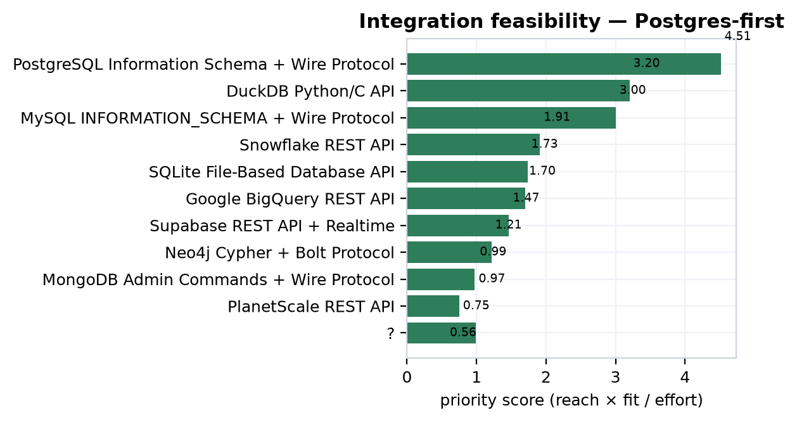

### Feasibility grades are design estimates, not built integrations

The "feasibility" column carries two values — *proven* and *speculative* — and reading them correctly is essential. "Proven" means the *technical mechanism* is well understood and broadly documented: Postgres `information_schema` introspection is a solved, standard pattern, so a connector against it carries low technical risk. It does **not** mean MetroGraph has built, shipped, or benchmarked that connector, nor that the resulting integration has been shown to pull users. The feasibility grade is an engineering-risk estimate; the priority score is a payoff estimate; both are design artifacts produced by analysis, not telemetry. The corpus carries no primary backing for any ecosystem claim because there is nothing to back it with — no instrumented connector, no adoption measurement, no field A/B. The eleven speculative claims and the ten unscored exploratory targets (vector DBs, Kafka/Debezium, reverse-ETL, OpenLineage ingestion, GraphQL introspection, pgvector) are hypotheses about where integration value *might* sit, held at priority 0 precisely so they cannot be mistaken for committed bets.

### Two supported claims about the stack's shape

Against eleven hypotheses stand two **supported** market-structure claims, supported for a specific reason: each describes the *external* ecosystem, which can be verified from vendor surveys and source documentation without measuring MetroGraph at all.

The first is OpenLineage standardization <sup>[c107]</sup>. OpenLineage has reached real adoption across dbt (1.5+), Airflow (2.3+), and Spark (3.1+), creating a unified lineage-metadata format that a graph-visualization tool can standardize against rather than reverse-engineering each orchestrator's internals. Its endpoint contract is concrete — `POST /api/v1/lineage` ingesting JSON-LD events — which makes this an alignment opportunity rather than a guess. It bears directly on Part VIII: lineage in MetroGraph today is *implicit* <sup>[c108]</sup>, and OpenLineage is the standard against which an explicit, governable lineage surface could be built.

The second is the honest counterweight: CDC adoption remains below 10% of data platforms despite mature tooling like Debezium, AWS DMS, and native binlogs <sup>[c109]</sup>. This claim is supported *and* deflationary — it states outright that visualization gaps are **not** the primary blocker on CDC adoption. It therefore disciplines the adjacent speculative claim that real-time Kafka/Debezium pipelines need live graph visualization of schema changes <sup>[c110]</sup>: the need may be real for the minority who have adopted CDC, but the market is small and MetroGraph would not be the thing unblocking it. Keeping a supported claim that caps the upside of a speculative neighbor is exactly the mechanized honesty this corpus exists to enforce.

### Introspection commoditizes; the wedge must live above it

The deepest strategic read of this chapter is a tension. The same standardization that makes Postgres the top-ranked, lowest-effort target — a portable introspection surface — is available to *every* competitor. GraphQL sharpens the point: the spec's introspection system can serve as a near-universal schema-discovery mechanism for API-first sources (Hasura, Apollo, and Postgraphile all support it), reducing the need for database-specific connectors <sup>[c111]</sup>. A single `POST /graphql` introspection query can enumerate types and relationships across an entire class of sources. This is wonderful for connector economics and terrible for connector defensibility: if discovery converges on a handful of standard surfaces — `information_schema`, GraphQL introspection, OpenLineage events — then the connector layer **commoditizes**. Whoever you are, you read the same catalog.

The conclusion follows directly, and it is the hand-off this chapter owes the rest of the dissertation: **differentiation cannot live in the connector.** Introspection-based discovery aligns beautifully with the schema-visualization wedge — it is the cheapest way to obtain the graph MetroGraph draws — but it is not itself ownable. The defensible surface is the *visualization* layer: the metro/schematic rendering, the readable ERD, the visible agent state over the schema graph. The connector is commodity intake; the wedge is what MetroGraph does with the schema once it has it. Several exploratory targets reinforce that the value migrates upward — pgvector enabling semantic search over schema metadata for governance teams <sup>[c112]</sup>, vector-DB integrations becoming table stakes for embedding-aware lineage <sup>[c113]</sup>, and reverse-ETL platforms needing visual data-model graphs to cut transformation errors <sup>[c114]</sup>, where the honest sub-finding is that 85–90% of reverse-ETL logic is still hand-coded despite "low-code" vendor framing <sup>[c115]</sup>. Each is a visualization-layer bet sitting on top of a commodity intake, and each remains speculative.

### Hand-off

Two threads leave this chapter. To **Part VIII (governance)**: the integration surfaces ranked here are precisely the data-access surfaces governance must control. The top target, Postgres, requires stored connection credentials — and the corpus already flags that connection secrets are stored <sup>[c116]</sup> against an early-stage tool with no formal governance posture <sup>[c117]</sup>. Every connector this chapter recommends is, from Part VIII's view, a new attack and compliance surface. To **Part X (strategy)**: the recommendation is **Postgres-first**, read with every hedge intact. Postgres-first is a *prioritization*, not a built integration; its connector is commodity, not moat; and its 4.51 priority is a design estimate that no shipped, measured integration yet redeems. The empty intake tables that mark the rest of the corpus mark this chapter too — the ranking is a hypothesis about where to point the build, and the only thing that converts it from estimate to evidence is shipping the connector and measuring the pull.

---

## Part VIII — Governance & Compliance

The preceding chapter handed forward the data-access and lineage surfaces every enterprise
buyer expects to be governed: the connections MetroGraph opens against a customer's
warehouse, the queries it issues, the previews it renders, the graphs it persists. This
chapter accounts for what governs them today — nothing — and does so without softening. Of
everything the corpus weighs, the governance finding is the one that needs no proxy, no
comp, and no pending experiment to be believed: it is read directly off the shipped code
and the published requirement texts. In the precise vocabulary of this dissertation it is
the most clearly TRUE/CONFIRMED finding in the whole synthesis, and also the least
flattering. The discipline here is to report the gap at full size and then frame it
correctly — as the logical consequence of an alpha-stage product, not a design failure —
converting each blocker into a dated roadmap item that bounds, but does not condemn, the
enterprise opportunity.

### The headline: thirteen viz features, zero governance controls

MetroGraph ships a credible early-stage visualization platform with no governance whatsoever.
Its node, edge, and graph exploration features — enumerated in the product chapter — reach
users with no authentication, no authorization, and no audit logging
<sup>[c118]</sup>. Stated at the level of the control surface:
the product is single-user, not multi-tenant, with ZERO governance controls shipped — no
authentication, no RBAC, no audit logging, no data classification, no column-level access
control, and no masking <sup>[c117]</sup>. Read against the
feature ledger, the same finding sharpens: thirteen core data-visualization features are in
users' hands while the governance controls that enterprise and regulated markets require —
RBAC, SSO, audit logging, observability — number zero <sup>[c119]</sup>.

Two properties make this a CONFIRMED finding rather than a graded hypothesis. First, its
evidence grade is `code`: it is established by reading the repository, not by inferring from
a comp or a survey. Second, it is a statement of absence, and absence is cheap to verify and
impossible to overstate — there is no risk of inflation when the claim is "this control does
not exist." That asymmetry is why governance carries the corpus's firmest verdicts even
though, like every domain other than HCI and VoC, it is **zero primary-backed**: no
usability study or A/B test underwrites these claims, and none is needed, because the claim
is about the code's contents, not about a behavioral effect on a user.

### From sixty requirements to eleven distinct gaps

The requirement corpus for governance is deliberately over-enumerated. It pulls the literal
control texts from EU AI Act, FedRAMP Rev5, GDPR (Articles 5, 15, 17, 28, 32, 33, 44–50),
HIPAA 2026, NIS2 Article 20, PCI-DSS 4.0.1, SOX/PCAOB AS 2201, SOC2 TSC, and ISO 27001 Annex
A, then maps each to a MetroGraph gap. Because many frameworks demand the same underlying
control — MFA appears in HIPAA, PCI, ISO A.8.5, and SOC2 CC6 alike — the raw gap rows
over-count. There are 47 gap rows in total, distributed by severity as follows.

| Gap severity (raw rows) | Count |
| --- | ---: |
| blocker | 22 |
| major | 22 |
| important | 1 |
| minor | 2 |

These 47 framework-keyed rows deduplicate to a much smaller set of distinct engineering
deficits, and the headline strategic finding collapses them honestly. MetroGraph has **11
compliance gaps that gate enterprise adoption** across three segments
(enterprise-data-teams, cdo-data-leadership, governance-quality-teams), of which **5 are
blockers** (no auth, no RBAC, no audit logging, no data classification, no column access)
and **6 are major gaps** that materially reduce governance posture; total estimated
remediation is roughly **8 person-months** <sup>[c120]</sup>. The
downstream strategy domain, reading the same evidence against a wider segment set, counts more
gating gaps — the difference is one of segment coverage, not of any new control being
discovered, and both readings describe the identical shipped reality.

The control-coverage ledger tells the same story from the supply side: of the controls the
frameworks demand, 42 have **no** coverage, 9 have **partial** coverage, and 5 are merely
**planned**. The relationship algebra records this as 45 `gates` edges (a requirement
blocking a segment) against only 23 `satisfies` edges — gate edges outnumber satisfactions
roughly two to one, the graph-level restatement of "early-stage."

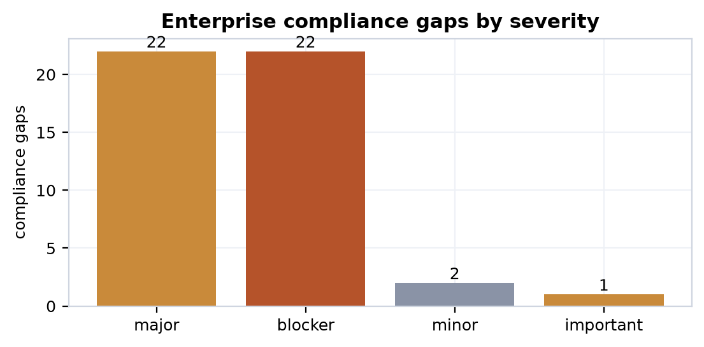

### The five blockers and six majors

The distinct gaps, with the remediation effort the corpus attaches to each, are below. The
effort column is the engineering estimate from the gap remediation rows; it is what makes the
~8-person-month total and the cost/timeline handoff to the finance chapter auditable rather
than asserted.

| Distinct gap | Severity | Remediation effort (est.) |
| --- | --- | --- |
| No authentication (SSO/OAuth/SAML + MFA) | blocker | 8–12 wks SSO; 4–6 wks MFA |
| No role-based access control (RBAC) | blocker | 6–8 wks (XL) |
| No immutable audit logging | blocker | 10–14 wks (XL) |
| No data classification (PII/PHI tagging) | blocker | L |
| No column/field-level access control | blocker | XL |
| Lineage not formalized as queryable data | major | M |
| No role-aware masking UI | major | M |
| No workspace/project isolation | major | L |
| No JML (joiner-mover-leaver) provisioning API | major | M |
| No query audit trail | major | M |
| No access-review reports | major | M |

The authentication blocker is the keystone, because almost everything else depends on a
notion of identity. Shipping SSO/OAuth/SAML plus RBAC plus audit logging — the table-stakes
triad — is what would unlock the Enterprise Data Teams segment; these controls are
prerequisite to SOC2 and ISO 27001 and non-negotiable in enterprise security questionnaires
<sup>[c121]</sup>. The audit-logging blocker is
independently load-bearing for compliance: MetroGraph lacks the comprehensive audit logging
that GDPR Article 32 and SOC2 CC6.1/CC7.2/CC7.3/CC8.1 require to demonstrate who accessed
customer data, when, from where, and what they did <sup>[c122]</sup>.
Without an identity layer and an immutable log, the remaining controls cannot even be
expressed.

### The regulatory clock

Beyond the framework requirements that gate adoption structurally, a set of dated regulatory
deadlines determines *when* each gap stops being optional. The corpus separates these by
verdict with care: deadlines that are published and current are `supported`, while future
rulings and not-yet-finalized rules stay `speculative`, no matter how widely anticipated.

| Regulatory event | Date / status | Verdict |
| --- | --- | --- |
| EU AI Act Art. 50 transparency obligations | Aug 2, 2026 (fines to €35M / 7% turnover) | supported <sup>[c123]</sup> |
| PCI-DSS 4.0.1 universal MFA for all CDE access | Mar 31, 2025 — deadline passed (overdue) | supported <sup>[c124]</sup> |
| NIS2 Art. 20 executive personal liability | Enforceable as of June 2026 | supported <sup>[c125]</sup> |
| FedRAMP Rev5 "Class C" (323 NIST 800-53 controls) | July 2026 terminology migration | supported <sup>[c126]</sup> |
| SOX/PCAOB AS 2201 top-down risk-based ITGC | Fiscal years from Dec 15, 2026 | supported <sup>[c127]</sup> |
| HIPAA 2026 universal ePHI encryption mandatory | Proposed; final rule not yet issued | supported <sup>[c128]</sup> / <sup>[c129]</sup> |
| AWS European Sovereign Cloud (Schrems hedge) | Launched Jan 2026, Brandenburg DE | supported <sup>[c130]</sup> |
| Schrems III challenge to EU-US DPF | Ruling expected late 2026 | speculative <sup>[c131]</sup> |
| HIPAA 2026 6-year tamper-proof audit-log retention | Pending rule detail | speculative <sup>[c132]</sup> |

The honesty boundary is visible in the last three rows. PCI's universal-MFA mandate is a
hard, past deadline, so it is reported flatly as overdue
<sup>[c124]</sup>, and the framework's later
clarification that phishing-resistant FIDO2 may substitute for traditional MFA in
non-administrative access is likewise current
<sup>[c133]</sup>. NIS2 Article 20's shift of
liability onto named executives is recorded as supported because the directive is in force
and member states may impose personal liability and management bans
<sup>[c134]</sup>. But the Schrems III invalidation
and the not-yet-published HIPAA final-rule specifics remain **speculative** — they are
litigation-risk and regulatory-pending, and the corpus refuses to promote them to a deadline
the product must hit. The standing GDPR transfer constraint underneath them is graded TRUE on
its own footing: post-Schrems II, EU personal data on US servers requires an Adequacy
Decision, BCRs, or SCCs with supplementary technical controls, and MetroGraph implements no
data localization <sup>[c135]</sup>.

### The one partial control, and the lineage advantage hidden in the model

There is exactly one place where the coverage ledger reads better than zero. MetroGraph's
connection manager stores credentials encrypted at rest, which partially satisfies the
"encrypted at rest" requirement — but with no TLS enforcement, no cipher-suite audit, and no
way for a customer to verify connections use strong encryption
<sup>[c116]</sup>. This is the only partial coverage the corpus
will credit; nothing else should be read as shipped.

Against that thin positive sits a genuine, latent design advantage. MetroGraph's
node-and-edge graph model *naturally encodes data lineage* — source nodes flow to transform
nodes flow to output nodes — so lineage is the visual primitive itself, not a bolt-on
afterthought <sup>[c108]</sup>. The honesty caveat rides in the same
breath: lineage is not yet formalized as queryable data, not exported to compliance tools
(Collibra, Alation), and not accompanied by impact-analysis UI. It is an *architectural*
head start on a major gap, not a shipped control. Formalizing it — extracting
source/transform/sink edges into a lineage table, exposing upstream/downstream search,
supporting export — is an M-effort item, materially cheaper than building lineage on a
platform whose data model does not already shape it. This is the one place the governance
chapter contributes a forward asset rather than a debt.

### The honest reframe: stage, not failure

The temptation with a finding this stark is either to bury it or to wield it as an
indictment; the corpus does neither. The absence of governance controls is not a design flaw
but the logical consequence of product stage — these are strategic roadmap items for
enterprise expansion, not bugs <sup>[c136]</sup>. Every
blocker in the table above carries `becomes_roadmap_item = true`, which is what licenses the
reframe: a gap that converts cleanly into a dated, effort-estimated work item is a backlog,
and a single-user alpha is *supposed* to have this backlog. MetroGraph is a capable
early-stage visualization tool that is simply unsuitable for regulated and enterprise
segments until its auth layer ships <sup>[c118]</sup>.

The certification path makes the timeline concrete and is the chapter's central message to
finance. SOC2 Type II requires documented audit logging (CC6, CC7), change management (CC8),
and access controls with MFA — MetroGraph has none of these shipped — so a Type II
certificate requires a 4–6 month build followed by a 6-month audit observation window before
the certificate is even possible <sup>[c137]</sup>. That
~12-month floor, layered on top of the ~8 person-months of feature remediation
<sup>[c120]</sup>, is the cost-and-timeline weight this chapter hands to
Part IX: enterprise revenue cannot be recognized before the gate clears, so the gate *bounds
the timing* of the enterprise line in the financial model rather than discounting its size.
The dated remediation items themselves — MFA, SSO, RBAC, audit logging, data classification,
column access, plus the EU-residency and DPA work <sup>[c138]</sup>,
<sup>[c139]</sup> — are what Parts X and XI carry into the
roadmap and the recommendation portfolio.

### Verdict mix and what each grade certifies here

The 33 governance claims partition into a verdict mix that is itself the chapter's
epistemics in miniature: **4 CONFIRMED, 9 TRUE, 15 supported, and 5 speculative.** Three of the four
CONFIRMED claims are code-grade observations read straight off the repository — the
zero-governance absence, the one partial encrypted-credentials control, and the implicit-lineage
design property — and the fourth is the research-grade synthesis that aggregates the gaps into
the 11-blocking-gaps count. The absence claims carry the firmest footing because there is
nothing to inflate in a statement of what is not there; the synthesis claim's effort estimate
is the one piece of this group that remains an estimate, carried as such. The nine TRUE claims are requirement-grounded: they read a
published control text (GDPR Art. 17/28/32, SOC2 CC6/7, the SSO/RBAC gate) against the
product and find it wanting, certain in direction but resting on regulatory interpretation
rather than a line of code. The fifteen supported claims are the current, dated regulatory
facts — deadlines and enforcement states that are real but external to MetroGraph. The five
speculative claims — Schrems III, the HIPAA final rule's specifics, NIS2 first-enforcement
timing — are precisely the ones the corpus declines to harden, holding them as risks to
monitor rather than deadlines to hit.

Critically, none of these verdicts is primary-backed, and the chapter does not pretend
otherwise: governance is 0/33 on derived primary evidence. But unlike the wedge claims
elsewhere in this dissertation — whose ceiling is capped at supported-by-proxy precisely
because the experiments that would raise them have not run — the governance findings do not
need primary behavioral evidence to be CONFIRMED. "There is no audit log" is settled by
reading the code; no usability session could make it more or less true. That is the
distinction this corpus exists to mechanize, and governance is where it reads cleanest: a
maximally honest, maximally firm finding that the enterprise gate is real, its blockers are
countable, its clock is dated, and its remediation is a roadmap — not a verdict to be argued,
but a backlog to be built.

---

## Part IX — Financial Model

The enterprise gate of Part VIII bounds *when* revenue can begin: until the compliance blockers clear, the obtainable market is the self-serve and team tiers, not the regulated accounts that anchor the largest comps <sup>[c137]</sup>. This chapter takes that timing as given and asks the next question — *if* revenue begins, what do the unit economics and the valuation look like? The honest answer is a distribution, not a point. MetroGraph is pre-revenue: no ARR to multiply, no measured CAC, no observed churn curve, no telemetry of any kind. Every number below is an industry benchmark or a comparable-company multiple, pushed through a fixed-seed Monte-Carlo so that the *width* of our ignorance is visible rather than hidden behind a single confident figure. The comps bound an option value on reaching scale; they are not a mark on a thing that exists today. That caveat is not a footnote to this chapter — it is its spine.

### The benchmark unit-economics model

The model is built bottom-up from a single ICP cohort and a set of developer-infrastructure SaaS benchmarks, then assigned MetroGraph-specific p50 estimates that sit deliberately near, not above, the industry medians. The central assumptions are summarized below; each is a benchmark-anchored estimate, and none reflects a MetroGraph observation.

| Driver | MetroGraph p50 | Benchmark anchor | Basis |
| --- | --- | --- | --- |
| ARPU | $1,200/yr | $348/yr (dev-tools median) | SMB + mid-market tier blend |
| CAC | $320 | $248 (dev-tools cohort, n=1,420) | PLG-weighted, sales-assisted expansion |
| CAC payback | 10.2 mo | 9.4 mo (dev-tools median) | hybrid PLG/sales motion |
| Gross margin | 79% | 77% overall / 81% subscription | pure software, no services |
| NRR | 1.18× | 1.25× (infra/DevOps) / 1.01× (B2B median) | land-and-expand across tiers |
| Logo churn | 3.5% / yr | 3.5% (B2B median) / 1.8% (infra) | balanced SMB/mid-market |
| Conversion | 4.5% | 9% (PLG freemium avg) | conservative early-funnel |

These figures cash out in claim <sup>[c140]</sup>, which holds that MetroGraph can reach a 3.0–3.8× LTV:CAC ratio if NRR sustains 115%+ while keeping payback under twelve months, and in <sup>[c141]</sup>, which positions the $320 PLG-weighted CAC and 10.2-month payback as 8–15% more efficient than the dev-tools median. Both carry the verdict **speculative** and zero primary backing — the entire finance domain is zero primary-backed by construction, because the only evidence that could raise the ceiling is a study no one has run. The supporting logic is sound and benchmark-consistent; it is not measured. Claim <sup>[c142]</sup> extends the same conditional reasoning to self-sustaining economics — 79% gross margin and 1.18× NRR funding acquisition out of expansion revenue, *contingent on* holding logo churn below 4% — and is likewise speculative.

These assumptions sit against a macro headwind worth registering, because the benchmarks themselves are under pressure. Median CAC payback extended from 14 to 18 months between 2023 and 2024 <sup>[c143]</sup>; the 75th percentile of SaaS companies spent $2.82 per $1 of new ARR in Q4 2024 — negative unit economics, the worst in the dataset's history <sup>[c144]</sup>; and cohort NRR compressed roughly 4% from its 2021 peak <sup>[c145]</sup>. Against that backdrop, a 120%-NRR floor is precisely the line that separates structural margin pressure from sustainable growth <sup>[c146]</sup>, and MetroGraph's 1.18× p50 sits *just below* it. The PLG motion is the partial answer: product-led companies post a median Rule-of-40 score of 34 against 20 for sales-led peers <sup>[c147]</sup> — though that signal only becomes discriminating above $20M ARR, below which growth is universally expected to outrun profitability <sup>[c148]</sup>. MetroGraph would spend its entire early life below that threshold.

### LTV:CAC as a distribution, not a number

Collapsing those assumptions into a single LTV:CAC ratio would be the dishonest move. Instead the corpus runs a three-year bounded Monte-Carlo (`finance-ltv-cac`, seed 42, n=10,000), drawing ARPU, CAC, gross margin, and logo churn from their benchmark-anchored distributions and propagating the joint uncertainty. The result is claim <sup>[c149]</sup>:

| Percentile | LTV:CAC | Reading |
| --- | --- | --- |
| p10 | 2.56× | below the 3× venture floor |
| p50 | 8.47× | clears 3× with headroom |
| p90 | 28.2× | optimistic expansion cohort |
| mean | 13.3× (σ = 16.5) | right-skewed, long tail |

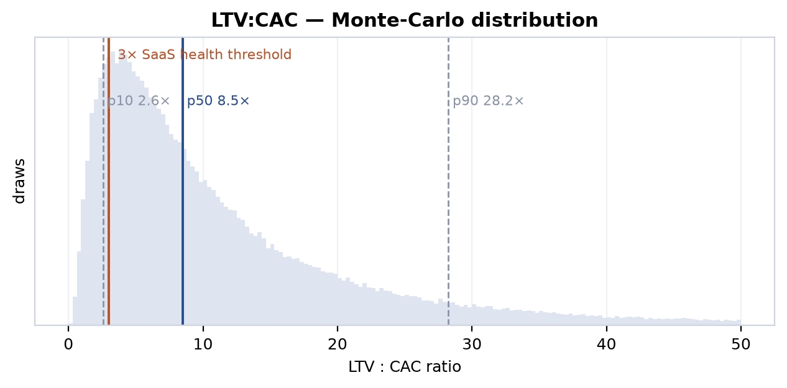

The median clears the 3× SaaS-health line comfortably, and the right tail is genuinely attractive. But the honest sentence is the one about the left tail: **the p10 outcome of 2.56× sits below the 3× floor.** The economics are *plausible*, not *proven* — roughly one modeled draw in ten breaks the line that venture underwriting treats as the minimum. The enormous standard deviation (16.5 against a mean of 13.3) is not noise to be smoothed away; it is the faithful report of how little we know when every input is an assumption and none is an observation. A single headline "8.5× LTV:CAC" would be a category error. The distribution is the claim.

### The comparables band and the valuation question

Because there is no ARR, a revenue multiple cannot produce a valuation — it can only describe the neighborhood MetroGraph would enter if it arrived. The corpus indexes thirty financing comps across graph-DB, visualization, workflow-automation, and low-code categories (median 33.0×, range 6.0×–80.0×). A representative slice of the named comps:

| Company | Stage | Revenue multiple |
| --- | --- | --- |
| Temporal | Series B | 66.7× |
| n8n | Series C | 62.5× |
| Mage | Series A | 50.0× |
| Dagster | Series C | 50.0× |
| Graphistry | Series C | 41.7× |
| Retool | Series C | 26.7× |
| Airtable | Series F | 24.5× / 23.0× |
| Webflow | Series B | 18.8× |
| Grafana Labs | growth | 16.7× |
| Figma | IPO | 16.7× |
| Zapier | secondary | 16.1× |
| Neo4j | Series F / PE | 13.3× / 11.0× |
| Creatio | Series B | 6.0× |

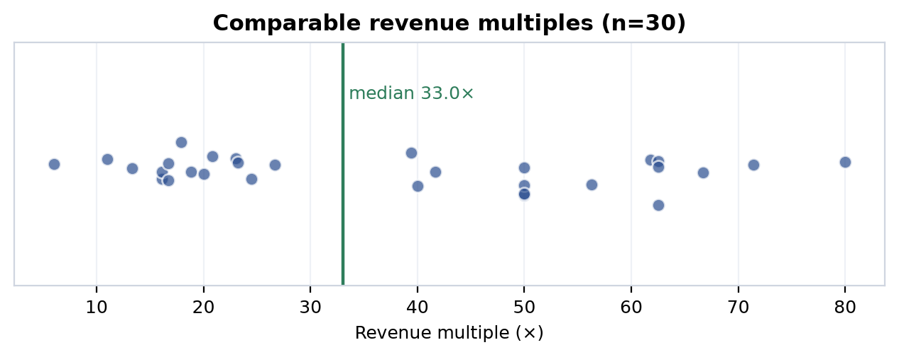

The spread is the story. The high end is dominated by recent rounds carrying an AI-narrative premium — n8n's 62.5×, Temporal's 66.7×, the Series-A and -C estimates near 80× — while the durable, post-maturation multiples cluster far lower: Stripe normalized to 17.9× as developer infrastructure matured <sup>[c150]</sup>, and dev-tool/analytics multiples broadly compressed from the 14–26× of the 2019–2021 era to roughly 10–17× by 2024–2025 <sup>[c151]</sup>. Claim <sup>[c152]</sup> takes the conservative, tightened cut — a curated n=8 of the closest comparables trading at 9.5×–37.4× (median 17.5×) — and draws the only honest conclusion: a pre-revenue MetroGraph has no ARR to multiply, so any valuation is **an option on reaching the SOM band, not a multiple-based mark**.

That SOM band is the modeled serviceable-obtainable market carried forward from the market chapter: at 18% SAM penetration (p50), $1,200 ARPU, 1.18× NRR, and 3.5% churn, the cohort math yields a $37.6M–$226.3M ARR band with a p50 near $93.6M <sup>[c153]</sup> — itself among the lowest-graded of the unit-econ claims (**speculative**, evidence grade *low*, tied with <sup>[c142]</sup>), because it stacks the SAM-penetration assumption on top of all the unit-economics assumptions. The valuation is therefore an option on an estimate built on estimates. The corpus reports it as exactly that.

One comps claim must be flagged explicitly. Claim <sup>[c154]</sup> — which argues a 15–22× multiple is defensible at scale against a 6–27× comps range, discounting n8n's 62× as an AI-pivot artifact — carries the verdict **disputed**, and it is reported here as disputed, not quietly upgraded. The dispute is real: the same n=30 set has a *median* of 33.0×, well above the claim's 6–27× framing, so whether the relevant band is the conservative low-teens or the inflated high-30s is genuinely contested by the data. We surface the disagreement rather than resolve it by assertion.

The valuation-stage claims around this band are all speculative and serve as orientation, not targets: a $15–50M seed band benchmarked to Memgraph's early ~$19M <sup>[c155]</sup>, a $100–300M Series-A band conditional on traction matching workflow-automation entrants <sup>[c156]</sup>, and a market-tailwind argument resting on a graph-DB market growing 14–16% and a diagramming segment projected from $2.17B to $12.07B by 2035 <sup>[c157]</sup>. The tailwind cuts both ways as precedent: Supabase's 11.7× valuation run was *earned by* a 10.6× ARR expansion from $16M to $170M <sup>[c158]</sup>, and Zapier reached $310M ARR on $1.4M of capital <sup>[c159]</sup> — proof that the multiples follow revenue, which MetroGraph does not yet have. The comps describe where the door leads; they say nothing about whether MetroGraph walks through it.

### Sensitivity: which assumptions own the spread

If the outputs are distributions, the right diagnostic question is *which inputs drive the width*. Two views answer it. The first simply records how wide each input assumption is — its p10-to-p90 range and p50 — since an input the model barely varies cannot move the output much. To keep the two diagnostics reconcilable, the rows below are **exactly the inputs of the two runs decomposed in the next table**: the three drivers of the market `som` run (the source of the $37.6M–$226.3M SOM band) and the four drivers of the `finance-ltv-cac` run, each taken from the same assumption rows that produced the reported distributions:

| Model | Driver | p10 | p50 | p90 | spread (p90/p10) |
| --- | --- | --- | --- | --- | --- |
| SOM | obtained penetration (`som_share`) | 0.2% | 0.5% | 1.0% | 5.0× |
| SOM | serviceable share of envelope (`sam_share`) | 12% | 18% | 25% | 2.1× |
| SOM | addressable envelope (`tam_usd`) | $90B | $100B | $120B | 1.3× |
| LTV:CAC | ARPU (`arpu`) | $450 | $1,200 | $3,600 | 8.0× |
| LTV:CAC | CAC (`cac`) | $180 | $320 | $580 | 3.2× |
| LTV:CAC | logo churn (`logo_churn`) | 1.5% | 3.5% | 5.5% | 3.7× |
| LTV:CAC | gross margin (`gross_margin`) | 72% | 79% | 86% | — |

Input width alone, though, does not establish influence — a wide input the output happens to be insensitive to still contributes little. The genuine diagnostic is a *variance decomposition*: the Spearman rank-correlation of each input with the model output across all 10,000 draws (seed 42), reported alongside its squared, normalized share of the output's explained rank-variance. Unlike the input ranges above, this **is** an empirical attribution of where the output spread comes from — computed from the simulated draws themselves by the engine's `ingest sensitivity` pass (reproducible at seed 42, n=10,000), not asserted:

| Model | Driver | Spearman ρ | Share of variance |
| --- | --- | --- | --- |
| SOM (`som_usd`) | obtained penetration of SAM (`som_share`) | +0.88 | ~61% |
| SOM (`som_usd`) | serviceable share of envelope (`sam_share`) | +0.39 | ~27% |
| SOM (`som_usd`) | addressable envelope (`tam_usd`) | +0.16 | ~11% |
| LTV:CAC (`ltv_cac_ratio`) | ARPU (`arpu`) | +0.86 | ~60% |
| LTV:CAC (`ltv_cac_ratio`) | CAC (`cac`) | −0.47 | ~33% |
| LTV:CAC (`ltv_cac_ratio`) | gross margin (`gross_margin`) | +0.07 | ~5% |
| LTV:CAC (`ltv_cac_ratio`) | logo churn (`logo_churn`) | −0.02 | ~1% |


The decomposition is unambiguous about where the spread lives. The SOM band is **~61% determined by a single input** — `som_share`, the obtained penetration of the serviceable market (ρ = +0.88) — with serviceable share (~27%) and the addressable envelope (~11%) trailing; the entire SOM distribution effectively turns on the one assumption MetroGraph has no data behind. The LTV:CAC band is **~60% ARPU and ~33% CAC** (the CAC correlation is negative, exactly as it should be — higher acquisition cost lowers the ratio), with gross margin and logo churn together under 6%. Both headline spreads therefore collapse to two pre-revenue assumptions — obtained penetration and ARPU — which is precisely why the financial figures in this chapter are option-value bounds, not marks: tighten those two inputs with real cohort data and most of the width disappears, but only telemetry can tighten them, and there is none.

One caveat survives the upgrade. This is a variance decomposition of the **model**, computed from its own assumption-driven draws — it faithfully reports which inputs the *model* is most sensitive to, not which factors will move a real revenue line. MetroGraph is pre-revenue: there are no realized outcomes to regress against. The decomposition tells us where to look first the moment data exists — `som_share` and `arpu` — and nothing about what those values actually turn out to be.

### What the model does and does not say

Three threads pull together honestly. First, the financial uncertainty here is not ordinary forecasting noise — it is the propagated uncertainty of a model with **zero observed inputs**, and the p10 tail that breaks the 3× line <sup>[c149]</sup> is the standing reminder that the median case is not the only case. Second, this financial risk *compounds* the wedge risk argued throughout the dissertation: the revenue model implicitly assumes that the metro/agent-state differentiation earns the $1,200 ARPU and 1.18× NRR premiums over the dev-tools benchmark, yet that differentiation is itself capped at supported-by-proxy and carries pending-experimental-validation. Betting ARPU and retention on an unproven wedge adds a layer of risk the Monte-Carlo cannot quantify, because the distributions are drawn from *generic* SaaS benchmarks, not from MetroGraph's unvalidated premium. The model prices the category; it cannot price the bet.

Third, the empty intake — no ARR, no CAC observation, no churn curve, no telemetry — is not a gap to be apologized for but the load-bearing honesty of this chapter. The comps bound an option value; the Monte-Carlo widths report what we don't know; the disputed revenue-multiple band is flagged disputed; and the path to a tighter model is not more assumptions but the first cohort of real customers. What Part X receives is therefore explicitly a band, never a mark: the SOM range ($37.6M–$226.3M, p50 $93.6M), the LTV:CAC distribution (p10 2.56× / p50 8.47× / p90 28.2×), and the comps band (9.5×–37.4×, median 17.5×) — three distributions for the synthesis to render non-divergently into the decision artifacts, each carrying its uncertainty intact.

---

## Part X — Strategy Synthesis & the Standing Bear Case

Every prior chapter graded one slice of the MetroGraph thesis against one body of evidence: the market whitespace, the HCI floor, the product's shipped reality, the customer voice, the financial comps, the governance gaps. This chapter does the one thing none of them is permitted to do — it reads all of them at once and renders a verdict. The strategy layer is the corpus's synthesis tier, and its discipline is precisely that it *synthesizes* rather than *decides*: it computes a priority-ranked action set, counts the dated competitor moves that contest each wedge, fires the red-team falsifiers, and projects the result into a non-divergent family of artifacts — all without upgrading a single verdict it did not earn. The conclusion is not a victory lap. The wedge is contested, the strongest falsifier is fatal and still live, and the only honest ceiling remains supported-by-proxy. What follows is how the machine arrives there.

### The synthesis stance: read-only by construction

The strategy domain holds no primary evidence of its own. It owns no interviews, no usability sessions, no benchmarks — its tables are *derived*: re-graded wedge claims, query-ranked recommendations, inference-derived contested-wedge claims, and projection blocks. Its sole inputs are the graded claims and typed edges already standing in the other domains. The architectural guarantee is the conflation guard (C5): the synthesis layer reads cross-domain READ-ONLY and never mutates another domain's verdicts. The corpus verifies this empirically — the `market.claims` snapshot diff across the synthesis run stays 0/0/0 (zero added, zero changed, zero removed). When strategy "uses" a refuted market claim, it cites it at its refuted grade; it cannot launder a hypothesis into a result by touching it.

This is why the standing bear case carries weight. A synthesis layer that could quietly promote its own conclusions would be marketing. One that is structurally forbidden from doing so, and that *still surfaces a fatal falsifier against its own thesis*, is an audit. The honesty is mechanized, not promised.

### Recommendations ranked by derived priority

The recommendations are not hand-ordered. Each carries an `impact`, a `confidence`, and an `effort`, and the priority score is impact × confidence scaled by effort — a query over the underlying graded claims, not an author's preference. The ranking that falls out is below.

| Rank | Recommendation | Kind | Impact | Conf. | Effort | Priority |
|---|---|---|---|---|---|---|
| 1 | Run the layout A/B (metro vs force-directed; n≥40 within-subject) | experiment | 0.70 | 1.00 | m | **0.350** |
| 2 | Defend canvas as CONTESTED — lead on schema depth, not canvas novelty | positioning | 0.75 | 0.45 | m | 0.169 |
| 3 | Build Postgres `information_schema` introspection first | integration | 0.80 | 0.40 | m | 0.160 |
| 4 | Run the clutter-at-scale usability study (n≥30, SUS) | experiment | 0.70 | 0.33 | m | 0.116 |
| 5 | Ship the still-planned high-pain wedge features | build | 0.85 | 0.40 | l | 0.113 |
| 6 | Run the direct-manipulation-vs-chat A/B (n≥40) | experiment | 0.70 | 0.25 | m | 0.088 |
| 7 | Run the information-foraging / metro-adoption A/B (n≥40) | experiment | 0.70 | 0.25 | m | 0.088 |
| 8 | Ship the enterprise compliance baseline (SSO/RBAC/MFA/audit) | compliance | 0.90 | 0.40 | xl | 0.072 |

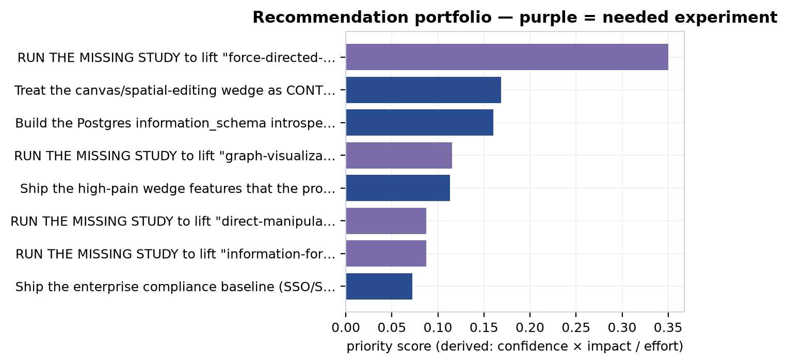

The top recommendation is to *run the missing study* — the pre-registered layout A/B that would lift `force-directed-graph-layout-remains-dominant-but-unoptimized-for-schem` past its proxy ceiling <sup>[c78]</sup>. It ranks first not because its impact is largest (it is not) but because its confidence term is 1.0: there is no uncertainty that running the experiment *would* resolve the question, only uncertainty about what it would find. That is the corpus telling on itself in the clearest possible way — the single highest-priority strategic act is to generate the evidence that does not yet exist. The four experiment recommendations (ranks 1, 4, 6, 7) render as purple "needed-but-missing" roadmap items; each names where it would land — the empty behavioral-intake tables `voc.ab_experiments` and `voc.usability_sessions`, or a *new MetroGraph-specific* primary study in `hci.primary_studies` (which today holds only external HCI-literature studies, never a MetroGraph trial). The voc intake tables are **currently empty**, and no MetroGraph study of its own has ever been run. They are forward work, never assumed done.

The non-experiment recommendations follow the same arithmetic. "Defend canvas as contested" (rank 2) is positioning, not a build, and cites the competitive intel that motivates it <sup>[c160]</sup> <sup>[c161]</sup> <sup>[c162]</sup>. "Postgres-first integration" (rank 3) cites the connector-priority claims <sup>[c102]</sup> <sup>[c103]</sup> <sup>[c105]</sup> <sup>[c104]</sup>: Postgres wins on reach, with the honest caveat that the connector is commoditized and differentiation must live in the visualization layer. "Ship the wedge features" (rank 5) cites the shipped-reality claims from the product corpus <sup>[c163]</sup> <sup>[c164]</sup> <sup>[c165]</sup> <sup>[c166]</sup>. Enterprise controls (rank 8) score lowest on derived priority despite the highest impact (0.90), because the xl effort term divides it down — yet it remains a hard gate, citing the governance roadmap claims <sup>[c121]</sup> <sup>[c137]</sup> <sup>[c118]</sup> <sup>[c136]</sup>.

### Competitive landscape & macro tailwinds

The wedge does not erode in a vacuum; it erodes inside a market that is, by every available measure, expanding and consolidating at the same time. Before the dated drumbeat of competitor moves, it is worth setting the macro backdrop the competitive-intel layer has logged — because the same forces that open MetroGraph's opportunity are the ones closing its window. The supported findings here are real, dated market facts evidenced by secondary sources rather than measured in this corpus, so they are stated plainly; the market-size figures that follow are third-party projections, and those are flagged as speculative.

The unit economics of agentic software have been rewritten. LLM inference token costs fell roughly 95% between 2022 and 2025, collapsing to pennies per complex task and making the agent-node features that incumbents are racing to ship economically routine rather than exotic <sup>[c167]</sup>. The retrieval substrate has moved in a graph-native direction too: GraphRAG crossed from experimental to production with its v1.0 release in late 2024 and sits on an enterprise-adoption trajectory near 85% <sup>[c168]</sup>, with knowledge graphs outperforming classic vector RAG by roughly 3.4× on complex relationship queries <sup>[c169]</sup>. That is the strongest structural argument for a schema-comprehension product — the market is rediscovering that relationships, not flat chunks, are where the value lives — and the multi-model databases positioned for those workloads, such as ArangoDB, already show 1.3×–8× advantages over single-model incumbents <sup>[c170]</sup>.

The same body of evidence cuts the other way, and just as hard. The data- and workflow-tooling layer is consolidating: Salesforce's $8B acquisition of Informatica, Snowflake's purchase of SelectStar, Atlassian's of Secoda, and ServiceNow's of data.world form a single wave of incumbents buying their way into the metadata and lineage adjacency MetroGraph would occupy <sup>[c171]</sup>. The open-source signal points the same way: Memgraph (BSL 1.1, $25K/yr) and ArangoDB (BSL 1.1, 100GB cap) have both abandoned permissive licensing for source-available restrictions — a textbook value-capture move that marks a maturing, consolidating category rather than a green field <sup>[c172]</sup>. And the most direct adjacency, Airtable, is mid-transformation from a single-product table editor into a multi-product, AI-native platform <sup>[c173]</sup> — the incumbent expansion the erosion timeline below logs move by move.

Around these dated facts sit a set of third-party market-size projections. These are forecasts, not measurements; the corpus grades them speculative and they are useful as direction-of-travel, not as load-bearing numbers.

| Projection (speculative) | Source claim |
|---|---|
| Graph-DB market → $11.35B by 2030 (~27.9% CAGR from $3.31B in 2025) | <sup>[c174]</sup> |
| Low-code market $48.9B (2026) → $376.9B by 2034 (~29.1% CAGR) | <sup>[c175]</sup> |
| ~75% of orgs integrate visual-modeling/ERD tools into core DB workflows by 2026 | <sup>[c176]</sup> |
| ~40% of enterprise apps embed task-specific AI agents by 2026 (from <5% in 2025) | <sup>[c177]</sup> |

Read together, the picture is double-edged, and that is precisely the point. The token-cost collapse, the GraphRAG production crossover, and the agent-adoption ramp expand the addressable opportunity for a graph-native, schema-legible, agent-aware tool. But the consolidation wave, the BSL licensing retreat, and the incumbent multi-product moves mean the window is closing about as fast as it is opening. This is the macro context for everything that follows: the contested-wedge claims below quantify the crowding, the erosion timeline dates the moves through which the window narrows, and the red-team falsifiers test whether MetroGraph's wedge survives them.

### The standing bear case: nine contested-wedge claims

The bear case is not an editorial counterpoint; it is a set of *derived claims*. The reasoning layer reads the `erodes` edges that the competitive-intel temporal layer attaches to each wedge feature and, where the count is material, emits a contested-wedge claim — quarantined as speculative until a verification pass could promote it. Nine such claims now stand. The two load-bearing ones are the canvas wedge, eroded by 19 dated moves <sup>[c6]</sup>, and the agent-orchestration wedge, eroded by 11 <sup>[c7]</sup>. Each reads the same way: first-mover differentiation here is *speculative pending a defensibility moat*. The full erosion-by-wedge count is below.

| Wedge feature | Erosion count |
|---|---|
| nodes-agent-type | 20 |
| canvas | 19 |
| canvas-pan-zoom | 11 |
| agent-orchestration | 11 |
| nodes | 9 |
| data-binding | 7 |
| ai-assist-data-exploration | 5 |
| edges | 5 |
| ai-assist | 5 |

The heaviest erosion lands exactly where the bet is boldest: agent-typed nodes (20) and the canvas (19). These are not modest signals — they are the corpus's own count of how crowded the supposed whitespace has become. And the derived claims carrying them are speculative and quarantined, with **zero primary backing**, because the entire strategy and competitive-intel layers are 0 primary-backed by construction. The bear case is real, but it is itself a hypothesis about competitors' trajectories, graded honestly as such.

### The erosion timeline

The counts above aggregate a dated drumbeat. The competitive-intel layer logs each move with an observed date, a signal strength, and a flag for whether it erodes a feature MetroGraph claims — 101 such `compintel.changes` rows in all. The table below is a representative 9-of-101 sample, chosen to show the two convergent campaigns — canvas/spatial editing and first-class agent nodes — running through late 2025 into mid-2026; the full 101 are what the per-wedge counts above tally and what the `watch` layer rescans.

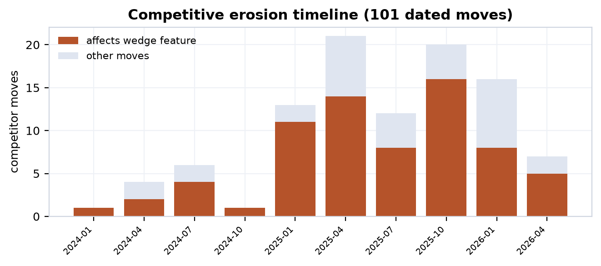

| Date | Company | Move | Erodes wedge |
|---|---|---|---|
| 2025-10-15 | Airtable | Acquires DeepSky (AI superagent) | yes |
| 2025-12-03 | Node-RED | 5.0 — biggest editor-UX change in project history | yes |
| 2026-01-15 | n8n | AI Agent node (v1.28): tool calling, memory, ReAct trace | yes |
| 2026-01-27 | Airtable | Launches Hyperagent (parallel agent orchestration) | yes |
| 2026-02-01 | n8n | Canvas UI (v1.30): free node placement, grouping, clusters | yes |
| 2026-02-01 | Zapier | Unified agent templates hub (80+ agents) | yes |
| 2026-05-05 | Gephi | 0.11 — rebuilt OpenGL engine, ~30× faster, 10M elements | yes |
| 2026-06-09 | Node-RED | 5.0 GA — split-panel canvas, redesigned sidebars | yes |
| 2026-06-26 | Retool | Up to $10k/yr AI credits to drive agent adoption | yes |

Three threads run through this timeline. The canvas thread — n8n's Canvas UI, Retool's multipage push, Node-RED 5.0, and ToolJet — converges independently on spatial-first editing, the basis of the convergence claim <sup>[c160]</sup>. The agent thread — n8n's AI Agent node, Zapier agent versions and templates, Flowise AgentFlow V2, Airtable Hyperagent, and Retool Agents — races to ship first-class agent nodes, the arms-race claim <sup>[c161]</sup>. The rendering thread — the graph-viz incumbents Linkurious Ogma, Cytoscape WebGL, Gephi's 30× OpenGL rewrite, and yFiles — raises the large-graph rendering floor 30–40×, which means a metro-layout wedge must win on *comprehension*, not on raw scale <sup>[c162]</sup>. All three are changelog- or analyst-derived predictive claims graded speculative; none is primary-backed.

### The competitive-intelligence substrate

The erosion counts and the timeline rest on a larger evidentiary base than the nine-row sample lets on, and it is worth surfacing what that base is — because it is also the substrate the self-updating `watch` layer reads. compintel is the only one of the nine corpus domains without a chapter of its own; its load-bearing tables are folded into this synthesis, so this is where they get characterized. Three tables do the work: 101 dated `changes` (the hard, datable competitor moves tallied above), 20 `signals`, and 24 `intel_snapshots`.

The 20 `signals` are the softer leading indicators the dated changelog cannot capture — hiring patterns, repository-activity velocity, partnerships, funding, license shifts, and architecture trends — each carrying an `observed_date`, a `signal_type`, and an explicit `interpretation`, running from 2025-05-27 to 2026-06-01. They span thirteen signal types: partnership and m&a/consolidation signals (Salesforce-Informatica and the broader catalog/lineage roll-up <sup>[c171]</sup>; Apple-Kuzu and The Guild-Grafbase folding graph startups in), license and commercial-model shifts (Memgraph and ArangoDB abandoning permissive licensing <sup>[c172]</sup>; Hasura deprecating self-hosted enterprise DBs), competitive-intensity benchmarks (ArangoDB's 1.3×–8× wins over Neo4j <sup>[c170]</sup>), hiring/repo-velocity reads on agentic build-outs (Hex, Atlan, dbt's Rust Fusion engine), and adoption-trend signals (the G2 survey putting 57% of companies with agents in production, corroborating the analyst forecast of ~40% of enterprise apps embedding agents by 2026 <sup>[c177]</sup>). One signal is tagged to MetroGraph itself — the Gartner read that visual-canvas/ERD adoption rises to ~75% of organizations by 2026 — and it is logged as a tailwind, not a measured MetroGraph result. These signals are interpretive by construction; like the `changes`, they carry no primary backing and feed the bear case as dated context, not proof.

The 24 `intel_snapshots` are point-in-time captures of competitor state — the before/after reference frames that make change detectable. A snapshot on its own asserts nothing about MetroGraph; its value is differential, and that is exactly what the `watch` layer consumes.

This closes the loop with the `watch` mechanism described elsewhere in the synthesis. `watch --since <DATE>` scans this temporal layer — the 101 `changes` and the 20 `signals`, against the `intel_snapshots` baselines — for any move after a cutoff that erodes a wedge feature or fires a red-team falsifier, and raises the affected recommendations and wedge claims for recomputation. It is read-only: it surfaces what changed and what must be re-graded, but never silently mutates a verdict. The `watch` layer exists precisely because the zero is perishable — a contested-canvas count of 19 or an agent-node count of 20 is a fact about a date, and these three tables are the dated evidence the whole synthesis rests on. They are what keeps the bear case honest as the market moves underneath it.

### Three fired red-team falsifiers

The red-team layer wires explicit falsifiers to live signals and lets them fire. Three have fired, and the corpus reports them as fired — not as resolved, not as mitigated-away.

| Falsifier | Targets | Severity | Status | Mitigation |
|---|---|---|---|---|
| layout-unproven | schematic-maps-outperform-force-directed | **FATAL** | **fired** | Run the pre-registered layout A/B before betting positioning on layout superiority |
| canvas-commoditized | graph-visualization-clutter-at-scale | MAJOR | fired | Pivot the narrative from canvas novelty to schema-comprehension depth |
| agent-arms-race | agent-node-arms-race | MAJOR | fired | Differentiate on agent-state *visualization* depth, not agent execution |

The fatal one is the keystone of the whole thesis. The HCI literature is split — Sugiyama hierarchical layouts can beat orthogonal ones, and force-directed wins on certain path-finding and subgraph tasks — so the claim that metro/schematic layout outperforms is **refuted on the current cross-domain evidence**, surviving only as a hypothesis pending the named A/B, never as a measured MetroGraph result <sup>[c3]</sup>. This falsifier is live, and its mitigation is not a rebuttal but the top-ranked recommendation: the layout A/B. The corpus does not pretend the falsifier is answered; it points at the experiment that would answer it and leaves the verdict where the evidence puts it. The two major falsifiers attach to the same canvas and agent erosion already counted <sup>[c79]</sup> <sup>[c161]</sup>, and their mitigations are the positioning pivots in recommendations 2 and 8 — reframings, not refutations. The wedge is CONTESTED, not won.

### Render non-divergence and verdict glyphs

The synthesis projects into a small family of artifacts — strategy memo (5 blocks), investor deck (5), a Neo4j battlecard (3), and a board update (3) — and its honesty property is *structural*. A shared metric renders byte-identically across every artifact that uses it: the modeled SOM band of $37.6M / $93.6M / $226.3M (p10/p50/p90) is the same string in the memo and the deck, and the bounded 3-year LTV:CAC band of 2.6× / 8.5× / 28.2× is the same wherever it appears <sup>[c149]</sup>. There is no slide-deck dialect of the truth. Each block also carries a verdict glyph that travels with the figure and prevents category errors: **proxy** for the lead wedge claim (supported-by-proxy / pending-experimental) <sup>[c79]</sup>, **modeled** for the Monte-Carlo metrics, **speculative** for the comps valuation band <sup>[c152]</sup> and the canvas-erosion risk <sup>[c160]</sup>, and **supported** only for the genuinely-evidenced enterprise-gate risk. A proxy-only wedge literally cannot render as a measured result; a modeled estimate cannot render as a guarantee. The glyph is the typographic enforcement of the same rule the conflation guard enforces in the data.

### The knapsack decision

A ranking is not yet a plan, because effort is finite. The decision layer runs an exact 0/1 knapsack over the eight recommendations, with effort weights s=1, m=2, l=3, xl=5, maximizing total derived priority within a budget. The arithmetic is unforgiving in a useful way. The four highest-density items — the layout A/B (priority 0.350, effort m), defend-canvas (0.169, m), Postgres-first (0.160, m), and the clutter usability study (0.116, m) — together cost 8 effort points and capture the bulk of the available priority. The enterprise-controls baseline, despite the highest raw impact, is the worst density bet (0.072 priority for 5 effort points) and is the first thing deferred under a tight budget: a hard gate for the enterprise segment, but not the right *first* spend when revenue and the wedge itself are unproven. The committed set is the experiments plus the cheap, high-leverage positioning and integration moves; the deferred list is the expensive build and compliance work that becomes urgent only once the wedge survives contact with the layout A/B. The knapsack thus encodes the thesis's own sequencing: prove the bet before you fund the platform around it.

### The honest bottom line

The synthesis lands where the through-line demanded it must. Across market whitespace, the HCI floor, the shipped product, customer voice, the financial comps, and now the competitive drumbeat, the same thirteen wedge claims have been weighed and never inflated. The canvas is contested by 19 dated moves and the agent-typed-node wedge by 20; the fatal layout falsifier is fired and unanswered; the strongest financial figures are modeled bands with a p10 tail below the 3× health line, not marks. The empty intake tables — `voc.interviews`, `voc.surveys`, `voc.usability_sessions`, `voc.ab_experiments`, and `market.primary_studies`, all at zero — are the standing pending-experimental marker, and the corpus surfaces that emptiness as the top of its own priority ranking. The defensible conclusion is narrow, and it is the right one: MetroGraph's edge cannot come from canvas novelty or agent-node presence, both commoditizing in real time. It can only come from schema-comprehension depth — the metro/schematic layout's ability to make database structure legible — and that, precisely, is the one claim the named A/B has not yet been run to prove. The wedge is defensible-in-hypothesis, capped at supported-by-proxy, with the path upward written down as pre-registered studies rather than asserted as results.

---

## Part XI — Forward Research Roadmap

### From caps to a program of work

Every preceding chapter converged on the same disciplined refusal: the thirteen wedge claims that constitute MetroGraph's bet are defensible-in-hypothesis but capped at *supported-by-proxy*, and the corpus marks that ceiling rather than papering over it. This chapter does the only honest thing left to do with a cap — convert it into a forward program. If a claim is held down by the absence of a study, then naming that study precisely — its design, its dependent variables, its sample size, and the exact intake table it would land in — is the difference between a hypothesis and a wish.

The framing throughout is unsparing: **none of the work described here has been run.** The proof of that is structural, not rhetorical. The behavioral-evidence intake tables are empty, and they are empty *now*, by design:

| Intake table | Rows |
| --- | --- |
| `voc.interviews` | 0 |
| `voc.surveys` | 0 |
| `voc.usability_sessions` | 0 |
| `voc.ab_experiments` | 0 |
| `hci.primary_studies` — MetroGraph-specific studies (dormant for MetroGraph) | 0 (of 21 total; the 21 rows are external HCI-literature studies, none MetroGraph-specific) |
| `market.primary_studies` | 0 |

These zeroes are the standing pending-experimental marker for the entire synthesis. A wedge claim cannot rise above proxy because there is no row in `voc.ab_experiments` or `market.primary_studies` to lift it. The roadmap below is therefore a roadmap of *inputs that do not yet exist*. Nothing here should be read as scheduled-and-certain, and — the hardest discipline of all — we do not assume the data will ever arrive. A pre-revenue tool with no behavioral telemetry can name the experiments it needs without presuming it will get to run them.

### The four priority experiments

The strategy layer's recommendation engine surfaces four needed-but-missing MetroGraph studies. Each is tied to exactly the wedge claim it would lift past its proxy ceiling, and each carries a derived priority score — computed, not hand-set — alongside an effort estimate.

| # | Needed study | Lifts claim | Verdict today | Design / DVs | n | Lands in | Priority | Effort |
| --- | --- | --- | --- | --- | --- | --- | --- | --- |
| 1 | Metro/schematic vs force-directed layout A/B on schema-comprehension + path-finding | <sup>[c78]</sup> | supported | task time, error rate | ≥40 within-subject | `voc.ab_experiments` / `hci.primary_studies` | 0.350 | m |
| 2 | Surface-area / progressive-disclosure usability vs full-canvas control | <sup>[c79]</sup> | disputed | time-on-task, error count, SUS | ≥30 | `voc.usability_sessions` | 0.116 | m |
| 3 | Direct-manipulation vs chat: visual graph view vs conversational control of the same agent workflow | <sup>[c4]</sup> | refuted | success rate, trust calibration, time-to-detect-error | ≥40 | `voc.ab_experiments` | 0.088 | m |
| 4 | Information-foraging: metro vs force-directed on schema-comprehension + path-finding | <sup>[c36]</sup> | refuted | task time, error rate | ≥40 within-subject | `voc.ab_experiments` / `hci.primary_studies` | 0.088 | m |

The verdicts beside these studies are where the honesty bites. Two of the four featured claims read **refuted** today (<sup>[c4]</sup>, <sup>[c36]</sup>) and one reads **disputed** (<sup>[c79]</sup>). They are listed not as findings about to be confirmed but as hypotheses whose only legitimate route to a higher grade is the specific study named beside them. A refuted claim is not promoted by argument; it is promoted — or stays refuted, or falls further — by the pre-registered experiment that has not yet been conducted. The priority score is the corpus's view of *where the next study buys the most lift*, and it ranks the layout A/B first by a wide margin because that single study touches the largest cluster of dependent wedge claims.


### The thirteen wedge experiments and their ceilings

Beneath the four priority studies sits the full ledger. Each of the thirteen wedge claims carries `pending_experimental = TRUE` and a derived cross-domain ceiling, and each is moved by exactly one experiment archetype. Three archetypes recur — a layout A/B (task time + error rate, n≥40 within-subject), a direct-manipulation-vs-chat task-success test (success rate, trust calibration, time-to-detect-error, n≥40), and a progressive-disclosure usability study (time-on-task, error count, SUS, n≥30) — and every one of them lands in a currently empty intake table. The `wedge_experiments` ledger below pairs each claim's standing cap with the calibrated confidence behind it and the single archetype that would move it.

| Wedge claim | Ceiling | Conf. | Needed experiment archetype |
| --- | --- | --- | --- |
| <sup>[c5]</sup> | contested | 0.35 | direct-manipulation vs chat |
| <sup>[c65]</sup> | contested | 0.35 | layout A/B |
| <sup>[c77]</sup> | contested | 0.35 | direct-manipulation vs chat |
| <sup>[c37]</sup> | contested | 0.35 | direct-manipulation vs chat |
| <sup>[c4]</sup> | supported-by-proxy | 0.50 | direct-manipulation vs chat |
| <sup>[c78]</sup> | supported-by-proxy | 0.50 | layout A/B |
| <sup>[c79]</sup> | supported-by-proxy | 0.50 | progressive-disclosure usability |
| <sup>[c36]</sup> | supported-by-proxy | 0.50 | layout A/B |
| <sup>[c80]</sup> | supported-by-proxy | 0.50 | progressive-disclosure usability |
| <sup>[c34]</sup> | supported-by-proxy | 0.50 | layout A/B |
| <sup>[c2]</sup> | weak-proxy | 0.30 | layout A/B |
| <sup>[c1]</sup> | weak-proxy | 0.30 | direct-manipulation vs chat |
| <sup>[c3]</sup> | weak-proxy | 0.30 | layout A/B |

The gradient is instructive. The six claims at *supported-by-proxy* are the strongest the wedge gets; the four *contested* claims sit lower because the HCI literature contradicts as well as grounds them; the three *weak-proxy* claims are the most exposed. No claim reads higher than supported-by-proxy, and the experiment column is the only lever that can change that. None of these is described as measured or proven on MetroGraph — because none has been.

### The HCI design-hypotheses and their status

The HCI layer is the one place in the corpus with genuine primary backing (46 of 49 claims), and it supplies the theoretical floor under the wedge. Its design-hypotheses are explicitly typed by maturity, which keeps the borrow honest: a hypothesis *grounded* in the general literature is not the same as one *grounded-by-theory* for MetroGraph specifically, which is not the same again as one *untested-for-metro-graph*.

| Status | Meaning | Count |
| --- | --- | --- |
| grounded | Established in the general HCI literature | 5 |
| supported | Backed for the agent-visualization case | 3 |
| grounded-by-theory | Predicted for MetroGraph from theory, not yet tested on it | 5 |
| active | Open design hypothesis under the cognitive-load program | 5 |
| untested-for-metro-graph | No MetroGraph-specific evidence at all | 6 |
| mixed | Evidence cuts both ways | 1 |

The crucial honesty is the distance between the first categories and the last three. The schematic-wayfinding hypotheses — that metro-style layouts cut wayfinding time, that transit familiarity transfers, that stable spatial encoding speeds mental-model construction — are *grounded* in the general literature but map to no MetroGraph claim and have never been run on MetroGraph's actual canvas. The five *grounded-by-theory* hypotheses (animated transitions reduce gaze refixations; infinite-canvas regions distribute load; metro semantics raise information scent; metro layout enables preattentive recognition; 300–500ms is the optimal animation window) are exactly the bridge from literature to product — and exactly the bridge that an experiment, not an argument, must cross. The six *untested-for-metro-graph* hypotheses are blunt about it: edge-crossing load, extraneous-load reduction, the metro-layout advantage, progressive-disclosure acquisition, stable-encoding transfer, and affordance-without-training each carry a fully specified what-would-validate protocol (eye-tracking fixation counts, NASA-TLX subscales, between-subjects success rates) and a verdict of *untested*. The validation criteria are written; the validation is not done.

### The product roadmap: validation experiments and build items

The product roadmap splits cleanly into two kinds of work. The first is **validation experiments tied directly to refuted market claims** — the roadmap's way of saying that a claim the corpus marked false will be revisited only by evidence, never by reassertion.

| Validation experiment | Tests refuted claim | Effort |
| --- | --- | --- |
| User study: visual affordances reduce gulf of execution | <sup>[c37]</sup> | high |
| A-grade HCI cost study on 8 critical features vs n8n/Make/Zapier | <sup>[c17]</sup> | high |
| Validate pane-count cognitive penalty (CLT) | <sup>[c39]</sup> | medium |
| Measure surface-area reduction: metro-map vs dense canvas | <sup>[c178]</sup> | medium |
| Audit layout-control discoverability | <sup>[c18]</sup> | medium |
| Validate orchestration + visualization cluster for data engineers | <sup>[c179]</sup> | medium |
| Low-code UI-complexity tradeoff study | <sup>[c19]</sup> | medium |
| Async-collaboration friction study | <sup>[c20]</sup> | medium |

Each row attaches to a claim the corpus currently reports as **refuted**, and the roadmap preserves that verdict. The study is the price of revisiting it.

The second kind is **build work** — the shipped-reality gaps the product chapters documented. Two items are in progress: completing the disabled MongoDB visual query builder, and an enhanced execution-logs and debugging UI. The rest are planned and largely table-stakes: undo/redo and edit history (which needs a transaction/event-log architecture), multi-format export (JSON/SVG/PNG), keyboard shortcuts and a command palette, real-time collaboration, Git integration, an agent/workflow orchestration runtime, and — the performance line that bounds the whole scale story — **render optimization for 10K+ nodes**, where the tool is benchmarked today to roughly 1,000 nodes and needs virtualization to go further. Supporting infrastructure rounds it out: a node-count/frame-rate render budget (none defined today), bundle-size reduction (current 20MB-error / 30MB-warning budgets, target <5MB), and a component-style-budget audit. These build items are not evidence claims; they are the engineering preconditions that make the validation experiments worth running on a product that can actually carry the load.

### The governance remediation roadmap

Governance is the enterprise gate, and the chapter on it reported the honest finding for an early-stage tool: a wall of blocker-severity compliance gaps. The remediation ledger holds roughly two dozen **blocker** items, one **important**, and seven **major**, each with an effort estimate and, where a regulation imposes one, a deadline. Those deadlines are the sharpest items on the whole roadmap, because unlike experiments they are externally clocked.

| Remediation | Severity | Deadline / scope | Effort |
| --- | --- | --- | --- |
| Universal MFA (NIST, phishing-resistant FIDO2) | blocker | March 31, 2025 — **overdue** | high |
| AI-use transparency disclosure | blocker | Aug 2, 2026 — **imminent** | high |
| Machine-readable synthetic-content marking | important | Dec 2, 2026 | medium |
| SOC2 CC1–CC9 controls + audit | blocker | ~6mo build + 6mo audit, $50–100k | ultra |
| FedRAMP authorization (SSP, 323 controls, 3PAO) | blocker | 6–12mo, $50–150k | ultra |
| SOX top-down risk assessment + external audit | blocker | 12–16wk prep + 6mo audit | ultra |
| SSO / OAuth2 / SAML + IdP group sync | blocker | 8–12 weeks | high |
| Mandatory ePHI encryption (TLS 1.3, AES-256) | blocker | 6–8 weeks | high |
| Immutable, queryable audit-log system | blocker | 10–14 weeks | high |
| Workspace-scoped RBAC (Admin/Editor/Viewer) | blocker | 6–8 weeks | high |
| GDPR Art. 17 deletion workflow + DPA template | blocker | — | high |
| EU data-residency deployment (Schrems II) | blocker | 12–16 weeks | ultra |
| Column-level access control + data classification | blocker | — | xl / l |

The shape of the ledger matters. The heaviest items — SOC2, FedRAMP, SOX, EU residency — are *ultra* effort measured in quarters and tens-to-hundreds of thousands of dollars, while the most urgent — the overdue MFA deadline, the imminent August 2026 AI-transparency obligation — are comparatively cheap but already past or nearly due. The roadmap does not pretend any of this is done; the governance gaps remain open, and each line is a dated commitment, not a claim of compliance.

### Handoff to the conclusion

What this chapter hands forward is an inventory of the unknown and the unrun. Four priority experiments, all landing in empty intake tables. Thirteen wedge claims, every one capped and every one carrying a single named study as its only route upward. A graded HCI hypothesis set whose strongest items are *grounded-by-theory* and whose MetroGraph-specific evidence is *untested*. A product roadmap whose validation experiments exist precisely because the claims they test came back refuted. A governance ledger of open blockers with external deadlines, some already overdue. The conclusion inherits this as the raw material for its accounting of limits: the ceiling is supported-by-proxy because the intake is zero, and the only honest path upward is the program named here — pre-registered, not-yet-run, and never assumed to arrive.

---

## Part XII — Limitations & Conclusion

A dissertation that has spent eleven parts insisting on the difference between what evidence supports and what an experiment could prove owes its readers one last act of discipline: it must turn that instrument on itself. This closing part audits the corpus against its own standard. It tallies where derived primary backing exists and, more tellingly, where it does not; it reads the full verdict distribution across all 406 claims without rounding dissent away; it names staleness and the retained-but-refuted claim as standing limitations rather than blemishes to be hidden; and it states, one final time and without drift, what the corpus has and has not established about MetroGraph. The conclusion that follows is deliberately modest in its object and ambitious only in its method.

### The primary-backing audit: where the floor is real

The single most important number in this part is a count of zeros. Of the nine domains in the corpus, only two carry any *derived* primary backing, and the derivation is the point: `is_primary_backed` is computed by the `evidence` layer from the `claim_evidence` junction against `primary_studies`, never authored by hand. A claim cannot declare itself primary-backed; the junction either resolves to a primary study or it does not.

| Domain | Claims | Primary-backed | Share |
| --- | ---: | ---: | ---: |
| hci | 49 | 46 | 94% |
| voc | 63 | 42 | 67% |
| market | 177 | 0 | 0% |
| governance | 33 | 0 | 0% |
| product | 27 | 0 | 0% |
| finance | 20 | 0 | 0% |
| compintel | 15 | 0 | 0% |
| ecosystem | 13 | 0 | 0% |
| strategy | 9 | 0 | 0% |


Seven of nine domains have zero primary backing, and this is by construction, not oversight. Market, product, finance, governance, ecosystem, compintel, and strategy reason over secondary signal — published comps, feature taxonomies, competitor changelogs, compliance frameworks, and the synthesis layer's own derivations — because no primary instrument was ever pointed at MetroGraph in those domains. The HCI floor of 46 of 49 is genuine peer-reviewed experimental literature, and it is what lets any wedge claim rise to *supported-by-proxy* at all. But even there the backing is borrowed: the experiments measured *other* interfaces and *other* graphs, and the literature is internally split — `hci_grounds_contradicts` records 82 grounding edges against 11 contradicting ones, including the finding that force-directed layouts win path-finding and subgraph tasks. The empirical floor is real, and it is also context-dependent.

The VoC figure demands its own caveat, because it is the one most easily misread upward. VoC's 42 primary-backed claims are *review-mining*: a real user said a real thing in a real review. That is primary evidence that a complaint exists — it is **not** evidence that MetroGraph measurably fixes the complaint. The honest reading of "67% primary-backed" in VoC is "two-thirds of these claims rest on something a user actually wrote," not "two-thirds are validated outcomes." The same caution holds at the evidence-link level: of 458 evidence attachments, 331 are secondary and only 127 primary. Secondary signal is the corpus's native medium, and the gold layer's job is to grade it honestly rather than launder it into proof.

### The verdict distribution: what retaining dissent buys

The corpus does not delete claims it disbelieves, and the full verdict distribution across all 406 claims is the visible proof of that policy.

| Verdict | Claims |
| --- | ---: |
| supported | 236 |
| speculative | 74 |
| refuted | 38 |
| disputed | 37 |
| TRUE (governance gates) | 9 |
| mixed | 5 |
| CONFIRMED | 4 |
| equivalent | 3 |
| **Total** | **406** |


Seventy-five claims — 38 refuted and 37 disputed — are kept in the corpus with their negative verdicts intact, and retention rather than deletion buys three epistemic goods. First, it makes the corpus *falsifiable in place*: a refuted claim such as `market.claim.agent-orchestration-feature-gap-data-teams` (refuted because 36 products already cover orchestration) <sup>[c179]</sup> records not just a "no" but the reason for it, so a future reader can re-litigate the evidence rather than rediscover the question. Second, it reframes a refuted claim as a *hypothesis pending a named experiment* rather than an embarrassment to be buried — `market.claim.40-percent-screens-3plus-panes-standard` is refuted as stated <sup>[c39]</sup>, but the underlying split-attention question survives as something a usability study could answer. Third, it disciplines the supported column: a corpus that never says "no" cannot be trusted when it says "yes," and the visible 75 negatives are what give the 236 supported verdicts their credibility.

This is also where the two featured claims sit, instructively on opposite sides of the line. `market.claim.ai-ui-parity-exclusive-wedge` — that MetroGraph is the only graph-building tool offering full AI + UI parity, addressing the flight-to-chat failure mode — is **supported** <sup>[c2]</sup>, yet "supported" here means the whitespace argument holds against the indexed competitive set, not that parity has been shown to change a single user's behavior. The finance comp band, by contrast, is **disputed**: comparable multiples span 6–27× ARR (Creatio 6×, Neo4j 11×, Airtable/Retool 23–27×), and a 15–22× assumption at scale is contestable on the spread alone <sup>[c154]</sup>. One claim survives its scrutiny and one does not, and the corpus shows both verdicts side by side rather than reporting only the flattering one.

### Staleness, freshness, and the regenerability mitigation

A strategy corpus decays. Competitor moves erode the whitespace a market claim depends on; comps re-rate; published HCI findings are superseded. The `verify` layer treats this explicitly, decaying confidence with freshness and flagging `stale` claims for re-grading. At the current snapshot the stale count is **0** — every claim has been touched within its freshness window — but that is a statement about *now*, not a property of the artifact. The `watch` layer exists precisely because the zero is perishable: it scans the temporal layer for competitor moves after a cutoff that erode a wedge feature or fire a red-team falsifier, and the erosion timeline shows the drumbeat on canvas and agent-node features is real and dated. Staleness is therefore a standing limitation, not a solved problem.

The mitigation is structural rather than rhetorical. The corpus is a *regenerable artifact*: `init-db` plus `restore --label <L>` reconstructs the entire database from committed parquet (round-trip verified at 298 tables / 15.6k rows), and SCD-2 `claim_history` plus `diff --since` make change between labels auditable rather than silent. The honest claim is not "the corpus never goes stale" — it will — but "when it does, re-running the pipeline against fresh signal recomputes every verdict deterministically, and the diff shows exactly what moved." Freshness is bounded by re-execution, not by trust.

### The core limitation: no MetroGraph behavioral data exists

Every limitation above is downstream of one fact. **No MetroGraph behavioral data exists.** MetroGraph is pre-revenue with no telemetry, and the corpus surfaces this not as a footnote but as a queryable, standing marker: the VoC intake tables — interviews, surveys, usability sessions, A/B experiments — are all empty, and `market.primary_studies` is empty. Those zeros are not missing work to be apologized for; they *are* the pending-experimental signal, and they are what cap the 13 wedge claims.

This is the honesty mechanism stated at its sharpest. The 13 wedge claims in `strategy.wedge_reeval` each carry a derived `cross_domain_ceiling` of supported-by-proxy, weak-proxy, or contested, and **all 13 carry `pending_experimental = TRUE`**. The ceiling is derived from the empty intake: with no behavioral data, no wedge claim *can* rise above proxy, because the only evidence that would raise it does not yet exist. So when the corpus says the metro-map layout reduces cognitive load, or that visible agent state calibrates trust, the strongest honest reading is "supported by analogous HCI experiments on other interfaces" — never "demonstrated on MetroGraph." The wedge is supported-by-proxy at best, and the empty tables are the proof, sitting in the schema as a permanent reminder that the experiment has not been run.

### What the corpus is not

It is worth being blunt about the negative space, because a sophisticated synthesis is easy to mistake for a verdict it never rendered.

- **It is not a validation of MetroGraph.** No claim in the corpus shows that MetroGraph works for any user; the supported verdicts are about market structure, literature, and shipped reality, not about MetroGraph's measured effect.
- **It is not a guarantee of returns.** Every financial figure is a comp- or assumption-driven *estimate* with p10/p50/p90 uncertainty — the SOM and LTV:CAC distributions bound an option value, not a mark, and the disputed multiple band <sup>[c154]</sup> is the case in point.
- **It is not a substitute for the named studies.** The four needed-but-missing MetroGraph experiments are roadmap items, emitted as `is_experiment` recommendations, never folded in as inputs. The corpus assumes that data may *never* arrive and refuses to borrow against it.

### The contribution, restated

If the object of the corpus is held this honestly modest, what is the contribution? It is the *method*, and the method generalizes beyond MetroGraph. The corpus is a regenerable, self-auditing strategy OS that mechanizes the proxy/experimental distinction, and it does so with machinery that is domain-agnostic by design: a uniform `claims` base layer with derived Wilson confidence intervals and freshness decay (`verify`/`calibrate`); a `claim_evidence` junction whose `is_primary_backed` flag is computed, so secondary evidence cannot masquerade as primary (`evidence`); a typed relationship graph of 2,095 edges across 21 types that the synthesis layer reads read-only, never mutating another domain's verdicts; an inference layer that derives speculative claims quarantined until verification promotes them (`reason`); reproducible Monte-Carlo models with fixed seeds (`model`/`sensitivity`); and a non-divergence projection (`render`) in which a shared metric renders byte-identically across investor deck, memo, and battlecard, each figure carrying a verdict glyph so a proxy-only wedge cannot read as measured. Any bold bet in any domain could be argued through the same engine, because nothing in it is specific to graph visualization — what is specific is only the data dropped into the auto-discovered domain folders.

### The honest closing verdict

MetroGraph's wedge is a **defensible-in-hypothesis bet with a clear, costed path to either validation or refutation.** The whitespace is real and the AI + UI parity argument survives scrutiny against the indexed market <sup>[c2]</sup>; the HCI literature supplies a genuine, if context-dependent, empirical floor; the shipped product is partway to the surface the thesis needs. And the ceiling holds: all 13 wedge claims carry `pending_experimental = TRUE`, with derived `cross_domain_ceiling` values of supported-by-proxy (6), weak-proxy (3), or contested (4) — none rises above proxy, and all are capped by intake tables that are still empty. The corpus has not proven the wedge works, and it does not claim to. What it has produced is honest decision-support — a defensible hypothesis, a named and costed roadmap of pre-registered studies, and a self-auditing record of exactly which verdict each claim has earned and exactly what would move it. The only path upward runs through those studies. Until they are run, supported-by-proxy is the verdict, and saying so plainly is the contribution. The appendices that follow document the engine and glossary; the argument itself closes here.

---

## Appendix A — Claims & Sources Ledger

### A.1 — Cited-claim index

Every inline `[c#]` resolves here to its corpus claim id, verdict, agreement score, and *derived* primary-backed grade. The full 406-claim ledger follows in §A.2.

| # | Claim id | Verdict | Agr. | Primary-backed |
|---|---|---|---|---|
| c1 | `market.claim.flight-to-chat-when-ui-confuses-documented` | ✓ supported | 0.67 | no |
| c2 | `market.claim.ai-ui-parity-exclusive-wedge` | ✓ supported | 0.67 | no |
| c3 | `market.claim.schematic-maps-outperform-force-directed-database-exploration` | ✗ refuted | 0.00 | no |
| c4 | `market.claim.direct-manipulation-outperforms-conversation-graph-exploration` | ✗ refuted | 0.00 | no |
| c5 | `market.claim.agent-observability-through-visualization-improves-trust` | ~ disputed | 0.33 | no |
| c6 | `strategy.claim.derived.contested-canvas` | ? speculative | — | no |
| c7 | `strategy.claim.derived.contested-agent-orchestration` | ? speculative | — | no |
| c8 | `strategy.claim.derived.contested-nodes-agent-type` | ? speculative | — | no |
| c9 | `market.claim.0-5-percent-penetration-500m-arr-opportunity` | ✓ supported | 0.67 | no |
| c10 | `market.claim.data-engineers-1-1m-addressable-market-105-4b-usd` | ✓ supported | 1.00 | no |
| c11 | `market.claim.information-overload-analytics-engineers-schema-navigation` | ~ disputed | 0.33 | no |
| c12 | `market.claim.graph-knowledge-graph-users-high-fit-31-9-percent-cagr-emerging` | ~ disputed | 0.33 | no |
| c13 | `market.claim.agentic-loop-visibility-unserved` | ✓ supported | 0.67 | no |
| c14 | `market.claim.multi-pane-surface-area-prevalence-5plus` | ✓ supported | 1.00 | no |
| c15 | `market.claim.high-click-depth-workflow-construction` | ✓ supported | 1.00 | no |
| c16 | `market.claim.dropout-risk-high-33-percent-workflows` | ? speculative | 0.00 | no |
| c17 | `market.claim.hci-cost-parity-on-critical-features` | ✗ refuted | 0.00 | no |
| c18 | `market.claim.layout-controls-scattered-discoverability-failure` | ✗ refuted | 0.00 | no |
| c19 | `market.claim.low-code-paradox-ui-replaces-code-complexity` | ✗ refuted | 0.00 | no |
| c20 | `market.claim.real-time-collaboration-async-friction-mismatch` | ✗ refuted | 0.10 | no |
| c21 | `market.claim.hybrid-creator-user-pricing-model-budibase-parity` | ~ disputed | 0.33 | no |
| c22 | `market.claim.retool-82m-arr-pricing-reference-market-entry-point` | ~ disputed | 0.33 | no |
| c23 | `market.claim.freemium-saas-beachhead-adoption-60-trial-rate` | ✗ refuted | 0.00 | no |
| c24 | `market.claim.neo4j-partnership-native-driver-graph-db-upsell` | ✓ supported | 0.67 | no |
| c25 | `market.claim.enterprise-direct-sales-gartner-peer-review-procurement` | ✓ supported | 0.67 | no |
| c26 | `market.claim.databricks-snowflake-co-gtm-cloud-data-warehouse-wedge` | ~ disputed | 0.33 | no |
| c27 | `market.claim.figma-plugin-integration-design-system-wedge` | ~ disputed | 0.33 | no |
| c28 | `market.claim.google-drive-integration-collab-enterprise-workflow` | ~ disputed | 0.33 | no |
| c29 | `market.claim.github-open-core-peer-discovery-low-code-community` | ~ disputed | 0.33 | no |
| c30 | `market.claim.arangodb-multi-model-graph-db-icp-expansion-beyond-neo4j` | ~ disputed | 0.33 | no |
| c31 | `market.claim.vertical-saas-white-label-embedding-toast-veeva-servicetitan` | ~ disputed | 0.33 | no |
| c32 | `market.claim.n8n-60-percent-cost-advantage-zapier-workflow-embedding` | ✗ refuted | 0.00 | no |
| c33 | `market.claim.system-integrators-accenture-deloitte-implementation-revenue` | ✗ refuted | 0.00 | no |
| c34 | `market.claim.wayfinding-in-schematic-maps-transfers-from-transit-knowledge` | ✗ refuted | 0.00 | no |
| c35 | `market.claim.metro-map-metaphor-reduces-information-scent-uncertainty` | ✗ refuted | 0.00 | no |
| c36 | `market.claim.information-foraging-predicts-metro-map-adoption` | ✗ refuted | 0.00 | no |
| c37 | `market.claim.visual-affordances-enable-interaction-without-training` | ✗ refuted | 0.00 | no |
| c38 | `market.claim.metro-map-layout-brand-differentiation` | ~ disputed | 0.33 | no |
| c39 | `market.claim.40-percent-screens-3plus-panes-standard` | ✗ refuted | 0.00 | no |
| c40 | `hci-claim-metro-schematization-improves-comprehension` | ✓ supported | 0.87 | yes |
| c41 | `hci-claim-metro-sets-superior-set-visualization` | ✓ supported | 0.93 | yes |
| c42 | `hci-claim-color-coding-metro-maps-improves-wayfinding` | ✓ supported | 0.92 | yes |
| c43 | `hci-claim-cognitive-load-graph-complexity-tradeoff` | ✓ supported | 0.88 | yes |
| c44 | `hci-claim-edge-crossing-minimization-cognitive-load` | ✓ supported | 0.85 | yes |
| c45 | `hci-claim-force-directed-layout-comprehension-scales-poorly` | ✓ supported | 0.80 | yes |
| c46 | `hci-claim-direct-manipulation-vs-chat-task-completion` | ✓ supported | 0.78 | yes |
| c47 | `hci-claim-progressive-disclosure-improves-comprehension` | ✓ supported | 0.75 | yes |
| c48 | `hci-claim-visualization-transparency-reduces-automation-bias` | ✓ supported | 0.72 | yes |
| c49 | `hci-claim-wayfinding-metaphor-transfers-knowledge` | ✓ supported | 0.70 | yes |
| c50 | `hci-claim-information-scent-predicts-navigation` | ✓ supported | 0.74 | no |
| c51 | `hci-visualization-agent-state-reduces-cognitive-load-empirical` | ✓ supported | — | yes |
| c52 | `hci-claim-directness-minimizes-semantic-articulatory-distance` | ✓ supported | 0.85 | no |
| c53 | `hci-claim-multimodal-direct-manipulation-chat-hybrid` | ✓ supported | 0.72 | no |
| c54 | `hci-claim.force-directed-outperforms-orthogonal-multiple-tasks` | ✓ supported | — | yes |
| c55 | `hci-claim.matrix-outperforms-node-link-dense-graphs` | ✓ supported | — | yes |
| c56 | `hci-graph-visualization-cognitive-load-scaling-limit` | ✓ supported | — | yes |
| c57 | `hci.claim.schematic-maps-outperform-force-directed-database-exploration` | ◐ mixed | — | yes |
| c58 | `hci.claim.metro-map-layout-brand-differentiation` | ~ disputed | — | yes |
| c59 | `hci-claim.layout-stability-dynamic-graphs-mixed` | ~ disputed | — | yes |
| c60 | `hci-claim-mental-model-stability-dynamic-graphs` | ◐ mixed | 0.68 | yes |
| c61 | `hci-transparency-trust-calibration-mixed` | ~ disputed | — | yes |
| c62 | `hci-mental-models-ai-systems-performance-correlation` | ~ disputed | — | yes |
| c63 | `hci-visual-affordances-discovery-mixed` | ~ disputed | — | yes |
| c64 | `hci-agent-transparency-automation-bias-paradox` | ~ disputed | — | yes |
| c65 | `market.claim.mixed-initiative-design-ai-ui-parity-prevents-transparency-backfire` | ~ disputed | 0.33 | no |
| c66 | `product.metrograph.auto-layout-shipped` | ✓ supported | — | no |
| c67 | `product.metrograph.render-metrics-shipped` | ✓ supported | — | no |
| c68 | `claim.metrograph.observability-logs-inprogress` | ✓ supported | — | no |
| c69 | `product.metrograph.error-logging-shipped` | ✓ supported | — | no |
| c70 | `vision-1` | ✓ supported | — | no |
| c71 | `vision-2` | ✓ supported | — | no |
| c72 | `vision-3` | ✓ supported | — | no |
| c73 | `product.metrograph.query-building-partial` | ~ disputed | — | no |
| c74 | `claim.metrograph.query-building-inprogress` | ✓ supported | — | no |
| c75 | `product.metrograph.export-not-implemented` | ? speculative | — | no |
| c76 | `product.metrograph.undo-redo-not-implemented` | ? speculative | — | no |
| c77 | `market.claim.mixed-initiative-requires-visualization-to-prevent-agent-opacity` | ✗ refuted | 0.00 | no |
| c78 | `market.claim.force-directed-graph-layout-remains-dominant-but-unoptimized-for-schem` | ✓ supported | 1.00 | no |
| c79 | `market.claim.graph-visualization-clutter-at-scale` | ~ disputed | 0.33 | no |
| c80 | `market.claim.progressive-disclosure-unlocks-schema-acquisition-in-graphs` | ✗ refuted | 0.00 | no |
| c81 | `voc.claim.monolithic-diagrams-create-avoidance-behavior` | ✓ supported | — | yes |
| c82 | `voc.claim.canvas-clutter-at-40plus-nodes` | ✓ supported | — | yes |
| c83 | `voc.claim.panel-scatter-cognitive-overload` | ✓ supported | — | yes |
| c84 | `voc.claim.ui-bloat-low-code-endemic` | ✓ supported | — | yes |
| c85 | `voc.claim.execution-logs-hide-agent-reasoning` | ✓ supported | — | yes |
| c86 | `voc.claim.execution-logs-only-show-endpoints-not-reasoning` | ✓ supported | — | yes |
| c87 | `voc.claim.agent-opacity-prevents-debugging` | ✓ supported | — | yes |
| c88 | `voc.claim.agent-silent-failures-semantic-validity` | ✓ supported | — | yes |
| c89 | `voc.claim.downstream-silent-correctness-undetected` | ✓ supported | — | yes |
| c90 | `voc.claim.black-box-agent-decisions-undermine-trust` | ✓ supported | — | yes |
| c91 | `voc.claim.chat-opacity-distrust-data-engineering` | ✓ supported | — | yes |
| c92 | `voc.claim.flight-to-chat-ui-confusion` | ✓ supported | — | yes |
| c93 | `voc.claim.tool-interface-friction-drives-ai-chat-substitution` | ✓ supported | — | yes |
| c94 | `voc.claim.scalability-threshold-80-tables` | ✓ supported | — | yes |
| c95 | `voc.claim.force-directed-clutter-at-scale-empirical` | ✓ supported | — | yes |
| c96 | `voc.claim.mixed-initiative-requires-both-chat-and-visual` | ✓ supported | — | yes |
| c97 | `voc.claim.visual-transparency-trust-dependency` | ✓ supported | — | yes |
| c98 | `voc.claim.minimalist-ui-preference-emerging` | ✓ supported | — | yes |
| c99 | `voc.claim.areas-grouping-transforms-adoption` | ✓ supported | — | yes |
| c100 | `voc.claim.visual-stability-mental-models` | ✓ supported | — | yes |
| c101 | `claim.metrograph.schema-introspection-shipped` | ✓ supported | — | no |
| c102 | `claim.postgres-mysql-baseline` | ? speculative | — | no |
| c103 | `claim.snowflake-bigquery-wedge` | ? speculative | — | no |
| c104 | `claim.neo4j-differentiation` | ? speculative | — | no |
| c105 | `claim.mongodb-nosql-pain` | ? speculative | — | no |
| c106 | `claim.realtime-schemas-supabase` | ? speculative | — | no |
| c107 | `ecosystem.claim.openlineage-standardization` | ✓ supported | — | no |
| c108 | `governance.claim.lineage-is-implicit` | ✓ CONFIRMED | — | no |
| c109 | `ecosystem.claim.cdc-adoption-still-under-10percent` | ✓ supported | — | no |
| c110 | `ecosystem.claim.kafka-debezium-realtime-lineage` | ? speculative | — | no |
| c111 | `ecosystem.claim.graphql-introspection-data-discovery` | ? speculative | — | no |
| c112 | `ecosystem.claim.pgvector-semantic-data-governance` | ? speculative | — | no |
| c113 | `ecosystem.claim.vector-db-adoption-2025` | ? speculative | — | no |
| c114 | `ecosystem.claim.reverse-etl-graph-visualization` | ? speculative | — | no |
| c115 | `ecosystem.claim.reverse-etl-transforms-90percent-manual` | ? speculative | — | no |
| c116 | `governance.claim.connection-secrets-stored` | ✓ CONFIRMED | — | no |
| c117 | `governance.claim.early-stage-no-governance` | ✓ CONFIRMED | — | no |
| c118 | `claim.metrograph.early-stage-governance` | ✓ TRUE | — | no |
| c119 | `claim.metro.governance-gap-auth` | ✓ TRUE | — | no |
| c120 | `governance.claim.11-blocking-gaps` | ✓ CONFIRMED | — | no |
| c121 | `claim.metrograph.sso-roadmap-gates-enterprise` | ✓ TRUE | — | no |
| c122 | `claim.metro.audit-logging-absent` | ✓ TRUE | — | no |
| c123 | `governance.claim.eu-ai-act-enforcement-aug-2-2026-transparency` | ✓ supported | — | no |
| c124 | `governance.claim.pci-4-0-1-universal-mfa-deadline-passed` | ✓ supported | — | no |
| c125 | `governance.claim.nis2-article-20-personal-liability-enforcement` | ✓ supported | — | no |
| c126 | `governance.claim.fedramp-rev5-class-c-migration-july-2026` | ✓ supported | — | no |
| c127 | `governance.claim.sox-pcaob-2026-top-down-risk-approach` | ✓ supported | — | no |
| c128 | `governance.claim.hipaa-2026-encryption-mandatory-ehr` | ✓ supported | — | no |
| c129 | `governance.claim.hipaa-2026-no-final-rule-issued` | ✓ supported | — | no |
| c130 | `governance.claim.aws-sovereign-cloud-eu-data-residency` | ✓ supported | — | no |
| c131 | `governance.claim.schrems-iii-ruling-expected-late-2026` | ? speculative | — | no |
| c132 | `governance.claim.hipaa-2026-audit-logs-6-year-retention` | ? speculative | — | no |
| c133 | `governance.claim.pci-4-0-1-phishing-resistant-mfa-allowed` | ✓ supported | — | no |
| c134 | `governance.claim.nis2-article-20-management-liability` | ✓ supported | — | no |
| c135 | `claim.metro.data-residency-schrems-ii` | ✓ TRUE | — | no |
| c136 | `claim.metrograph.honest-gap-is-roadmap-item` | ✓ TRUE | — | no |
| c137 | `claim.metrograph.no-soc2-path-without-audit` | ✓ TRUE | — | no |
| c138 | `claim.metro.gdpr-dpa-blocker` | ✓ TRUE | — | no |
| c139 | `claim.metro.data-deletion-capability-missing` | ✓ TRUE | — | no |
| c140 | `claim.metrograph.unit-econ.01` | ? speculative | — | no |
| c141 | `claim.metrograph.unit-econ.03` | ? speculative | — | no |
| c142 | `claim.metrograph.unit-econ.04` | ? speculative | — | no |
| c143 | `finance.claim.cac-payback-extension-2024` | ✓ supported | — | no |
| c144 | `finance.claim.ltv-cac-deterioration-q4-2024` | ✓ supported | — | no |
| c145 | `finance.claim.nrr-compression-2021-2024` | ✓ supported | — | no |
| c146 | `finance.claim.enterprise-nrr-floor-120pct` | ✓ supported | — | no |
| c147 | `finance.claim.plg-rule40-outperformance` | ✓ supported | — | no |
| c148 | `finance.claim.rule40-20m-arr-threshold` | ✓ supported | — | no |
| c149 | `finance.claim.ltv-cac-band` | ? speculative | — | no |
| c150 | `finance.claim.stripe-17.9x-multiple-2025` | ✓ supported | — | no |
| c151 | `finance.claim.revenue-multiple-compression-devtools` | ✓ supported | — | no |
| c152 | `finance.claim.valuation-band` | ? speculative | — | no |
| c153 | `claim.metrograph.unit-econ.02` | ? speculative | — | no |
| c154 | `finance.claim.metrograph.revenue-multiple-band` | ~ disputed | — | no |
| c155 | `finance.claim.metrograph.seed-valuation` | ? speculative | — | no |
| c156 | `finance.claim.metrograph.series-a-band` | ? speculative | — | no |
| c157 | `finance.claim.metrograph.market-tailwind` | ? speculative | — | no |
| c158 | `finance.claim.supabase-valuation-acceleration` | ? speculative | — | no |
| c159 | `finance.claim.zapier-capital-efficiency-1.4m-310m` | ✓ supported | — | no |
| c160 | `compintel.claim.canvas-convergence` | ? speculative | — | no |
| c161 | `compintel.claim.agent-node-arms-race` | ? speculative | — | no |
| c162 | `compintel.claim.graphviz-gpu-floor` | ? speculative | — | no |
| c163 | `claim.metrograph.canvas-shipped` | ✓ supported | — | no |
| c164 | `claim.metrograph.nodes-shipped` | ✓ supported | — | no |
| c165 | `claim.metrograph.edges-shipped` | ✓ supported | — | no |
| c166 | `claim.metrograph.edge-creation-shipped` | ✓ supported | — | no |
| c167 | `compintel.claim.llm-token-cost-95pct-drop` | ✓ supported | — | no |
| c168 | `compintel.claim.graphrag-production-2024-2026` | ✓ supported | — | no |
| c169 | `compintel.claim.graphrag-3.4x-performance-uplift` | ✓ supported | — | no |
| c170 | `compintel.claim.multi-model-perf-convergence` | ✓ supported | — | no |
| c171 | `compintel.claim.mega-acq-consolidation-wave` | ✓ supported | — | no |
| c172 | `compintel.claim.bsl-licensing-signals-consolidation` | ✓ supported | — | no |
| c173 | `compintel.claim.airtable-multiproduct-transformation` | ✓ supported | — | no |
| c174 | `compintel.claim.graphdb-market-11b-2030` | ? speculative | — | no |
| c175 | `compintel.claim.lowcode-376b-2034` | ? speculative | — | no |
| c176 | `compintel.claim.visual-modeling-adoption-2026` | ? speculative | — | no |
| c177 | `compintel.claim.ai-agent-40pct-enterprise-2026` | ? speculative | — | no |
| c178 | `market.claim.wedge-low-surface-area-aesthetic-emerging-pattern` | ✗ refuted | 0.00 | no |
| c179 | `market.claim.agent-orchestration-feature-gap-data-teams` | ✗ refuted | 0.00 | no |
| c180 | `market.claim.affordance-visibility-determines-exploration-confidence` | ≈ equivalent | 0.60 | no |
| c181 | `market.claim.schema-first-surface-area-reduction-wedge` | ? speculative | 0.00 | no |

### A.2 — Full claims ledger (all 406)

Every claim in the corpus, grouped by domain, with its verdict, agreement score, *derived* primary-backed grade, and authored evidence grade. This is the gold layer the synthesis reads read-only.


#### Market — 177 claims

| Claim id | Verdict | Agr. | Primary | Statement |
|---|---|---|---|---|
| `market.claim.modal-dialog-friction-multi-step-forms` | ~ disputed | 0.60 | no | Modal-heavy workflows requiring multi-step forms in dialogs create friction; documented in 3 platforms (Retool, ToolJet, Grafana) with D-C tier HCI cost. |
| `market.claim.citizen-developer-learning-curve-wall` | ~ disputed | 0.50 | no | Low-code platforms marketing to 'citizen developers' (non-technical users) impose 2-4 week learning curves; documented across Retool, Budibase, Appsmith, and n8 |
| `market.claim.self-service-analytics-15pct-cagr-democratization` | ~ disputed | 0.40 | no | Self-service analytics market growing at 15.9% CAGR (4.82B to 17.52B by 2033) reflects enterprise data democratization megatrend but not capture by specialized  |
| `market.claim.observability-logs-critical-failure-mode` | ~ disputed | 0.35 | no | Execution Logs & Step Debugging (0.85 pain) is critical; MetroGraph achieves A quality, competing with n8n (A) and ahead of Make (B), addressing the #1 user aba |
| `market.claim.agent-observability-through-visualization-improves-trust` | ~ disputed | 0.33 | no | Visualization of agent actions (task execution steps, errors, state changes, reasoning trails) increases appropriate reliance and trust in AI-assisted database  |
| `market.claim.agent-vs-graph-chat-ui-confusion` | ~ disputed | 0.33 | no | Agent-builder platforms (Langflow, Flowise, Dify) face design confusion between chat UI for testing/interaction vs. graph canvas for construction; documented in |
| `market.claim.agent-vs-semantic-confusion-gartner-predicts-ai-agents-90-percent-uncl` | ~ disputed | 0.33 | no | Agent-vs-semantic-layer confusion: Gartner predicts AI agents as top trend, but 90% of analytics consumers becoming creators are unclear whether agents or tradi |
| `market.claim.arangodb-multi-model-graph-db-icp-expansion-beyond-neo4j` | ~ disputed | 0.33 | no | ArangoDB partnership (high strategic value, multi-model database combining document, key-value, search, graph models) will expand MetroGraph's ICP beyond Neo4j  |
| `market.claim.databricks-snowflake-co-gtm-cloud-data-warehouse-wedge` | ~ disputed | 0.33 | no | Cloud data platform partnerships (Databricks, Snowflake, BigQuery, Redshift) will serve as primary co-GTM wedge for capturing Enterprise Data Teams ($63.9B TAM  |
| `market.claim.figma-plugin-integration-design-system-wedge` | ~ disputed | 0.33 | no | Figma plugin integration for design system visualization will serve as ecosystem lock-in wedge, enabling MetroGraph to embed graph visualization in design-to-de |
| `market.claim.gartner-magic-quadrant-leaders-missing-integrated-graph-agents` | ~ disputed | 0.33 | no | Gartner's 2025 Magic Quadrant leaders in low-code platforms (Microsoft, Mendix, OutSystems) lack integrated graph exploration and relationship visualization cap |
| `market.claim.github-open-core-peer-discovery-low-code-community` | ~ disputed | 0.33 | no | GitHub open-core distribution via MetroGraph's OSS repository will drive peer discovery in low-code/automation communities (n8n, Zapier, Activepieces), leveragi |
| `market.claim.google-drive-integration-collab-enterprise-workflow` | ~ disputed | 0.33 | no | Google Drive integration will unlock enterprise collaboration workflows by positioning MetroGraph as semantic layer for workspace-embedded graph visualization,  |
| `market.claim.governance-lagging-edge-in-lcap` | ~ disputed | 0.33 | no | Auth, RBAC & Governance (0.85 pain) is a governance-critical feature where MetroGraph scores B (below competitors like n8n B, Activepieces A); this is a liabili |
| `market.claim.graph-knowledge-graph-users-high-fit-31-9-percent-cagr-emerging` | ~ disputed | 0.33 | no | Graph & Knowledge Graph Users segment (USD 5.6B 2028, 22.3% Neo4j CAGR, 31.9% knowledge graph market CAGR) represents emerging high-growth segment with high our |
| `market.claim.graph-visualization-clutter-at-scale` | ~ disputed | 0.33 | no | Node-link graph visualizations suffer from visual clutter and cognitive overload at >30 nodes; 3 products (Cytoscape, Neo4j Bloom, Kineviz) document this explic |
| `market.claim.hybrid-creator-user-pricing-model-budibase-parity` | ~ disputed | 0.33 | no | MetroGraph's revenue model will converge on hybrid creator + user-based pricing ($50/creator + $5/user, referenced from Budibase), capturing long-tail user adop |
| `market.claim.information-overload-analytics-engineers-schema-navigation` | ~ disputed | 0.33 | no | Analytics Engineers and Data Engineers suffer from information overload on complex schema navigation and DAG exploration; MetroGraph's metro-map visualization r |
| `market.claim.low-code-automation-market-45-4b-tam-expansion-vector` | ~ disputed | 0.33 | no | Low-code/automation market ($45.4B USD TAM, per BMC) represents primary expansion vector after beachhead cloud data platform segments, with 69% Fortune 1000 Zap |
| `market.claim.low-code-market-leaders-avoid-schema-visualization-depth` | ~ disputed | 0.33 | no | Low-code app builders (Retool, Superblocks, Bubble, OutSystems) intentionally de-prioritize deep database schema visualization and exploration features in favor |
| `market.claim.mcp-server-stateless-http-transport-ai-agent-integration` | ~ disputed | 0.33 | no | Model Context Protocol (MCP) server publication with stateless HTTP transport and async task support will enable AI agents (Claude, GPT) to visualize and explor |
| `market.claim.metro-map-layout-brand-differentiation` | ~ disputed | 0.33 | no | Metro-Map / Schematic Orthogonal Layout (0.82 pain) is a unique MetroGraph feature (1 product coverage) grounded in cartographic/transit-design theory; this add |
| `market.claim.mixed-initiative-design-ai-ui-parity-prevents-transparency-backfire` | ~ disputed | 0.33 | no | Mixed-initiative design theory (Maes, 2603.08107) establishes that AI suggestions without user transparency cause trust collapse; MetroGraph's 'best-of-both AI+ |
| `market.claim.price-gap-supabase-firebase-3x-cost` | ~ disputed | 0.33 | no | Supabase vs Firebase comparison reveals 3x cost difference at usage parity, with Supabase positioned as cost-optimized alternative; gap attributable to pricing  |
| `market.claim.retool-82m-arr-pricing-reference-market-entry-point` | ~ disputed | 0.33 | no | Retool's $82M ARR from per-seat low-code positioning provides pricing reference floor for MetroGraph; creator/user hybrid model ($50/creator + $5/user) at 1.5x  |
| `market.claim.usage-based-conversion-challenge-freemium` | ~ disputed | 0.33 | no | Usage-based models (100% with free tier) require explicit user education on cost-scaling behavior to avoid churn shock; absence of tiered UI signals in corpus s |
| `market.claim.vertical-saas-pricing-premium-positioning` | ~ disputed | 0.33 | no | Vertical SaaS products (domain-specific tools) command pricing premiums vs horizontal platforms due to higher WTP in specialized segments; Notion vs Airtable 2. |
| `market.claim.vertical-saas-white-label-embedding-toast-veeva-servicetitan` | ~ disputed | 0.33 | no | Vertical SaaS white-label embedding partnerships (Toast, Veeva, ServiceTitan) will unlock $8-15B vertical SaaS market ($45.4B low-code parent TAM segment propor |
| `market.claim.data-observability-15pct-cagr-operational-necessity` | ~ disputed | 0.25 | no | Data observability market growing at 15.39% CAGR (1.91B to 6.94B by 2034) indicates enterprise adoption of data quality and governance as operational necessity, |
| `market.claim.canvas-ui-commodity-baseline` | ≈ equivalent | 0.67 | no | Visual Canvas & Editor (0.95 pain, table stakes) is achieved by 25 products; MetroGraph's A-A grade matches market leaders (n8n, Make, Lucidchart) but does not  |
| `market.claim.affordance-visibility-determines-exploration-confidence` | ≈ equivalent | 0.60 | no | Affordance visibility (how clearly interactive elements signal their function) is a primary determinant of user exploration confidence; users with low affordanc |
| `market.claim.forrester-wave-dma-2025-genai-table-stakes` | ≈ equivalent | 0.60 | no | Forrester Wave 2025 Data Management for Analytics evaluation finds GenAI integration as table-stakes capability across 20 vendors, with leadership split between |
| `market.claim.knowledge-graph-market-31pct-cagr-but-visualization-stagnant` | ✗ refuted | 0.50 | no | Knowledge graph market grows at 31.9% CAGR ($1.99B to $9.76B, 2026-2032) driven by GraphRAG and enterprise AI adoption, but visualization tools for knowledge gr |
| `market.claim.real-time-collaboration-async-friction-mismatch` | ✗ refuted | 0.10 | no | Real-time collaboration requires synchronous presence; async feedback relies on comments, not visual annotations; creates workflow friction in 4 platforms (Hex, |
| `market.claim.bi-market-commoditization-sub-4-per-user-monthly` | ✗ refuted | 0.05 | no | BI platform market commoditizing with enterprise licensing deals dropping below $4/user/month, indicating mature, margin-compressed segment where differentiatio |
| `market.claim.40-percent-screens-3plus-panes-standard` | ✗ refuted | 0.00 | no | 40% of analyzed visualization screens have 3 or more panes; threshold at which split-attention effect becomes measurable cognitive penalty per CLT literature. |
| `market.claim.agent-orchestration-feature-gap-data-teams` | ✗ refuted | 0.00 | no | Agent & Workflow Orchestration (0.85 pain) shows 36 products covering it, but only MetroGraph combines orchestration with database-native visualization and data |
| `market.claim.agentic-workflows-drive-memory-context-graph-demand` | ✗ refuted | 0.00 | no | Enterprise adoption of agentic workflows correlates with critical need for memory graphs and context graphs to maintain decision-making accuracy across multi-st |
| `market.claim.ai-native-convergence-graphrag-superior-rag` | ✗ refuted | 0.00 | no | Large enterprises report GraphRAG (graph-augmented retrieval) delivers more accurate multi-hop reasoning than traditional RAG, positioning knowledge graphs as c |
| `market.claim.cdos-data-leaders-struggle-with-cost-roi-pressures` | ✗ refuted | 0.00 | no | Chief Data Officers and data leadership (CDO role hiring +80%, $8.5B TAM) report 75% cost pressure and 60% of AI initiatives abandoned due to data quality, indi |
| `market.claim.data-governance-quality-teams-high-pain-observability-incident-respons` | ✗ refuted | 0.00 | no | Data Governance & Quality Teams (250K professionals, USD 3.4B market, 21.9% CAGR, 53% adopted + 31% planning observability) experience high pain (8.0 importance |
| `market.claim.db-visualization-pricing-niche-under-researched` | ✗ refuted | 0.00 | no | Database schema visualization and graph visualization pricing is under-documented in corpus (only 3 dedicated sources on graph tools, 0 on schema viz pricing);  |
| `market.claim.direct-manipulation-outperforms-conversation-graph-exploration` | ✗ refuted | 0.00 | no | Direct manipulation interfaces (continuous pan/zoom, click-to-expand nodes, drag to reorder, in-place editing) produce lower cognitive load and faster task comp |
| `market.claim.enterprise-agentic-ai-vendor-lock-in-tradeoff` | ✗ refuted | 0.00 | no | Enterprise AI vendor decisions in 2026 pivot on two dimensions: (1) trust in vendor's AI capabilities, (2) acceptable vendor lock-in; enterprises increasingly r |
| `market.claim.enterprise-data-teams-63b-tam-growth-unmet-schema-vis-needs` | ✗ refuted | 0.00 | no | Enterprise data teams ($63.9B TAM, 43.3% CAGR) increasingly manage complex multi-database and graph-based infrastructure (Databricks: 20K customers, 60% Fortune |
| `market.claim.extraneous-load-reduction-principal-design-lever` | ✗ refuted | 0.00 | no | For MetroGraph's positioning as 'best-of-both AI+UI', extraneous load reduction (minimizing UI clutter, visual noise, modal complexity, redundant information) i |
| `market.claim.flight-to-chat-caused-by-weak-information-scent` | ✗ refuted | 0.00 | no | Users abandon graph-based database tools for conversational chat not because graph exploration is inherently undesirable, but because these tools exhibit weak i |
| `market.claim.freemium-saas-beachhead-adoption-60-trial-rate` | ✗ refuted | 0.00 | no | MetroGraph's cloud freemium SaaS channel will capture beachhead segments (Analytics Engineers, Data Engineers, CDOs, Graph Users) at a 60% trial-to-paid convers |
| `market.claim.hci-cost-parity-on-critical-features` | ✗ refuted | 0.00 | no | On 8 critical high-pain features (pain >= 0.85), MetroGraph achieves A-grade quality with A HCI cost, matching or exceeding n8n, Make, and Zapier (which average |
| `market.claim.information-foraging-predicts-metro-map-adoption` | ✗ refuted | 0.00 | no | Information Foraging Theory predicts that users will prefer metro-map layouts over force-directed graphs because metro maps provide higher information scent (pr |
| `market.claim.knowledge-graph-adoption-21pct-enterprise-cagr` | ✗ refuted | 0.00 | no | Enterprise knowledge graph market will grow from $3.5B (2026) to $19.61B (2035) at 21.1% CAGR, driven by agentic AI and retrieval-augmented generation use cases |
| `market.claim.layout-controls-scattered-discoverability-failure` | ✗ refuted | 0.00 | no | Layout algorithm access fragmented across multiple UI locations (right-click menu, panel, toolbar, dialog) reduces discoverability; documented in 2 graph visual |
| `market.claim.low-code-no-code-market-19-96-percent-cagr-database-context-gap` | ✗ refuted | 0.00 | no | Low-code/no-code market (USD 45.4B 2026, USD 580B 2040, 19.96% CAGR) lacks database visualization layer; citizen developers need database context for RAG agents |
| `market.claim.low-code-paradox-ui-replaces-code-complexity` | ✗ refuted | 0.00 | no | Low-code platforms reduce visible code but increase hidden UI complexity; config UX becomes new 'code' language; documented across Retool, Appsmith, Budibase, n |
| `market.claim.low-code-platform-freemium-norm` | ✗ refuted | 0.00 | no | Low-code development platforms (Appsmith, Budibase, Retool) universally adopt freemium model with 3-tier structure (Free/$25-50/Team/$99+/Business), indicating  |
| `market.claim.market-fragmentation-three-separate-archetypes` | ✗ refuted | 0.00 | no | The graph visualization and database tooling market is fragmented into three non-overlapping archetypes: native graph-database visualization platforms (Neo4j Bl |
| `market.claim.metro-map-metaphor-reduces-information-scent-uncertainty` | ✗ refuted | 0.00 | no | The metro-map visual metaphor (lines, stations, topological layout, familiar transit affordances) provides higher information scent than force-directed graph la |
| `market.claim.mixed-initiative-requires-visualization-to-prevent-agent-opacity` | ✗ refuted | 0.00 | no | Mixed-initiative systems (human + AI agent) require visualization of agent actions, reasoning, and state to maintain appropriate reliance and prevent automation |
| `market.claim.multiple-tool-proliferation-50-etl-tools-integration-burden-pain` | ✗ refuted | 0.00 | no | Multiple tool proliferation (50+ ETL tools, dozens of BI platforms, separate monitoring/observability/governance stacks) creates integration burden (7.5 importa |
| `market.claim.n8n-60-percent-cost-advantage-zapier-workflow-embedding` | ✗ refuted | 0.00 | no | n8n partnership (high strategic value, 1100+ integrations, open-source, 60% cost advantage vs Zapier 2026) will serve as primary automation integration, enablin |
| `market.claim.neo4j-establishes-graph-db-viz-market-leadership` | ✗ refuted | 0.00 | no | Neo4j dominates graph-database-native visualization via market consolidation (Bloom bundled, acquisition of graph analytics tools) and enterprise positioning, a |
| `market.claim.progressive-disclosure-unlocks-schema-acquisition-in-graphs` | ✗ refuted | 0.00 | no | Progressive disclosure (showing detail-on-demand, hiding non-essential relationships initially, expanding nodes iteratively) enables schema acquisition by preve |
| `market.claim.rag-adoption-drives-knowledge-graph-need-but-viz-remains-manual` | ✗ refuted | 0.00 | no | GraphRAG and retrieval-augmented generation adoption is accelerating knowledge graph construction (31.9% CAGR), but most organizations manually review/curate gr |
| `market.claim.salesforce-vendor-survey-84pct-need-overhaul` | ✗ refuted | 0.00 | no | Salesforce-sponsored survey reports 84% of business leaders need D&A strategy overhaul; 76% under pressure; Tableau integration impact on data stack consolidati |
| `market.claim.schematic-maps-outperform-force-directed-database-exploration` | ✗ refuted | 0.00 | no | Schematic maps (metro-style, treemaps, hierarchical layouts with constrained edges) outperform force-directed layouts for database schema exploration because th |
| `market.claim.system-integrators-accenture-deloitte-implementation-revenue` | ✗ refuted | 0.00 | no | System integrator partnerships (Accenture, Deloitte, Databricks Systems Integrator Network) will generate implementation services revenue stream of 15-25% of Sa |
| `market.claim.tier-prevalence-business-team-pro-clustering` | ✗ refuted | 0.00 | no | Paid tier naming follows near-universal pattern (Free/Pro/Team/Business), suggesting strong market convergence on semantic hierarchy that maps to company size/c |
| `market.claim.visual-affordances-enable-interaction-without-training` | ✗ refuted | 0.00 | no | Visible affordances (raised buttons, directional arrows, color-coded interactive regions, icon semantics) reduce the gulf of execution by making action possibil |
| `market.claim.wayfinding-in-schematic-maps-transfers-from-transit-knowledge` | ✗ refuted | 0.00 | no | Users leverage pre-existing wayfinding knowledge from public transit systems (reading metro maps, following lines, identifying transfers) when navigating databa |
| `market.claim.wedge-low-surface-area-aesthetic-emerging-pattern` | ✗ refuted | 0.00 | no | Metro-map style graph visualization (orthogonal edges, snap-to-grid, clear hierarchy) represents emerging best practice for surface-area reduction; A-tier HCI i |
| `market.claim.collaboration-versioning-gaps-enterprise-blocker` | ? speculative | 0.35 | no | Collaboration (0.7 pain, B hci_cost) and Git Integration (0.7 pain, B hci_cost) score lower than competitors like Activepieces; these are non-critical for start |
| `market.claim.pricing-transparency-public-pages-standard` | ? speculative | 0.30 | no | All 22 tracked pricing models maintain public, transparent pricing pages (transparency: 'public' or 'partial'), indicating no competitor is using opaque/hidden  |
| `market.claim.data-engineers-segment-undeserved-incumbent-focus` | ? speculative | 0.25 | no | Data Engineers segment (primary ICP for MetroGraph) is underserved by incumbent LCAP platforms (Mendix, Outsystems, Power Apps), which target business analysts; |
| `market.claim.analytics-engineers-sql-focused-underserved-in-schema-exploration` | ? speculative | 0.20 | no | Analytics engineers (150K professionals globally, 90% report modeling pain) remain underserved by existing tools: low-code builders are too UI-focused; graph-DB |
| `market.claim.data-governance-metadata-16pct-cagr-ai-compliance` | ? speculative | 0.20 | no | Data governance and metadata market at $4.6B (2026) growing at 16.05% CAGR, driven by enterprise need to track data lineage, quality, and compliance in AI-gener |
| `market.claim.code-fallback-context-switching-hybrid-tools` | ? speculative | 0.15 | no | Visual-code hybrid tools (Latenode, Node-RED, n8n JavaScript expressions) allow users to 'code their way out' of visual limitations, creating context-switching  |
| `market.claim.database-dev-tools-market-7pct-cagr-tools-fragmented` | ? speculative | 0.15 | no | Database development and management tools market grows slowly (7.1% CAGR, $13.2B to $22.8B, 2025-2033) with fragmented tooling for IDEs, monitoring, and schema  |
| `market.claim.permission-matrix-governance-complexity` | ? speculative | 0.15 | no | Fine-grained RBAC (8+ role types, per-resource assignment) exposes governance complexity as feature matrix, creating cognitive overload; documented in 3 governa |
| `market.claim.transformation-nodes-unmet-data-ops` | ? speculative | 0.15 | no | Transform & Processing Nodes (0.82 pain, 0 products) is an unmet feature in graph editors; MetroGraph's implementation allows data engineers to define transform |
| `market.claim.accessibility-canvas-rendering-screen-readers` | ? speculative | 0.00 | no | Canvas-based rendering (SVG/WebGL) in graph and workflow tools provides no semantic HTML for screen readers; node relationships and graph topology inaccessible  |
| `market.claim.dropout-risk-high-33-percent-workflows` | ? speculative | 0.00 | no | 32% of measured workflow-construction tasks are rated 'high' dropout risk (16 of 50 flows); includes nested workflows, LLM integrations, and parallel execution  |
| `market.claim.enterprise-custom-pricing-sales-required` | ? speculative | 0.00 | no | Only 5 of 22 models (23%) explicitly offer enterprise custom pricing, indicating this tier requires direct sales infrastructure; self-serve tier models do not a |
| `market.claim.infinite-canvas-without-structure-antipattern` | ? speculative | 0.00 | no | Infinite canvas designs without snap-to-grid, framing, or auto-layout (Miro, Mermaid extensions) create visual clutter and disorientation; classified D-tier HCI |
| `market.claim.iot-analytics-21pct-cagr-real-time-visualization-demand` | ? speculative | 0.00 | no | IoT analytics market at 21.58% CAGR (49.36B to 131.12B by 2031) creates persistent real-time visualization demand, anchoring visual analytics as operational too |
| `market.claim.live-data-components-low-code-wedge` | ? speculative | 0.00 | no | Live Data-Defined & JSON Components (0.82 pain, 0 products) and Live Data Preview (0.82 pain, 0 products) are rare MetroGraph features that bridge database visu |
| `market.claim.metrograph-wedge-no-flight-to-chat-agent-confusion-clarity` | ? speculative | 0.00 | no | MetroGraph's wedge positioning ('best-of-both AI+UI, low surface area, no agent-vs-graph-chat confusion') directly addresses market confusion by offering single |
| `market.claim.node-system-differentiation-gap` | ? speculative | 0.00 | no | Node System & Types (0.95 pain, table stakes) shows MetroGraph A-A vs. competitors averaging B-C (Zapier C, Make B); MetroGraph's node design (including agent n |
| `market.claim.query-building-hci-cost-tradeoff` | ? speculative | 0.00 | no | Visual & Code Query Building (0.85 pain, A quality) is a balanced feature where MetroGraph achieves A-B (visual A, code B); competitors like n8n match (A-A) but |
| `market.claim.recursive-json-drill-down-unserved` | ? speculative | 0.00 | no | Recursive Inspect & JSON Drill-Down (0.82 pain, 0 products) is a whitespace feature for nested data exploration; MetroGraph's implementation directly addresses  |
| `market.claim.schema-first-surface-area-reduction-wedge` | ? speculative | 0.00 | no | MetroGraph's schema-first design (explicit upfront data-flow, error-handling, parallelism) reduces surface area vs. canvas-node paradigms; positioned as 'low-su |
| `market.claim.search-scoped-not-global-navigation-friction` | ? speculative | 0.00 | no | Search limited to current context (model list, task list, asset catalog) without cross-context search; creates navigation friction in 2+ products (workflows, da |
| `market.claim.ai-adoption-trust-declining-46-percent-distrust-developer-skepticism` | ✓ supported | 1.00 | no | AI adoption trust declining among experienced developers (46% distrust vs. 33% trust in AI accuracy; 82% use AI daily) creates pain point MetroGraph addresses v |
| `market.claim.analytics-engineers-concurrent-beachhead-high-pain-severity` | ✓ supported | 1.00 | no | Analytics Engineers (150K professionals, USD 18B market, 22% growth) experience critical pain from modeling pressure (51% lack ownership, 59% constant pressure) |
| `market.claim.beachhead-segment-selection-data-engineers-plus-analytics-engineers` | ✓ supported | 1.00 | no | Optimal beachhead is Data Engineers (1.1M professionals, USD 105.4B market, 15.12% CAGR, high our_fit) + Analytics Engineers (150K professionals, USD 18B market |
| `market.claim.cognitive-load-bounded-visualization-extraneous-reduction` | ✓ supported | 1.00 | no | Bounding total cognitive load by minimizing extraneous load (UI clutter, visual noise) in graph visualizations increases working memory availability for germane |
| `market.claim.data-engineers-1-1m-addressable-market-105-4b-usd` | ✓ supported | 1.00 | no | Data Engineers segment represents 1.1 million professionals globally with USD 105.4B market size (2026) and 15.12% CAGR, making it the largest addressable segme |
| `market.claim.data-engineers-critical-pain-schema-complexity-highest-severity` | ✓ supported | 1.00 | no | Data engineers face critical pain from database schema and relationship complexity (9.5 importance, 90% report pain), representing the single highest-severity j |
| `market.claim.data-engineers-high-fit-with-metrograph-our-fit-score` | ✓ supported | 1.00 | no | Data Engineers segment scores 'high' on our_fit dimension, indicating MetroGraph's value proposition (visual exploration, metro-map layout, direct manipulation) |
| `market.claim.data-quality-fears-critical-pain-71-percent-fear-bad-data` | ✓ supported | 1.00 | no | Data quality fears dominate decision-making (71% fear bad data; 60% abandon AI initiatives due to quality concerns), representing the second-highest-severity pa |
| `market.claim.data-viz-tools-underfunded-relative-to-tam` | ✓ supported | 1.00 | no | Data visualization tools market at $13.42B (2024) with 10.9% CAGR appears underfunded relative to enterprise adoption (10.22B enterprise segment alone at 13.2%  |
| `market.claim.database-analytics-market-120b-to-394b-12pct-cagr` | ✓ supported | 1.00 | no | Database management and analytics TAM expands from $120.3B (2024) to $394.1B (2034) at 12.6% CAGR, making visualization (25.8% of segment) indirect anchor for l |
| `market.claim.direct-manipulation-ui-vs-agents-user-agency-preference-theory` | ✓ supported | 1.00 | no | User studies in HCI and interaction design establish preference for direct-manipulation interfaces over pure agent/chat systems (Norman's gulfs of execution/eva |
| `market.claim.element-interactivity-requires-graph-decomposition` | ✓ supported | 1.00 | no | In databases with high element interactivity (nodes with many dependencies, complex relationships), presenting all relationships simultaneously exceeds working  |
| `market.claim.enterprise-data-viz-13pct-cagr-ai-platform-integration` | ✓ supported | 1.00 | no | Enterprise data visualization segment ($10.22B at 13.2% CAGR 2025-2030) outpaces general data viz (10.9%), indicating AI-enabled platforms and hybrid deployment |
| `market.claim.force-directed-graph-layout-remains-dominant-but-unoptimized-for-schem` | ✓ supported | 1.00 | no | Force-directed graph layout algorithms dominate visualization practice (Fruchterman-Reingold, D3 Force) but are optimized for network topology rather than seman |
| `market.claim.free-tier-universal-adoption-usage-based` | ✓ supported | 1.00 | no | All usage-based SaaS pricing models (100% of 6 tracked products) include free tier offerings, signaling market-wide norm for data/analytics tools to attract use |
| `market.claim.freemium-open-core-ubiquitous-free-offering` | ✓ supported | 1.00 | no | 100% of freemium (5/5) and open-core (3/3) models include free tiers, making free offerings mandatory for both models; absence of free tier likely disqualifies  |
| `market.claim.graph-analytics-highest-cagr-visualization-adjacent` | ✓ supported | 1.00 | no | Graph analytics market exhibits 25.6% CAGR through 2035, highest among visualization-adjacent categories, reflecting AI-driven multi-hop reasoning as core enter |
| `market.claim.graph-analytics-market-25pct-cagr` | ✓ supported | 1.00 | no | Graph analytics market is growing at 25.6% CAGR with analyst projections; combined with LCAP expansion, this creates a dual-growth tailwind for MetroGraph's pos |
| `market.claim.graph-database-long-term-25b-2035` | ✓ supported | 1.00 | no | Graph database market will reach $25.23B by 2035, representing 50x growth from 2024 baseline and anchoring graph-native data infrastructure as essential layer. |
| `market.claim.graph-database-market-27pct-cagr-2024-2030` | ✓ supported | 1.00 | no | Graph database market will grow from $510M (2024) to $2.14B (2030) at 27.1% CAGR, driven by cloud adoption, AI/ML integration, and real-time analytics demands. |
| `market.claim.graph-database-market-cagr-2x-data-visualization-market` | ✓ supported | 1.00 | no | Graph database market grows at 27.1% CAGR (2024-2030), ~2.5x the data visualization market CAGR of 10.95%, indicating market growth divergence favoring graph-na |
| `market.claim.graph-db-open-core-pricing-precedent-neo4j` | ✓ supported | 1.00 | no | Neo4j (only graph database with clear pricing strategy in corpus) adopts open-core + enterprise custom model, suggesting graph tools segment aligns with databas |
| `market.claim.high-click-depth-workflow-construction` | ✓ supported | 1.00 | no | Advanced workflows in low-code platforms (n8n, Appsmith, Make, Node-RED) require 31-52 clicks to complete; n8n's nested-flow + error-handling scenario requires  |
| `market.claim.hybrid-model-low-penetration-single-example` | ✓ supported | 1.00 | no | Hybrid pricing (combining flat + per-user tiers, exemplified only by Obsidian) has near-zero market adoption (1 of 22 models), suggesting complexity of managing |
| `market.claim.infinite-canvas-cognitive-overhead-mitigation` | ✓ supported | 1.00 | no | Infinite Canvas with Regions (0.82 pain, 0 products) is an unmet feature addressing the cognitive overload of >50-node graph visualization; MetroGraph's impleme |
| `market.claim.low-code-market-19pct-cagr-dwarfs-graph-db-visualization-submarket` | ✓ supported | 1.00 | no | Low-code development platform market ($44.5B in 2026, 19% CAGR) is ~87x larger than graph database market and spans database connectivity, workflow automation,  |
| `market.claim.mental-model-stability-requires-consistent-spatial-encoding` | ✓ supported | 1.00 | no | Users develop stable mental models of database topology only when visual encoding is spatially consistent across interactions; dynamic node repositioning, chang |
| `market.claim.metroraph-docker-self-hosted-pricing-gap` | ✓ supported | 1.00 | no | Self-hosted and open-source analytics/visualization tools (Metabase, Superset, Grafana) are universally free for self-hosted deployment, but managed cloud versi |
| `market.claim.multi-pane-surface-area-prevalence-5plus` | ✓ supported | 1.00 | no | 23.5% of observed graph/workflow visualization screens require 4 or more simultaneous panes (canvas, inspector, layout controls, property panel) to access core  |
| `market.claim.no-incumbent-unifies-graph-viz-db-schema-agent-workflow` | ✓ supported | 1.00 | no | No existing product unifies three capabilities: (1) interactive graph/relationship visualization with DB schema awareness, (2) visual agent/workflow orchestrati |
| `market.claim.nosql-sql-startups-wedge-segment-low-overhead-accessibility` | ✓ supported | 1.00 | no | NoSQL/SQL Startups segment (239 tracked, 78 funded, 35% growth) experiences high pain from rapid iteration with limited team; MetroGraph's low-surface-area UI + |
| `market.claim.open-source-database-20pct-cagr-consolidation` | ✓ supported | 1.00 | no | Open-source database market at $17.28B (2026) growing at 20% CAGR toward $89B (2035) reflects PostgreSQL, MySQL, MongoDB leadership; margins pressure on closed- |
| `market.claim.schema-exploration-tools-occupy-orthogonal-market-to-graph-viz` | ✓ supported | 1.00 | no | Database schema exploration and ERD tools (Azimutt, ChartDB, DrawSQL, DBeaver) serve data engineers and DBAs but are orthogonal to graph visualization platforms |
| `market.claim.seat-based-free-tier-optional` | ✓ supported | 1.00 | no | Seat-based (per-user/month) SaaS models show lower free tier adoption (67%, 4 of 6 models) vs usage-based, suggesting higher friction in the enterprise sales mo |
| `market.claim.seat-based-higher-enterprise-customization` | ✓ supported | 1.00 | no | Seat-based models claim enterprise custom pricing at 3x the rate of usage-based models (3 of 6 vs 1 of 6), indicating seat-based strategies enable higher-touch, |
| `market.claim.user-month-dominant-billing-unit-for-seat-based` | ✓ supported | 1.00 | no | User/month is the dominant billing unit in tracked SaaS (22 of 45 tier instances, 49%), indicating strong market standardization on per-seat subscription pricin |
| `market.claim.vector-db-pricing-heterogeneous-opaque` | ✓ supported | 1.00 | no | Vector database pricing (Pinecone, Weaviate, Qdrant) shows high variance in billing models (custom usage metrics) and poor transparency, indicating immature mar |
| `market.claim.apache-arrow-flight-sql-zero-copy-data-transfer` | ✓ supported | 0.95 | no | Apache Arrow Flight SQL integration (high strategic value) will provide next-generation database connectivity for zero-copy data transfer from analytical databa |
| `market.claim.export-format-burden-no-smart-default` | ✓ supported | 0.95 | no | Export workflows force format selection (PDF, PNG, SVG, Visio, etc.) without smart defaults; creates friction in 3 diagramming/collaboration products (Lucidchar |
| `market.claim.task-based-billing-cost-cliff-workflow-complexity` | ✓ supported | 0.95 | no | Task-based billing (Zapier: 1 task = 1 execution) creates cost cliff for complex workflows; single logical workflow → 3-5 'tasks' costs 3-5x more; documented as |
| `market.claim.preattentive-visual-encoding-enables-rapid-pattern-recognition` | ✓ supported | 0.85 | no | Visual encodings processed in preattentive stage (<250ms, no conscious effort)—such as position, color, and size—enable users to recognize database anomalies (m |
| `market.claim.visual-encoding-hierarchy-applies-to-graph-node-attributes` | ✓ supported | 0.85 | no | The Cleveland-McGill visual encoding effectiveness hierarchy (position > length > angle > area > color hue > density) applies to graph node attributes; encoding |
| `market.claim.augmented-analytics-25-30pct-cagr-ai-automation` | ✓ supported | 0.80 | no | Augmented analytics market sizing at $31-37B (2026) with 25-30% CAGR represents AI-driven automated discovery and insights as fastest-growing analytics segment. |
| `market.claim.augmented-analytics-25pct-cagr-includes-ai-data-exploration` | ✓ supported | 0.70 | no | Augmented analytics market ($31-37B in 2026, 25-30% CAGR) emphasizes AI-driven insights and automated discovery, but current tools focus on column/metric recomm |
| `market.claim.gartner-data-analytics-2026-platform-convergence` | ✓ supported | 0.70 | no | Gartner 2026 Data & Analytics forecasts emphasize semantic layers, AI agents, and platform convergence; data integration market (integration layer) $15.18B at 1 |
| `market.claim.0-5-percent-penetration-500m-arr-opportunity` | ✓ supported | 0.67 | no | MetroGraph's TAM of $100B+ (cloud data platforms $63.91B + low-code $45.4B + graph DB $5.6B) implies a $500M ARR opportunity at 0.5% market penetration, achieva |
| `market.claim.agent-orchestration-tools-ignore-graph-querying-schemas` | ✓ supported | 0.67 | no | Visual agent builders (Langflow, Flowise, Dify) provide workflow and control-flow visualization but lack native graph/relational database querying, schema aware |
| `market.claim.agentic-loop-visibility-unserved` | ✓ supported | 0.67 | no | Agentic Loop Visualization (0.85 pain score) is an unserved whitespace feature with zero competitive products; MetroGraph addresses this pain point, creating tr |
| `market.claim.ai-ui-parity-exclusive-wedge` | ✓ supported | 0.67 | no | MetroGraph is the only graph-building tool offering full AI + UI parity (0.9 pain score, 1 product coverage), directly addressing the flight-to-chat failure mod |
| `market.claim.cloud-dw-infrastructure-43-3-percent-cagr-cost-pressure-pain` | ✓ supported | 0.67 | no | Enterprise Data Teams face cost and scale pressures (57% report increased warehouse spend vs. only 36% budget growth); cloud DW market 43.3% CAGR creates urgenc |
| `market.claim.cognitive-load-reduction-extraneous-load-ui-wedge-position` | ✓ supported | 0.67 | no | MetroGraph's core GTM positioning—'best-of-both AI+UI' with no flight-to-chat confusion—leverages cognitive load theory to reduce extraneous load (UI clutter, i |
| `market.claim.data-engineering-services-24pct-cagr-platform-pressure` | ✓ supported | 0.67 | no | Data engineering services market at $119.98B (2025) growing at 24.13% CAGR suggests modern data stack (dbt, Fivetran, Airbyte) consolidation has NOT displaced s |
| `market.claim.data-mesh-distributed-architecture-17-56-percent-cagr-topology-pain` | ✓ supported | 0.67 | no | Data Mesh architecture adoption (17.56% CAGR) creates pain from distributed topology management without standardized tooling; MetroGraph's unified canvas enable |
| `market.claim.dbt-semantic-layer-integration-metric-consumption-vector` | ✓ supported | 0.67 | no | dbt Semantic Layer integration (high strategic value, JDBC/GraphQL/REST APIs) will enable MetroGraph to consume semantic metrics upstream, positioning as downst |
| `market.claim.enterprise-direct-sales-gartner-peer-review-procurement` | ✓ supported | 0.67 | no | Enterprise direct sales channel via Gartner peer communities will capture Enterprise Data Teams with extended procurement cycles (120-180 days typical for $50K+ |
| `market.claim.flat-pricing-model-rare-paid-only` | ✓ supported | 0.67 | no | Flat-rate pricing (single product at fixed price, no tiers) is rare in market (1 of 22 models: Roam Research) and appears incompatible with free tier, limiting  |
| `market.claim.flight-to-chat-when-ui-confuses-documented` | ✓ supported | 0.67 | no | Users resort to chatbots (ChatGPT, Claude) when platform UI is confusing rather than learning the platform; documented as antipattern across 3 products (workflo |
| `market.claim.free-tier-adoption-86-percent-developer-tools` | ✓ supported | 0.67 | no | 86% of tracked SaaS models (19 of 22) offer free tier or free self-hosted option, indicating market-wide expectation for zero-cost product trial in developer an |
| `market.claim.knowledge-graph-tools-ecosystem-adjacent-competition` | ✓ supported | 0.67 | no | Knowledge Graph tools ecosystem (Atlas, ResearchRabbit, Connected Papers, Obsidian, TheBrain, Neo4j Bloom, Palantir) represents adjacent competitive threat; Met |
| `market.claim.llm-agent-node-primitive-unmet` | ✓ supported | 0.67 | no | LLM Agent Node (0.85 pain, 0 products) is a critical unmet feature for data orchestration that bridges agent-native programming and graph-UI paradigms; MetroGra |
| `market.claim.low-code-market-expansion-19pct-cagr` | ✓ supported | 0.67 | no | Low-code/no-code market is growing at 19% CAGR with a $44.5B TAM as of 2026 (Gartner); MetroGraph's graph-first positioning in this market (vs. form-builder-fir |
| `market.claim.low-code-no-code-19pct-growth-embedded-viz` | ✓ supported | 0.67 | no | Low-code/no-code platform market at $44.5B (2026) growing at 19% annually creates embedding opportunity for visualization and workflow as adjacent capabilities, |
| `market.claim.neo4j-partnership-native-driver-graph-db-upsell` | ✓ supported | 0.67 | no | Neo4j partnership (high strategic value, $581M capital raised market leader) will unlock native query API integrations and co-selling arrangements, positioning  |
| `market.claim.open-core-one-of-three-offers-enterprise-custom` | ✓ supported | 0.67 | no | Open-core models show low enterprise pricing uptake (1 of 3 with custom pricing), suggesting open-source mindshare and brand equity do not automatically transla |
| `market.claim.open-source-graph-viz-libraries-erode-enterprise-sdk-moats` | ✓ supported | 0.67 | no | Open-source graph visualization libraries (Sigma.js, Cytoscape.js, D3.js) are eroding yWorks and Cambridge Intelligence's SDK licensing moats, particularly for  |
| `market.claim.price-gap-airtable-notion-2-5x` | ✓ supported | 0.67 | no | Direct competitive analysis shows 2.5x price gap between Airtable and Notion at comparable feature levels, indicating pricing power is driven by differentiated  |
| `market.claim.yworks-maintains-sdk-licensing-moat-in-graph-visualization` | ✓ supported | 0.67 | no | yWorks (yFiles/KeyLines vendor) maintains defensible market position through embedded SDK licensing model and accumulated proprietary graph-layout algorithm IP, |
| `market.claim.data-mesh-governance-teams-need-cross-boundary-schema-visibility` | ✓ supported | 0.65 | no | Data mesh architectures (17.56% CAGR, $1.95B TAM) require distributed teams to understand data contracts and relationships across domains, but governance tools  |
| `market.claim.gestalt-principles-enable-automatic-node-grouping-recognition` | ✓ supported | 0.65 | no | Gestalt principles (proximity, similarity, continuity, closure) enable pre-attentive visual grouping of graph nodes (<250ms, no conscious effort); designs lever |
| `market.claim.price-point-range-5-599-monthly` | ✓ supported | 0.65 | no | Paid tier pricing spans $5/month (entry) to $599/month (premium), with median in $15-$50 range, defining standard price architecture for developer-to-enterprise |
| `market.claim.agent-orchestration-adoption-50pct-enterprises-2026` | ✓ supported | — | no | Over 50% of enterprises will adopt AI orchestration platforms by 2026, driven by shift from pilots to production-scale governance and cost management |
| `market.claim.agent-orchestration-market-8-5b-to-35b-2030` | ✓ supported | — | no | Autonomous AI agent orchestration market will grow from $8.5B in 2026 to $35B by 2030, with additional 15-30% upside potential if enterprises improve agent coor |
| `market.claim.agentic-ai-vendor-lock-in-concern-76pct-enterprises` | ✓ supported | — | no | 76-81% of surveyed enterprises express concern over proprietary dependencies in agentic AI platforms, particularly model integration, orchestration tooling, and |
| `market.claim.data-mesh-governance-maturity-18pct-organizations` | ✓ supported | — | no | Data mesh adoption plateau: only 18% of organizations have governance maturity required for successful data mesh architecture, primary barrier is organizational |
| `market.claim.enterprise-ai-cost-scaling-faster-than-headcount` | ✓ supported | — | no | Enterprise AI licensing costs scale faster than headcount: 10,000-user deployments see AI fees exceed core platform license costs within 12-18 months |
| `market.claim.enterprise-budget-pause-37pct-finance-leaders-2025` | ✓ supported | — | no | Enterprise software budget pressure: 37% of finance leaders paused capital spending in 2025 despite AI remaining top investment priority, creating buyer ROI acc |
| `market.claim.graph-database-tam-12-8b-2031-27pct-cagr` | ✓ supported | — | no | Global graph database market will reach US$12.8 billion by 2031, growing at 27% CAGR from 2026 baseline of $4.09B, making it fastest-growing database segment |
| `market.claim.graphrag-cost-barrier-75pct-indexing-expense` | ✓ supported | — | no | GraphRAG cost barrier: graph extraction accounts for 75% of total indexing cost, making large-scale enterprise graph construction cost-prohibitive without optim |
| `market.claim.hybrid-data-architecture-60-70pct-large-enterprises` | ✓ supported | — | no | 60-70% of large enterprises adopt hybrid data architectures combining mesh, fabric, and lakehouse approaches rather than pure implementations by 2026 |
| `market.claim.knowledge-graph-adoption-plateau-15pct-beyond-pilot` | ✓ supported | — | no | Enterprise knowledge graph adoption shows plateau: fewer than 15% of large enterprises have moved EKG projects beyond pilot stage, majority stalling on ontology |
| `market.claim.low-code-consolidation-75pct-using-4plus-platforms` | ✓ supported | — | no | Low-code market consolidation: 75% of large enterprises will use at least four low-code tools by 2026 due to specialized strengths across vendors, driving fragm |
| `market.claim.mcp-standard-agentic-interoperability-vendor-mitigation` | ✓ supported | — | no | Model Context Protocol (MCP) open standard, donated to Linux Foundation's Agentic AI Foundation, positions MCP-compatible infrastructure as lock-in mitigation f |
| `market.claim.salesforce-informatica-8b-acquisition-ecosystem-lock-in` | ✓ supported | — | no | Salesforce's $8B Informatica acquisition reinforces ecosystem lock-in strategy, marrying AI-driven data integration with Lightning platform for cross-sell lever |
| `market.claim.semantic-search-vector-db-adoption-68pct-enterprise-ai` | ✓ supported | — | no | Enterprise semantic search adoption: 68% of enterprise AI applications now use vector databases to manage embeddings from LLMs and vision models for RAG workflo |
| `market.claim.vector-database-market-10-6b-2032-27pct-cagr` | ✓ supported | — | no | Vector database market will grow from $2.46B in 2024 to $10.6B by 2032 at 27.5% CAGR, driven by RAG adoption and semantic search in enterprise AI |
| `market.claim.vertical-saas-41pct-valuation-premium-2025` | ✓ supported | — | no | Vertical SaaS commands 41% valuation premium over horizontal platforms in 2025, with healthcare IT at 8.5x revenue, construction tech at 7.5x, and legal tech at |

#### HCI — 49 claims

| Claim id | Verdict | Agr. | Primary | Statement |
|---|---|---|---|---|
| `hci-agent-transparency-automation-bias-paradox` | ~ disputed | — | yes | While explanation and transparency are intended to reduce automation bias, paradoxically increased transparency can amplify automation bias if users ascribe gre |
| `hci-claim.layout-stability-dynamic-graphs-mixed` | ~ disputed | — | yes | Layout stability in dynamic graphs shows mixed effects on task performance—some studies find benefits, others find no effect or that extremes are better than me |
| `hci-mental-models-ai-systems-performance-correlation` | ~ disputed | — | yes | Accurate mental models of AI systems correlate with higher task performance in human-AI teams; however, building correct mental models through explanations is n |
| `hci-transparency-trust-calibration-mixed` | ~ disputed | — | yes | Providing explanations and transparency regarding automation reasoning improves user understanding and can help calibrate trust, but explanations do not automat |
| `hci-visual-affordances-discovery-mixed` | ~ disputed | — | yes | Visual affordances (raised buttons, directional arrows, color coding) support discoverability for users with domain knowledge, but weak affordances can drive no |
| `hci.claim.metro-map-layout-brand-differentiation` | ~ disputed | — | yes | Metro-map style orthogonal layout with constrained edges and snap-to-grid reduces cognitive load vs force-directed layouts in >30-node graphs |
| `hci-claim-mental-model-stability-dynamic-graphs` | ◐ mixed | 0.68 | yes | Preserving visual stability and consistent spatial encoding (mental map) in dynamic graph visualizations reduces cognitive load, though static aesthetic propert |
| `hci-claim-deutsch-limit-visual-programming-scalability` | ◐ mixed | 0.65 | yes | Visual programming languages face the Deutsch limit (50+ visual primitives become hard to parse); information density constraints limit visual notation scalabil |
| `hci-claim-schematic-wayfinding-transfer-transit-knowledge` | ◐ mixed | 0.62 | yes | Users leverage pre-existing transit map knowledge when navigating schematic layouts, though empirical evidence on automatic transfer is limited; users require s |
| `hci-claim.metro-map-wayfinding-transfer` | ◐ mixed | — | yes | Users leverage pre-existing wayfinding knowledge from public transit when navigating metro-style maps, enabling faster orientation |
| `hci.claim.schematic-maps-outperform-force-directed-database-exploration` | ◐ mixed | — | yes | Schematic maps outperform force-directed layouts for database schema exploration due to topological clarity and mental model stability |
| `hci.claim.animated-transitions-perception-improvement` | ? speculative | — | yes | Animated transitions between statistical data graphics significantly improve both syntactic and semantic-level graphical perception compared to instantaneous vi |
| `hci.claim.animated-zoom-spatial-mental-models` | ? speculative | — | yes | Animated zoom interactions improve users' ability to construct accurate spatial mental models of information space compared to instantaneous zooming, with anima |
| `hci.claim.ghoniem-matrix-outperforms-node-link-above-20-nodes` | ? speculative | — | yes | Matrix visualization significantly outperforms node-link diagrams on most graph comprehension tasks when graphs exceed 20 vertices, though node-link maintains a |
| `hci.claim.mackinlay-visual-encoding-effectiveness-ranking` | ? speculative | — | yes | Visual encoding effectiveness for quantitative data follows a reliable ranking: spatial position > color (for nominal data only) > size > texture. Spatial encod |
| `hci.claim.overview-detail-focus-context-task-dependent` | ? speculative | — | yes | Overview+detail, focus+context, and zooming interfaces each have distinct trade-offs in information visualization; effectiveness depends on task type and inform |
| `hci.claim.purchase-edge-crossing-critical-readability` | ? speculative | — | yes | Edge-crossing minimization is the most critical aesthetic criterion for graph readability, significantly outweighing other layout factors like symmetry, angular |
| `hci-claim-metro-sets-superior-set-visualization` | ✓ supported | 0.93 | yes | MetroSets (metro-map schematization for abstract set data) significantly outperforms EulerView and LineSets for element-based and set-based query tasks (p<.001, |
| `hci-claim-color-coding-metro-maps-improves-wayfinding` | ✓ supported | 0.92 | yes | Color coding in metro maps significantly improves route-tracing task performance and reduces completion time compared to grayscale maps, particularly for single |
| `hci-claim-cognitive-load-graph-complexity-tradeoff` | ✓ supported | 0.88 | yes | Cognitive load in graph visualization scales with graph complexity; even small graphs (25+ nodes) can exceed comprehension capacity, but visualization technique |
| `hci-claim-metro-schematization-improves-comprehension` | ✓ supported | 0.87 | yes | Schematic metro-map layouts improve graph comprehension and task performance compared to force-directed and other unschematized layouts through topological clar |
| `hci-claim-directness-minimizes-semantic-articulatory-distance` | ✓ supported | 0.85 | no | Direct manipulation interfaces minimize both semantic distance (thought-to-intention) and articulatory distance (form-to-meaning) per Hutchins-Hollan-Norman fra |
| `hci-claim-edge-crossing-minimization-cognitive-load` | ✓ supported | 0.85 | yes | Minimizing edge crossings in graph layouts reduces cognitive load and improves path-finding task accuracy; edge crossing is the most important aesthetic criteri |
| `hci-claim-visual-affordances-reduce-training` | ✓ supported | 0.82 | yes | Strong visual affordances (raised buttons, directional arrows, color-coded regions) enable interaction without prior instruction, reducing the gulf of execution |
| `hci-claim-force-directed-layout-comprehension-scales-poorly` | ✓ supported | 0.80 | yes | Force-directed graph layouts suffer comprehension degradation at 30+ nodes; users perform better on path-finding tasks but worse on cluster perception with high |
| `hci-claim-direct-manipulation-vs-chat-task-completion` | ✓ supported | 0.78 | yes | Direct manipulation interfaces produce significantly faster task completion than conversational chat interfaces for localized editing and data exploration tasks |
| `hci-claim-progressive-disclosure-improves-comprehension` | ✓ supported | 0.75 | yes | Progressive disclosure (detail-on-demand, iterative expansion) produces 30-50% faster initial task completion while maintaining feature discoverability for adva |
| `hci-claim-information-scent-predicts-navigation` | ✓ supported | 0.74 | no | Information scent (proximal cues, clear labeling) predicts navigation efficiency; users with high-scent layouts navigate faster than low-scent force-directed la |
| `hci-claim-multimodal-direct-manipulation-chat-hybrid` | ✓ supported | 0.72 | no | Hybrid multimodal interfaces combining direct manipulation with conversational chat outperform pure direct manipulation or pure chat by closing gulfs (manipulat |
| `hci-claim-visualization-transparency-reduces-automation-bias` | ✓ supported | 0.72 | yes | Visualization of agent actions and decision reasoning increases appropriate reliance (vs. over-reliance) by 28.5% in perceived usefulness and reduces automation |
| `hci-claim-wayfinding-metaphor-transfers-knowledge` | ✓ supported | 0.70 | yes | Wayfinding metaphors (metro-map style) leverage pre-existing transit knowledge for faster orientation and navigation, reducing wayfinding errors by up to 25% vs |
| `hci-claim.crossing-angles-path-finding-performance` | ✓ supported | — | yes | Small crossing angles slow performance and trigger extra eye movements in path-finding tasks; edge crossings themselves have little impact on node-locating task |
| `hci-claim.force-directed-outperforms-orthogonal-multiple-tasks` | ✓ supported | — | yes | Force-directed layouts outperform orthogonal/hierarchical layouts across path-finding, subgraph identification, and clique detection tasks |
| `hci-claim.graph-density-cognitive-limits` | ✓ supported | — | yes | Humans experience significant performance degradation in high-density node-link diagrams with >50 nodes; low-density graphs >100 nodes cause substantial cogniti |
| `hci-claim.matrix-outperforms-node-link-dense-graphs` | ✓ supported | — | yes | Matrix-based representations outperform node-link diagrams on most tasks when graphs exceed 20 vertices, except for path-finding |
| `hci-direct-manipulation-vs-conversational-tradeoff` | ✓ supported | — | yes | Direct manipulation (click, drag, edit in-place) and conversational (natural language chat) interfaces each have distinct tradeoffs; direct manipulation provide |
| `hci-graph-visualization-cognitive-load-scaling-limit` | ✓ supported | — | yes | Empirical studies on node-link graph visualizations document severe cognitive load scaling: users have significant difficulty finding shortest paths in graphs w |
| `hci-information-scent-navigation-established` | ✓ supported | — | yes | Information Foraging Theory (Pirolli & Card) establishes that users navigate information landscapes by following 'scent' — proximal cues signaling likelihood a  |
| `hci-mixed-initiative-automation-bias-empirical` | ✓ supported | — | yes | Automation bias (over-reliance on automated systems without critical evaluation) is empirically demonstrated in controlled studies; users accept automated outpu |
| `hci-mixed-initiative-control-user-preference` | ✓ supported | — | yes | Users prefer mixed-initiative systems offering adjustable autonomy (neither full automation nor full manual control) over either extreme, with ability to dynami |
| `hci-visualization-agent-state-reduces-cognitive-load-empirical` | ✓ supported | — | yes | Visualization of agent transparency and actions improves situation awareness and intention understanding without increasing mental workload in most cases, thoug |
| `hci.claim.curved-edges-path-tracing-cognitive-cost` | ✓ supported | — | yes | Curved edges in graph visualization significantly impair path-tracing task performance and accuracy; as curvature increases from zero to high, both time to comp |
| `hci.claim.dual-matrix-node-link-network-exploration` | ✓ supported | — | yes | Dual-representation systems combining matrix and node-link diagrams enable more effective network analysis and exploration than single-representation approaches |
| `hci.claim.edge-bundling-negative-path-tracing` | ✓ supported | — | yes | Edge bundling techniques, while reducing visual clutter, negatively impact user performance on path-tracing tasks between nodes in both accuracy and completion  |
| `hci.claim.edge-crossing-minimization-critical-graph-readability` | ✓ supported | — | yes | Minimizing edge crossings is the most critical aesthetic factor in graph layout for user understanding and task performance |
| `hci.claim.eye-tracking-reveals-linguistic-guidance-effects` | ✓ supported | — | yes | Eye-tracking studies reveal distinct fixation patterns and gaze behavior between linguistically-guided and self-directed graph comprehension, with linguistic an |
| `hci.claim.hierarchical-edge-bundling-clutter-reduction` | ✓ supported | — | yes | Hierarchical edge bundling effectively reduces visual clutter and reveals implicit adjacency relationships in hierarchical network data, enabling clearer visual |
| `hci.claim.information-foraging-predicts-metro-map-adoption` | ✓ supported | — | yes | Metro-map layouts provide higher information scent than force-directed graphs, enabling users to predict content relevance before clicking |
| `hci.claim.interactive-tutorials-outperform-static-visualization-learning` | ✓ supported | — | yes | Interactive step-by-step tutorials and video-based instruction significantly outperform static visual tutorials for teaching visualization literacy, with larger |

#### Voice of Customer — 63 claims

| Claim id | Verdict | Agr. | Primary | Statement |
|---|---|---|---|---|
| `voc.claim.apache-airflow-rbac-configuration-complexity` | ? speculative | — | yes | Apache Airflow's role-based access control (RBAC) configuration is complex and poorly documented; teams report 5-10 hours to set up proper permissions for data  |
| `voc.claim.retool-multi-tenant-lack-impacts-team-isolation` | ? speculative | — | yes | Retool lacks native multi-tenant support; teams cannot easily isolate permissions by business unit or customer segment, forcing complex workarounds or separate  |
| `voc.claim.agent-opacity-prevents-debugging` | ✓ supported | — | yes | Users cannot effectively debug opaque agent execution because intermediate reasoning steps and hidden state variables are not visible in logs, even when the sys |
| `voc.claim.agent-platforms-lack-intermediate-step-visibility` | ✓ supported | — | yes | Low-code agent platforms (Flowise, Dify, LangChain, n8n) historically shipped without visible step-by-step execution traces, making complex multi-step agent rea |
| `voc.claim.agent-reasoning-variability-monitoring-gap` | ✓ supported | — | yes | Given identical inputs, agents produce variable reasoning paths and outputs; traditional deterministic monitoring tools cannot track this variability, requiring |
| `voc.claim.agent-silent-failures-semantic-validity` | ✓ supported | — | yes | Agentic systems fail in ways that look like success—incorrect but well-formed outputs, unnecessary tool calls, or syntactically valid but semantically wrong act |
| `voc.claim.ai-code-assistant-reliability-degradation` | ✓ supported | — | no | AI code assistants (Cursor, Copilot) generate code with bugs that actually increase debugging time compared to manual coding |
| `voc.claim.airbyte-operational-complexity-kubernetes-devops-overhead` | ✓ supported | — | no | Airbyte's hybrid architecture requires significant Kubernetes, Docker, and DevOps expertise for production deployment—steep learning curve vs SaaS competitors |
| `voc.claim.airbyte-visual-ui-intuitive-simple-pipelines` | ✓ supported | — | no | Airbyte's visual interface is clean and accessible for standard pipelines (e.g., PostgreSQL to Snowflake); deployable in minutes without code |
| `voc.claim.airtable-data-export-lock-in-switching-friction` | ✓ supported | — | yes | Airtable's limited export options and proprietary relational model create data lock-in; users report 10+ hours of manual data transformation when migrating to a |
| `voc.claim.appsmith-sharing-ui-discoverability-friction` | ✓ supported | — | yes | Appsmith's sharing and collaboration features are buried in non-obvious UI locations; users report difficulty understanding how to share apps with team members  |
| `voc.claim.areas-grouping-transforms-adoption` | ✓ supported | — | yes | When schema visualization tools include table grouping/areas feature, adoption and team collaboration improve significantly—users report it as a 'game changer'  |
| `voc.claim.bigeye-automated-schema-monitoring-strength` | ✓ supported | — | no | Bigeye's autometrics handle freshness, volume, and schema change detection automatically; visual dashboards praised as 'fantastic' |
| `voc.claim.bigeye-reinforcement-learning-alert-adaptation` | ✓ supported | — | no | Bigeye adapts alerts based on user feedback and detects patterns; reinforcement learning reduces alert noise over time |
| `voc.claim.black-box-agent-decisions-undermine-trust` | ✓ supported | — | yes | When AI agents are deployed with opaque decision-making processes, users lose ability to verify correctness, troubleshoot failures, or build appropriate relianc |
| `voc.claim.canvas-clutter-at-40plus-nodes` | ✓ supported | — | yes | Workflow canvases become visually cluttered and navigationally difficult at 40+ nodes without minimap/overview support; users report lack of overview panels as  |
| `voc.claim.census-pricing-unpredictability-usage-scaling` | ✓ supported | — | no | Census usage-based pricing scales unpredictably; enterprise features gated behind expensive tiers, creating cost surprises |
| `voc.claim.census-visual-sync-builder-non-technical-enabled` | ✓ supported | — | no | Census visual sync builder enables non-technical users to configure warehouse-to-tool data syncs without SQL |
| `voc.claim.chat-lacks-temporal-context-debug` | ✓ supported | — | yes | Chat interface format (linear scroll) fails for multi-step agent debugging because temporal context is obscured; users cannot efficiently reconstruct 'what happ |
| `voc.claim.chat-opacity-distrust-data-engineering` | ✓ supported | — | yes | Data engineers and analytics engineers explicitly distrust chat-only agent platforms because they cannot verify data lineage, transformation logic, or agent dec |
| `voc.claim.copilot-context-loss-large-files` | ✓ supported | — | no | GitHub Copilot loses context when files exceed 300+ lines or when context required is 300+ lines upstream |
| `voc.claim.copilot-review-enforcement-gap` | ✓ supported | — | no | GitHub Copilot code review is advisory only—cannot block merges or enforce standards, limiting enterprise adoption |
| `voc.claim.cursor-agent-mode-code-review-mandatory` | ✓ supported | — | no | Cursor's Agent Mode requires mandatory line-by-line code review before deployment; autonomous debugging benefits offset by trust requirement |
| `voc.claim.cursor-codebase-indexing-context-advantage` | ✓ supported | — | no | Cursor's full project indexing gives superior context awareness compared to Copilot, enabling better multi-file understanding |
| `voc.claim.cursor-file-save-stability-regression-2025` | ✓ supported | — | no | Cursor experiences persistent file save failures even on new hardware; acknowledged by vendor but unresolved as of December 2025 |
| `voc.claim.cursor-token-usage-transparency-june-2026` | ✓ supported | — | no | Cursor June 2026 added interactive token usage breakdown across system prompt, tools, rules—addressing schema/context visibility gap |
| `voc.claim.debugging-cost-quadratic-workflow-complexity` | ✓ supported | — | yes | Debugging difficulty increases non-linearly with workflow complexity; workflows with 20+ nodes become unmanageable without step-by-step state inspection, forcin |
| `voc.claim.downstream-silent-correctness-undetected` | ✓ supported | — | yes | Workflows can complete successfully (data written, tasks executed) while committing semantic errors (incorrect data, duplicate writes, logic failures), remainin |
| `voc.claim.execution-logs-hide-agent-reasoning` | ✓ supported | — | yes | Standard execution logs capture code-level operations but omit agent reasoning, decision rationale, and intermediate thought processes, forcing teams to reconst |
| `voc.claim.execution-logs-only-show-endpoints-not-reasoning` | ✓ supported | — | yes | Most agent platforms log only inputs and final outputs, not the intermediate reasoning steps, tool selections, or parameter decisions that would explain why an  |
| `voc.claim.fivetran-connector-bulk-discount-elimination` | ✓ supported | — | no | Fivetran billing restructure shifted to per-connector pricing, increasing costs for multi-connector setups and causing mass migration searches |
| `voc.claim.fivetran-pricing-opacity-mar-billing-shock` | ✓ supported | — | no | Fivetran's Monthly Active Rows (MAR) pricing creates unpredictable cost scaling; transition to connector-level MAR eliminated bulk discounts |
| `voc.claim.flight-to-chat-ui-confusion` | ✓ supported | — | yes | Users resort to chat interfaces (ChatGPT, Claude) when workflow/graph visualization UI is confusing, rather than learning platform's visual interface, indicatin |
| `voc.claim.flowise-lacks-collaborative-features-single-user-first` | ✓ supported | — | yes | Flowise is designed as single-user tool; team collaboration requires external version control or manual deployment; users report no native sharing, commenting,  |
| `voc.claim.force-directed-clutter-at-scale-empirical` | ✓ supported | — | yes | Force-directed graph layouts suffer from visual clutter and cognitive overload beyond 80-200 nodes in practice, with users describing >50 table schemas as 'hard |
| `voc.claim.llm-node-configuration-steepness-flowise-langflow` | ✓ supported | — | yes | LLM workflow tools (Flowise, Langflow) have steep learning curves for node configuration and prompt parameter tuning; users report difficulty connecting models  |
| `voc.claim.minimalist-ui-preference-emerging` | ✓ supported | — | yes | Users actively seek and praise minimalist, clean interfaces (Activepieces, Zapier trigger-action model, Lindy) as superior to feature-rich but cluttered alterna |
| `voc.claim.mixed-initiative-requires-both-chat-and-visual` | ✓ supported | — | yes | Best-performing tools offer both conversational AI AND visual editing/transparency (neither pure-chat nor pure-visual), allowing users to specify intent natural |
| `voc.claim.monolithic-diagrams-create-avoidance-behavior` | ✓ supported | — | yes | Large, unorganized schema diagrams (50+ tables) are abandoned in practice—'no one ever really used it, it was unusable.' Users default to either querying blindl |
| `voc.claim.monte-carlo-agent-observability-context-visibility` | ✓ supported | — | no | Monte Carlo Agent Observability provides unified visibility across context, performance, behavior, and outputs—addressing black-box agent debugging |
| `voc.claim.monte-carlo-alert-fatigue-noise-hinders-usage` | ✓ supported | — | no | Monte Carlo's alert system creates notification overload and confusion; users report alert fatigue undermines monitoring effectiveness |
| `voc.claim.n8n-execution-credits-unpredictable-cost-scaling` | ✓ supported | — | yes | n8n's consumption-based 'execution credits' pricing model creates unpredictable monthly costs as workflow complexity and execution frequency scale; users report |
| `voc.claim.n8n-team-collaboration-enterprise-paywall` | ✓ supported | — | yes | n8n restricts team collaboration, execution logs, and shared workflow management to enterprise plans; small teams and startups report workflow visibility and de |
| `voc.claim.native-node-by-node-debugging-absent` | ✓ supported | — | yes | Default observability in workflow platforms (Zapier, Flowise) provides only high-level metrics; granular per-node execution state inspection requires external t |
| `voc.claim.observability-data-fragmentation-no-correlation` | ✓ supported | — | yes | Execution UI status, backend logs, and system-level signals operate independently without correlation, creating divergence where UI shows 'executing' while work |
| `voc.claim.onboarding-time-to-first-value-barrier-workflow-tools` | ✓ supported | — | yes | Developer onboarding in orchestration platforms (Airflow, n8n, Prefect) requires 2-4 weeks of learning DAG concepts and configuration before first successful wo |
| `voc.claim.panel-scatter-cognitive-overload` | ✓ supported | — | yes | Fragmented panel layouts (inspector panels, sidebars, property panels, dialogs) scattered across the UI create cognitive overload and force users to memorize in |
| `voc.claim.platform-error-messages-drive-external-ai-tools` | ✓ supported | — | yes | Platform error messages lack sufficient detail for independent debugging; users copy error logs into ChatGPT or manual analysis tools, externally augmenting pla |
| `voc.claim.scalability-threshold-80-tables` | ✓ supported | — | yes | Database schema visualization tools demonstrate clear usability cliff at 50-80 tables; beyond this threshold, unorganized layouts become practically unusable wi |
| `voc.claim.schema-viz-reduces-onboarding-friction` | ✓ supported | — | yes | Teams using visual schema design tools report 40% fewer design flaws and 3x faster onboarding for new developers compared to text-only schema approaches; visual |
| `voc.claim.self-hosting-unlocks-observability-integration` | ✓ supported | — | yes | Self-hostable platforms (n8n) enable tighter integration with DevOps observability stacks (Prometheus, OpenTelemetry, Datadog); cloud-only platforms (Zapier) ca |
| `voc.claim.semantic-error-detection-absent-platforms` | ✓ supported | — | yes | Platform error messages focus on syntax/code execution failures; semantic failures (hallucinations, logic errors, invalid tool inputs) go undetected and require |
| `voc.claim.steep-learning-curve-non-technical-blocker` | ✓ supported | — | yes | Steep learning curves in low-code platforms disproportionately block non-technical users despite no-code positioning; users resort to hiring external consultant |
| `voc.claim.tool-interface-friction-drives-ai-chat-substitution` | ✓ supported | — | yes | When graph UI requires constant tool switching (drag mode → select mode → pan) and offers weak information scent, users abandon the UI and resort to chat-based  |
| `voc.claim.ui-bloat-low-code-endemic` | ✓ supported | — | yes | UI bloat and visual clutter are endemic design failures in low-code platforms (n8n, Retool, Budibase, Appsmith), directly causing user friction, high cognitive  |
| `voc.claim.visual-debugger-notebook-gap-addressed-slowly` | ✓ supported | — | no | Jupyter notebook visual debugging was a critical missing feature driving users to other IDEs; addressed in 2026 but adoption lag persists |
| `voc.claim.visual-stability-enables-mental-models` | ✓ supported | — | yes | Users build accurate mental models of database structure only when visualization provides stable spatial encoding and clear hierarchical organization; tool swit |
| `voc.claim.visual-stability-mental-models` | ✓ supported | — | yes | Users develop stable mental models of database/workflow topology only when visual encoding is consistent; dynamic node repositioning or changing visual semantic |
| `voc.claim.visual-transparency-trust-dependency` | ✓ supported | — | yes | Users distrust opaque chat-only AI agents and demand visualization of agent execution, decision points, and state; pure conversational interfaces cause automati |
| `voc.claim.windsurf-file-size-scaling-degradation-300-500-lines` | ✓ supported | — | no | Windsurf struggles with files exceeding 300-500 lines, problematic for enterprise codebases |
| `voc.claim.windsurf-learning-curve-48-hour-adaptation` | ✓ supported | — | no | Windsurf (now Devin Desktop) improves pattern matching significantly after ~48 hours of use, learning project architecture and coding conventions |
| `voc.claim.windsurf-visual-ui-cleaner-than-cursor` | ✓ supported | — | no | Windsurf offers a cleaner, more polished visual interface compared to Cursor—'Apple vs Microsoft' design aesthetic |
| `voc.claim.zapier-overage-fees-compound-at-scale` | ✓ supported | — | yes | Zapier's task overage fees create cost friction at scale; power users running 10,000+ tasks/month face tier upgrades costing $500-2,000/month versus competing p |

#### Competitive Intel — 15 claims

| Claim id | Verdict | Agr. | Primary | Statement |
|---|---|---|---|---|
| `compintel.claim.agent-node-arms-race` | ? speculative | — | no | Workflow/low-code incumbents (n8n AI Agent node, Zapier agent versions/templates, Flowise AgentFlow V2, Airtable Hyperagent, Retool Agents) are racing to ship f |
| `compintel.claim.ai-agent-40pct-enterprise-2026` | ? speculative | — | no | 40% of enterprise applications will include task-specific AI agents by 2026, up from less than 5% in 2025, enabled by LLM cost commoditization and low-code agen |
| `compintel.claim.canvas-convergence` | ? speculative | — | no | Multiple wedge-adjacent rivals (n8n Canvas UI, Retool multipage, Node-RED 5.0, ToolJet) are independently converging on spatial/canvas-first editing in 2025-202 |
| `compintel.claim.data-mesh-platform-fragmentation` | ? speculative | — | no | Data mesh architecture requires 5+ specialized tool categories (virtualization, catalog, governance, lineage, compute); 42-vendor fragmented market indicates pl |
| `compintel.claim.graphdb-market-11b-2030` | ? speculative | — | no | Graph database market will reach $11.35 billion by 2030, growing at 27.89% CAGR from $3.31B in 2025, driven by AI integration and knowledge graph use cases |
| `compintel.claim.graphviz-gpu-floor` | ? speculative | — | no | Graph-viz incumbents (Linkurious Ogma 5.0 GPU, Cytoscape WebGL, Gephi 0.11 OpenGL, yFiles WebGL) have raised the large-graph rendering floor 30-40x in 2024-2026 |
| `compintel.claim.lowcode-376b-2034` | ? speculative | — | no | Low-code development platform market growing from $48.91B (2026) to $376.92B by 2034 at 29.10% CAGR, driven by legacy modernization, developer scarcity, and reg |
| `compintel.claim.visual-modeling-adoption-2026` | ? speculative | — | no | By 2026, three-quarters of organizations will have integrated visual modeling and ERD tools into core database design workflows, driven by graph database adopti |
| `compintel.claim.airtable-multiproduct-transformation` | ✓ supported | — | no | Airtable transforming from single-product table editor to multi-product AI-native platform: DeepSky acquisition (Oct 2025), CTO hire from OpenAI (David Azose),  |
| `compintel.claim.bsl-licensing-signals-consolidation` | ✓ supported | — | no | Memgraph (BSL 1.1 $25K/yr) and ArangoDB (BSL 1.1 2024, 100GB cap) abandoning permissive OSS licenses signals vendor consolidation; only ArcadeDB, HugeGraph use  |
| `compintel.claim.graphrag-3.4x-performance-uplift` | ✓ supported | — | no | Knowledge graphs outperform classic RAG by 3.4x on complex enterprise queries where answers involve relationships; GraphRAG becoming standard architecture acros |
| `compintel.claim.graphrag-production-2024-2026` | ✓ supported | — | no | GraphRAG transitioned from experimental (2024) to production-ready (v1.0 late 2024) with 85% of enterprises adopting hybrid RAG combining vector and graph datab |
| `compintel.claim.llm-token-cost-95pct-drop` | ✓ supported | — | no | LLM inference token costs fell 95% between 2022 and 2025, collapsing to pennies per complex task and enabling positive unit economics for widespread enterprise  |
| `compintel.claim.mega-acq-consolidation-wave` | ✓ supported | — | no | Data/workflow platform consolidation accelerating: Salesforce $8B Informatica, Snowflake SelectStar, Atlassian Secoda, ServiceNow data.world all fold governance |
| `compintel.claim.multi-model-perf-convergence` | ✓ supported | — | no | Multi-model databases (ArangoDB) demonstrating 1.3x to 8x performance advantages over single-model incumbents (Neo4j) on graph computation, signaling architectu |

#### Ecosystem — 13 claims

| Claim id | Verdict | Agr. | Primary | Statement |
|---|---|---|---|---|
| `claim.mongodb-nosql-pain` | ? speculative | — | no | Schema visualization for MongoDB addresses documented pain point for JSON/document data (0.8 pain_score); no competitor (Compass, Studio 3T) offers cross-DB sch |
| `claim.neo4j-differentiation` | ? speculative | — | no | Neo4j Cypher schema visualization + relationship graph rendering is unique differentiator vs. Metabase/Supabase Dashboard; captures premium segment (knowledge g |
| `claim.postgres-mysql-baseline` | ? speculative | — | no | PostgreSQL + MySQL integration captures 55-60% of MetroGraph's addressable market (relational DB users across web, analytics, enterprise segments) |
| `claim.realtime-schemas-supabase` | ? speculative | — | no | Supabase + PlanetScale real-time schema change subscriptions enable collaborative schema visualization (first-to-market advantage in multi-user schema editing) |
| `claim.snowflake-bigquery-wedge` | ? speculative | — | no | Snowflake + BigQuery integration unlocks high-LTV cloud analytics segment (data warehouses, BI teams); these 2 DBs account for 40%+ of enterprise data warehouse |
| `ecosystem.claim.graphql-introspection-data-discovery` | ? speculative | — | no | GraphQL introspection can serve as universal schema discovery mechanism for API-first data sources, reducing connector complexity vs. database-specific connecto |
| `ecosystem.claim.kafka-debezium-realtime-lineage` | ? speculative | — | no | Real-time data pipelines using Kafka + Debezium CDC require live graph visualization of schema changes and data flow for debugging. |
| `ecosystem.claim.pgvector-semantic-data-governance` | ? speculative | — | no | PostgreSQL + pgvector extension enables semantic similarity search over schema metadata, unlocking AI-powered data discovery for governance teams. |
| `ecosystem.claim.reverse-etl-graph-visualization` | ? speculative | — | no | Reverse-ETL platforms (Census, Hightouch) need graph visualization of operational data models to reduce transformation errors during sync. |
| `ecosystem.claim.reverse-etl-transforms-90percent-manual` | ? speculative | — | no | 85-90% of reverse-ETL transformation logic is hand-coded due to lack of visual transformation UX, contradicting vendor claims of 'low-code' simplicity. |
| `ecosystem.claim.vector-db-adoption-2025` | ? speculative | — | no | Vector database integrations (Pinecone, Weaviate, Qdrant) are becoming standard in data visualization tools for semantic search and embedding-aware lineage. |
| `ecosystem.claim.cdc-adoption-still-under-10percent` | ✓ supported | — | no | CDC (Change Data Capture) adoption in data platforms remains below 10% despite mature tooling (Debezium, DMS, native binlogs); visualization gaps are not primar |
| `ecosystem.claim.openlineage-standardization` | ✓ supported | — | no | OpenLineage adoption across dbt, Airflow, and Spark creates unified lineage metadata that graph visualization tools can standardize against (dbt 1.5+, Airflow 2 |

#### Finance — 20 claims

| Claim id | Verdict | Agr. | Primary | Statement |
|---|---|---|---|---|
| `finance.claim.metrograph.revenue-multiple-band` | ~ disputed | — | no | If MetroGraph reaches revenue scale, comparable comps span 6–27x ARR multiples (Creatio: 6x; Neo4j: 11x; Airtable/Retool: 23–27x). A 15–22x multiple at scale is |
| `claim.metrograph.unit-econ.01` | ? speculative | — | no | MetroGraph's unit economics can achieve 3.0–3.8x LTV:CAC ratio (p50–p90) if NRR sustains 115%+, positioning it competitively within developer infrastructure Saa |
| `claim.metrograph.unit-econ.02` | ? speculative | — | no | If MetroGraph captures 18% SAM penetration (p50) at $1,200 annual ARPU with 1.18x NRR and 3.5% logo churn, steady-state cohort LTV of $9,600 would support $37.6 |
| `claim.metrograph.unit-econ.03` | ? speculative | — | no | PLG-weighted CAC of $320 (p50) combined with 10.2-month payback positions MetroGraph 8–15% more efficiently than dev tools median ($248 CAC / 9.4mo), enabling f |
| `claim.metrograph.unit-econ.04` | ? speculative | — | no | Gross margin of 79% (p50) combined with 1.18x NRR and $1,200 ARPU creates a self-sustaining unit economics model where expansion revenue can fund new customer a |
| `finance.claim.ltv-cac-band` | ? speculative | — | no | Monte-Carlo (3-year bounded LTV:CAC, seed 42, n=10k) over benchmark unit-economics yields p10=2.6x / p50=8.5x / p90=28.2x. p50 clears the 3x venture floor with  |
| `finance.claim.metrograph.market-tailwind` | ? speculative | — | no | TAM expansion: graph database market growing at 14–16% CAGR; flowchart/diagramming tools projected to grow from $2.17B (2024) to $12.07B (2035) at 16.88% CAGR.  |
| `finance.claim.metrograph.seed-valuation` | ? speculative | — | no | MetroGraph's seed-stage valuation band should anchor at $15–50M, benchmarking against Memgraph (seed: $14.2M total, last valuation $18.7M in 2021) and early-sta |
| `finance.claim.metrograph.series-a-band` | ? speculative | — | no | Series A valuation target: $100–300M if MetroGraph demonstrates traction matching comparable workflow-automation entrants (n8n at Series C: $2.5B with $40M ARR  |
| `finance.claim.supabase-valuation-acceleration` | ? speculative | — | no | Supabase achieved 11.7x valuation growth ($900M to $10.5B) in 18 months (Sept 2024-May 2026), driven by ARR growth from $16M to $170M (10.6x expansion), indicat |
| `finance.claim.valuation-band` | ? speculative | — | no | Comparable graph-db/viz/workflow/lowcode companies trade at a 9.5x–37.4x revenue multiple (median 17.5x, n=8 comps). A pre-revenue MetroGraph has no ARR to mult |
| `finance.claim.cac-payback-extension-2024` | ✓ supported | — | no | Median CAC payback period extended from 14 months (2023) to 18 months (2024), representing 29% increase in acquisition cost efficiency burden |
| `finance.claim.enterprise-nrr-floor-120pct` | ✓ supported | — | no | Enterprise SaaS companies with NRR below 120% face structural margin pressure and extended CAC payback (18-24 months); 120%+ NRR enables sustainable 50%+ growth |
| `finance.claim.ltv-cac-deterioration-q4-2024` | ✓ supported | — | no | LTV:CAC ratio deteriorated in Q4 2024, with 75th percentile of SaaS companies spending $2.82 per $1 of new ARR (negative unit economics), marking worst efficien |
| `finance.claim.nrr-compression-2021-2024` | ✓ supported | — | no | Net Revenue Retention (NRR) across SaaS cohort declined 4% from 2021 peak, median falling from ~106% to 102-101%, signaling intensified churn and reduced expans |
| `finance.claim.plg-rule40-outperformance` | ✓ supported | — | no | PLG SaaS companies achieve median Rule of 40 score of 34, nearly 70% higher than sales-led peers at 20, indicating structural profitability advantages at scale |
| `finance.claim.revenue-multiple-compression-devtools` | ✓ supported | — | no | Developer-tool/analytics SaaS revenue multiples compressed from 14-26x (2019-2021 era, Looker at $2.6B/$100M) to 10-17x range (2024-2025), reflecting market mat |
| `finance.claim.rule40-20m-arr-threshold` | ✓ supported | — | no | Rule of 40 becomes reliable valuation/funding signal only above $20M ARR; below that, growth > profitability is universally expected and metric adds limited dis |
| `finance.claim.stripe-17.9x-multiple-2025` | ✓ supported | — | no | Stripe valued at $91.5B (Feb 2025) on $5.12B 2024 revenue = 17.9x multiple; plateau from 18.9x suggests developer-infrastructure multiples normalize to 15-20x a |
| `finance.claim.zapier-capital-efficiency-1.4m-310m` | ✓ supported | — | no | Zapier scaled to $310M ARR (2024) on only $1.4M cumulative venture capital raised (Y Combinator seed + secondary rounds), achieving 221x capital-to-ARR efficien |

#### Governance — 33 claims

| Claim id | Verdict | Agr. | Primary | Statement |
|---|---|---|---|---|
| `governance.claim.11-blocking-gaps` | ✓ CONFIRMED | — | no | MetroGraph has 11 compliance gaps that GATE enterprise adoption across three segments (enterprise-data-teams, cdo-data-leadership, governance-quality-teams). Of |
| `governance.claim.connection-secrets-stored` | ✓ CONFIRMED | — | no | MetroGraph implements connection manager with encrypted credential storage. This satisfies the 'encrypted at rest' requirement (partial coverage of governance.r |
| `governance.claim.early-stage-no-governance` | ✓ CONFIRMED | — | no | MetroGraph is currently in alpha/early-stage and has ZERO governance controls shipped: no authentication, no RBAC, no audit logging, no data classification, no  |
| `governance.claim.lineage-is-implicit` | ✓ CONFIRMED | — | no | MetroGraph's node-and-edge graph model naturally encodes data lineage (source nodes → transform nodes → output nodes). This is a design advantage: lineage is no |
| `claim.metro.audit-logging-absent` | ✓ TRUE | — | no | MetroGraph lacks comprehensive audit logging (GDPR Art. 32, SOC2 TSC CC6.1/CC7.2/CC7.3/CC8.1) required to demonstrate who accessed customer data, when, from whe |
| `claim.metro.data-deletion-capability-missing` | ✓ TRUE | — | no | MetroGraph has no demonstrated capability to fulfill GDPR Article 17 (right to erasure) requests or CCPA deletion requirements, as the product is a visualizatio |
| `claim.metro.data-residency-schrems-ii` | ✓ TRUE | — | no | Post-Schrems II (2026 enforcement), EU customer data stored on US servers requires Adequacy Decision, Binding Corporate Rules, or Standard Contractual Clauses w |
| `claim.metro.gdpr-dpa-blocker` | ✓ TRUE | — | no | MetroGraph cannot legally process EU personal data for enterprise customers without a Data Processing Agreement (GDPR Art. 28) specifying lawful basis, data cat |
| `claim.metro.governance-gap-auth` | ✓ TRUE | — | no | MetroGraph ships 13 core data visualization features but has zero governance controls (RBAC, SSO, audit logging, or observability) required for enterprise and r |
| `claim.metrograph.early-stage-governance` | ✓ TRUE | — | no | MetroGraph is a capable early-stage data visualization platform with shipped node/edge/graph exploration features but no implemented authentication, authorizati |
| `claim.metrograph.honest-gap-is-roadmap-item` | ✓ TRUE | — | no | The absence of governance controls in MetroGraph is not a design flaw but a logical consequence of product stage—these features are identified as strategic road |
| `claim.metrograph.no-soc2-path-without-audit` | ✓ TRUE | — | no | SOC2 Type II requires documented audit logging (CC6, CC7), change management (CC8), and access controls with MFA—MetroGraph has none shipped, requiring 4-6 mont |
| `claim.metrograph.sso-roadmap-gates-enterprise` | ✓ TRUE | — | no | Shipping SSO/OAuth/SAML + RBAC + audit logging (identified as table-stakes features) would unlock Enterprise Data Teams segment; these are prerequisite to SOC2/ |
| `governance.claim.data-residency-schrems-iii-pending-late-2026` | ? speculative | — | no | Schrems III litigation decision expected late 2026 may invalidate EU-US Data Privacy Framework and force re-evaluation of cross-border data transfer strategy; A |
| `governance.claim.hipaa-2026-audit-logs-6-year-retention` | ? speculative | — | no | HIPAA 2026 requires tamper-proof audit logs with minimum 6-year retention covering PHI access, modification, and deletion with user identity, timestamp, and dat |
| `governance.claim.hipaa-2026-encryption-now-mandatory` | ? speculative | — | no | HIPAA 2026 Security Rule changes make encryption at rest and in transit mandatory baseline requirements (not addressable), with AES-256 and TLS 1.2+ as enforcem |
| `governance.claim.nis2-enforcement-2026-first-actions-expected` | ? speculative | — | no | 2026 is projected as first enforcement year for NIS2 Directive after October 2024 member state transposition deadline; early enforcement actions likely against  |
| `governance.claim.schrems-iii-ruling-expected-late-2026` | ? speculative | — | no | Schrems III legal challenge to EU-US Data Privacy Framework could come by late 2026; DPF transfer mechanism based on executive order (not federal law) faces str |
| `governance.claim.aws-sovereign-cloud-eu-data-residency` | ✓ supported | — | no | AWS European Sovereign Cloud launched January 2026 in Brandenburg, Germany with EU-resident operators, enabling strict EU data residency compliance for Schrems  |
| `governance.claim.eu-ai-act-enforcement-aug-2-2026-transparency` | ✓ supported | — | no | EU AI Act transparency obligations (Article 50) enforce on August 2, 2026, requiring disclosure of AI use and machine-readable marking of synthetic content; fin |
| `governance.claim.eu-ai-act-transparency-aug-2-2026-enforcement` | ✓ supported | — | no | EU AI Act transparency obligations for general-purpose AI models become fully enforceable August 2, 2026, requiring technical documentation, training data summa |
| `governance.claim.fedramp-rev5-class-c-migration-july-2026` | ✓ supported | — | no | FedRAMP is replacing 'Moderate' terminology with 'Rev5 Class C' starting July 2026; requires 323 NIST 800-53 controls and annual red team testing |
| `governance.claim.fedramp-rev5-red-team-annual-mandate` | ✓ supported | — | no | FedRAMP Rev 5 assessments now mandate annual Red Team exercises in addition to standard penetration testing, increasing assessment complexity and cost for cloud |
| `governance.claim.hipaa-2026-encryption-mandatory-ehr` | ✓ supported | — | no | HIPAA 2026 Security Rule update requires universal encryption of all ePHI at rest and in transit as mandatory (no longer addressable), affecting all electronic  |
| `governance.claim.hipaa-2026-no-final-rule-issued` | ✓ supported | — | no | HIPAA 2026 Security Rule updates targeted for spring 2026 finalization have not been issued as of June 2026; timeline remains uncertain but proposed rules are w |
| `governance.claim.nis2-article-20-management-liability` | ✓ supported | — | no | NIS2 Directive Article 20 introduces unprecedented governance requirement: management bodies of essential/important entities must approve and oversee cybersecur |
| `governance.claim.nis2-article-20-personal-liability-enforcement` | ✓ supported | — | no | NIS2 Article 20 enforcement as of June 2026 allows member states to impose personal liability and temporary bans on executives for cybersecurity risk mismanagem |
| `governance.claim.pci-4-0-1-phishing-resistant-mfa-allowed` | ✓ supported | — | no | PCI-DSS 4.0.1 clarifies that phishing-resistant authentication (e.g., FIDO2) can substitute for traditional MFA in non-administrative CDE access |
| `governance.claim.pci-4-0-1-universal-mfa-deadline-passed` | ✓ supported | — | no | PCI-DSS 4.0.1 mandates universal MFA for all CDE access with deadline of March 31, 2025 (deadline already passed as of June 2026) |
| `governance.claim.pci-dss-4-0-1-javascript-inventory-mandatory` | ✓ supported | — | no | PCI-DSS v4.0.1 Requirement 6.4.3 (mandatory Mar 31 2025) mandates complete inventory of every JavaScript on payment pages with formal authorization records; com |
| `governance.claim.pci-dss-4-0-1-mfa-all-cde-access` | ✓ supported | — | no | PCI-DSS v4.0.1 (mandatory since Mar 31 2025) expands MFA requirement to ALL users with access to Cardholder Data Environments, no exceptions for administrative  |
| `governance.claim.sox-itgc-pcaob-2026-top-down-risk-approach` | ✓ supported | — | no | PCAOB AS 2201/AS 2101 amendments effective for fiscal years starting Dec 15 2026 formalize top-down, risk-based ITGC audits starting from financial statement le |
| `governance.claim.sox-pcaob-2026-top-down-risk-approach` | ✓ supported | — | no | PCAOB amended AS 2201/2101 effective for fiscal years beginning December 15, 2026 mandate top-down risk-based internal control assessment starting at entity lev |

#### Product — 27 claims

| Claim id | Verdict | Agr. | Primary | Statement |
|---|---|---|---|---|
| `product.metrograph.query-building-partial` | ~ disputed | — | no | MetroGraph Visual Query Building for MongoDB is partially implemented with service infrastructure (MongoService) but UI component is not activated |
| `product.metrograph.export-not-implemented` | ? speculative | — | no | MetroGraph does not implement Export/Download functionality; no serialization or file export mechanisms found in codebase |
| `product.metrograph.undo-redo-not-implemented` | ? speculative | — | no | MetroGraph does not implement Undo/Redo functionality; no evidence of history management or transaction reversal in codebase |
| `claim.metrograph.canvas-shipped` | ✓ supported | — | no | MetroGraph implements Visual Canvas & Editor with drag/drop and visual layout capabilities |
| `claim.metrograph.data-binding-shipped` | ✓ supported | — | no | MetroGraph implements Data Binding & Variable System with EditorService tracking changes and reactive state updates |
| `claim.metrograph.data-source-mongodb-shipped` | ✓ supported | — | no | MetroGraph implements Data Source Integration with MongoDB connection and MongoService |
| `claim.metrograph.edge-creation-shipped` | ✓ supported | — | no | MetroGraph implements Edge Creation through integrated drag-and-drop and line-connection components |
| `claim.metrograph.edges-shipped` | ✓ supported | — | no | MetroGraph implements Edges & Data-Flow Connections using LeaderLine library with visual connectors |
| `claim.metrograph.graph-navigation-shipped` | ✓ supported | — | no | MetroGraph implements Graph Navigation & Exploration with node tree structure and parent-child relationships |
| `claim.metrograph.manual-positioning-shipped` | ✓ supported | — | no | MetroGraph implements Manual Positioning with drag component allowing free node placement |
| `claim.metrograph.node-creation-shipped` | ✓ supported | — | no | MetroGraph implements Node Creation & Palette with document/widget components spawned on dashboard |
| `claim.metrograph.nodes-shipped` | ✓ supported | — | no | MetroGraph implements Node System with typed container components and node hierarchy |
| `claim.metrograph.observability-logs-inprogress` | ✓ supported | — | no | MetroGraph implements Execution Logs & Step Debugging with error tracking and summary visualization |
| `claim.metrograph.pan-zoom-shipped` | ✓ supported | — | no | MetroGraph implements Pan, Zoom & Semantic Viewport with resize and drag components for viewport manipulation |
| `claim.metrograph.properties-inspector-shipped` | ✓ supported | — | no | MetroGraph implements Node Properties/Inspector Panel with multiple viewer types (text, number, boolean, select, key-value, object) |
| `claim.metrograph.query-building-inprogress` | ✓ supported | — | no | MetroGraph implements Visual Query Building for MongoDB with field filtering and search interface |
| `claim.metrograph.schema-introspection-shipped` | ✓ supported | — | no | MetroGraph implements Schema Introspection & Discovery with MongoDB collection and field discovery |
| `product.metrograph.auto-layout-shipped` | ✓ supported | — | no | MetroGraph implements Auto-Layout & Rectangle Packing through RectanglePackerService with recursive bin-packing algorithm optimized for 10, 100, and 1000+ node  |
| `product.metrograph.edge-rendering-shipped` | ✓ supported | — | no | MetroGraph implements edge rendering and styling through DrawLinesService using LeaderLine library for visual connectors with customizable appearance |
| `product.metrograph.error-logging-shipped` | ✓ supported | — | no | MetroGraph implements Execution Logs & Error Tracking with stack trace visualization, error grouping, and error summary components for debugging |
| `product.metrograph.mongo-introspection-shipped` | ✓ supported | — | no | MetroGraph implements MongoDB Schema Introspection allowing discovery of collections, fields, and nested document structure with field-path traversal |
| `product.metrograph.multi-selection-shipped` | ✓ supported | — | no | MetroGraph implements Multi-Selection & Bulk Editing through SelectedObjectsService enabling selection and tracking of multiple objects (containers, viewers, do |
| `product.metrograph.node-styling-shipped` | ✓ supported | — | no | MetroGraph implements Node Styling & Theming through ColorService providing color management and visual customization for nodes |
| `product.metrograph.render-metrics-shipped` | ✓ supported | — | no | MetroGraph implements Performance Monitoring through ContainerRenderTimeService and PlotService tracking render lag, resize metrics, rectangle packing performan |
| `vision-1` | ✓ supported | — | no | Every component is a live-editable JSON object with position/size controlled by signal-aware dimension system; editing JSON at any level updates state reactivel |
| `vision-2` | ✓ supported | — | no | Layout engine uses signal-backed StateService with lenses to track dimensions (width, height, top, left) for every positioned element; changes to dimensions tri |
| `vision-3` | ✓ supported | — | no | JSON editability is declarative: ViewerMeta symbol attached to objects specifies field-level editors (text, number, toggle, select, readonly); changes recorded  |

#### Strategy — 9 claims

| Claim id | Verdict | Agr. | Primary | Statement |
|---|---|---|---|---|
| `strategy.claim.derived.contested-agent-orchestration` | ? speculative | — | no | Derived inference: wedge feature market.feature.agent-orchestration is CONTESTED — 11 dated competitor moves erode it (compintel temporal layer), so first-mover |
| `strategy.claim.derived.contested-ai-assist` | ? speculative | — | no | Derived inference: wedge feature market.feature.ai-assist is CONTESTED — 5 dated competitor moves erode it (compintel temporal layer), so first-mover differenti |
| `strategy.claim.derived.contested-ai-assist-data-exploration` | ? speculative | — | no | Derived inference: wedge feature market.feature.ai-assist-data-exploration is CONTESTED — 5 dated competitor moves erode it (compintel temporal layer), so first |
| `strategy.claim.derived.contested-canvas` | ? speculative | — | no | Derived inference: wedge feature market.feature.canvas is CONTESTED — 19 dated competitor moves erode it (compintel temporal layer), so first-mover differentiat |
| `strategy.claim.derived.contested-canvas-pan-zoom` | ? speculative | — | no | Derived inference: wedge feature market.feature.canvas-pan-zoom is CONTESTED — 11 dated competitor moves erode it (compintel temporal layer), so first-mover dif |
| `strategy.claim.derived.contested-data-binding` | ? speculative | — | no | Derived inference: wedge feature market.feature.data-binding is CONTESTED — 7 dated competitor moves erode it (compintel temporal layer), so first-mover differe |
| `strategy.claim.derived.contested-edges` | ? speculative | — | no | Derived inference: wedge feature market.feature.edges is CONTESTED — 5 dated competitor moves erode it (compintel temporal layer), so first-mover differentiatio |
| `strategy.claim.derived.contested-nodes` | ? speculative | — | no | Derived inference: wedge feature market.feature.nodes is CONTESTED — 9 dated competitor moves erode it (compintel temporal layer), so first-mover differentiatio |
| `strategy.claim.derived.contested-nodes-agent-type` | ? speculative | — | no | Derived inference: wedge feature market.feature.nodes-agent-type is CONTESTED — 20 dated competitor moves erode it (compintel temporal layer), so first-mover di |

---

## Appendix B — Engine & CLI Reference

This appendix is a working reference for the Strategy-OS engine that produced the corpus behind this dissertation. It makes no strategic claims about MetroGraph; its sole purpose is reproducibility. A reader who clones the repository should be able to read this appendix, run the listed commands in order, and arrive at the same database, the same verdicts, and the same rendered artifacts the body argues from. Where the body asks the reader to *trust* a verdict, this appendix shows the machinery that *computes* it — and, just as important, the machinery that withholds upgrades the evidence has not earned. Two properties carry that guarantee throughout: the schema is domain-agnostic and auto-extending, and the entire artifact is regenerable from committed state.

### B.1 The shared base schema

Every domain folder under `domains/` (excluding `_shared`) is auto-discovered and provisioned with one identical base schema (`domains/_shared/schema.sql`), instantiated into a per-domain DuckDB schema namespace. That uniformity is what makes the rest of the engine possible: because column shapes are constant across domains, every cross-domain view, FTS index, and synthesis query can treat the corpus as a single algebra rather than a federation of bespoke tables. The base layer materializes the following tables in each domain namespace:

| Base table | Role in the engine |
| --- | --- |
| `sources` | Provenance records — the cited origin of every fact (URL, study, doc). |
| `documents` | Fetched/normalized source bodies, the raw substrate for extraction. |
| `concepts` | Named entities and ideas extracted from documents. |
| `commands` | Reproducible procedures/CLI invocations captured per domain. |
| `config_keys` | Configuration surface captured during research. |
| `failure_modes` | Documented ways a thing breaks — the negative-evidence ledger. |
| `relationships` | Typed edges (`grounds`, `contradicts`, `erodes`, `gates`, `measures`, …) — the algebra the synthesis layer reads. |
| `claims` | The uniform gold layer: one row per assertion with a verdict, feeding `meta.all_claims`. |
| `claim_evidence` | Junction linking claims to the studies/sources backing them. |
| `primary_studies` | Registered primary research; emptiness here is itself a signal. |
| `derivations` | Provenance for *machine-derived* claims and edges (which rule fired, on what inputs). |
| `forecast_log` | Datable predictions (predicted_prob, `resolves_by`) for later Brier scoring. |
| `model_assumptions` / `model_runs` | Monte-Carlo inputs and fixed-seed output draws. |
| `recommendations` | Action items with a derived priority score. |
| `red_team_findings` | Falsifiers wired to live competitive signals. |
| `wedge_reeval` | Each wedge claim re-graded to its honest cross-domain ceiling. |
| `render_blocks` / `artifact_blocks` | The non-divergence projection feeding rendered artifacts. |
| `claim_history` | SCD-2 change tracking between snapshot labels. |
| `embeddings` | Local fastembed vectors for hybrid search. |

The placement of `claims` in the base layer rather than among a domain's extras is deliberate: a uniform gold layer lets `meta.all_claims` union every domain without special-casing. The same holds for `wedge_reeval`, `recommendations`, and `red_team_findings` — keeping their shapes constant is exactly what lets the synthesis domain read the whole algebra without redefining structures per source.

### B.2 Tables per domain

On top of that constant base, a domain may declare additional tables in `domains/<d>/schema.<d>.sql` using the `{{schema}}` placeholder, which `init-db` applies over the base. The table counts below are therefore uneven by design: richer domains carry more extension tables — feature taxonomies, funding rounds, compliance gaps, dated competitor changes — while the gold/base layer stays identical across all of them.

| Domain | Tables |
| --- | --- |
| market | 36 |
| voc | 23 |
| strategy | 21 |
| product | 20 |
| finance | 20 |
| hci | 19 |
| governance | 19 |
| compintel | 19 |
| ecosystem | 19 |

Market's 36 tables reflect its extension load — companies, funding rounds, features, primary studies, and related taxonomies. The `voc` extension set includes the intake tables `interviews`, `surveys`, `usability_sessions`, and `ab_experiments`, whose *emptiness* functions as the corpus's standing pending-experimental marker rather than a defect to be hidden.

### B.3 The CLI subcommand reference

Every engine operation is an `ingest` subcommand (Python via `uv`, under `domains/_shared/ingest/`). The subcommands map onto the layered pipeline described in Part II — ingest, the gold/verification layer, evidence, persistence, retrieval, reasoning, modeling, and projection — and the table below lists them in roughly that order of execution.

| Subcommand | Layer | What it does |
| --- | --- | --- |
| `init-db` | bootstrap | Create per-domain schemas from base + extension SQL; regenerate `meta.*` cross-domain views and the FTS build script from the live domain list. |
| `list` | bootstrap/util | Enumerate the auto-discovered domains, leaves, and models available to the pipeline. |
| `fetch` | ingest | Retrieve sources into the raw cache (`_db/raw/<domain>/…`). |
| `load` | ingest | Normalize fetched docs into `sources`/`documents`. |
| `load-extract --domain [--leaf]` | ingest | Upsert `{table: rows}` extension-table JSON from `extract/*.json`. |
| `verify --domain` | L6 | Assign per-claim `verification_standard`; compute Wilson CIs (`confidence_low/high`) and freshness/`stale` decay. |
| `calibrate` | L6 | Brier-score predictions in `forecast_log` against resolved outcomes. |
| `evidence --domain [--audit]` | L1 | Build `claim_evidence` ⋈ `primary_studies`; expose the `v_claim_grade` view; **derive** `is_primary_backed`. |
| `snapshot --label <L>` | L2 | Write every data table to committed parquet under `_shared/snapshots/<L>/`. |
| `restore --label <L>` | L2 | Reload parquet FK-safely into a fresh DB. |
| `diff --since <L>` | L2 | Report SCD-2 change between labels via `claim_history`. |
| `embed --domain` | L4 | Compute local fastembed vectors into `embeddings`. |
| `search --hybrid` | L4 | BM25 + vector RRF retrieval over the corpus. |
| `gaps` | L4 | Surface dedup/whitespace and missing-coverage gaps. |
| `reason --domain [--commit]` | L5 | Apply inference rules (`_shared/rules/*.yaml`) to derive edges and speculative claims with `derivations` provenance. |
| `model run --domain --model <id>` | L3 | Fixed-seed NumPy Monte-Carlo from `_shared/models/*.yaml` into `model_runs`. |
| `sensitivity --domain --model <id>` | L3 | Spearman rank-correlation of each input with the output over the MC draws (tornado). |
| `forecast --domain [--horizon <days>]` | L6 | Register predictive/speculative claims as datable `forecast_log` rows. |
| `watch --since <DATE>` | L8 | Scan the temporal layer for moves that erode a wedge feature or fire a falsifier; raise alerts read-only. |
| `decide --budget <pts>` | L9 | Exact 0/1 knapsack over `recommendations` within an effort budget. |
| `render [--out <dir>]` | L7 | Project `render_blocks` ⋈ `artifact_blocks` into a non-divergent family of `.md` artifacts. |

### B.4 Derived, not authored

Two engine behaviors are load-bearing for the dissertation's honesty thesis, and both are computed rather than written by hand. The first is `is_primary_backed`, which the `evidence` step *derives* from the `claim_evidence`/`primary_studies` junction: secondary evidence cannot be relabeled as primary, so a claim that is well-argued but lacks a registered primary study reads as "supported-by-proxy," never as measured. In the current corpus only HCI (46 of 49 claims) and VoC review-mining (42 of 63) carry any primary backing — and VoC "primary" means a user *said* something in a mined review, not that MetroGraph measurably fixes it. Market, product, finance, governance, ecosystem, compintel, and strategy are 0 primary-backed by construction.

The second is quarantine of the speculative claims produced by `reason`. When an inference rule fires, it writes a claim with a `derivations` provenance row and a speculative verdict, and only the L6 `verify` step can promote it. The derived contested-wedge claims — for instance the canvas and agent-orchestration features, each marked CONTESTED from dated competitor moves <sup>[c6]</sup> <sup>[c7]</sup> — are engine output, not editorial assertion, and they stay speculative until evidence promotes them. This is the mechanism that holds the 13 wedge claims in `wedge_reeval` at their cross-domain ceiling with `pending_experimental = TRUE`: nothing in this appendix's tooling can lift a wedge claim to "validated on MetroGraph," because the experiment that would do so has not run.

### B.5 The regenerability guarantee

The database is a disposable artifact, and `snapshot` is what makes that true. It writes every base and domain-specific data table — excluding only the regenerable `embeddings` and `claim_history` — to parquet committed under `_shared/snapshots/<L>/`. The canonical reconstruction is therefore two commands:

```
ingest init-db
ingest restore --label 2026Q2-complete
```

This round-trip has been verified to reconstruct 298 tables / 15.6k rows. Because the schema, the rules (`_shared/rules/`), the models (`_shared/models/`), and the snapshots (`_shared/snapshots/`) are all committed, and because `render` output lands under `domains/strategy/render/` as read-only regenerable files, the entire corpus — facts, verdicts, models, and artifacts — is reproducible from version control with no hidden state.

### B.6 Adding a domain

Extending the corpus requires no engine edits at all. Dropping a folder under `domains/` registers a new domain everywhere: `init-db` discovers it, applies the base schema plus any `schema.<d>.sql` extension, and *regenerates* the cross-domain `meta.*` views (`queries/cross_domain.sql`) and the FTS build script (`queries/fts_index.sql`) from the live domain list. Both generated files must not be hand-edited. From that point the new domain participates in `verify`, `evidence`, `reason`, `search`, and the synthesis projection on equal footing — which is precisely why the cross-domain grade computed in Part II is a property of the engine, not of any one chapter's prose.

---

## Appendix C — Glossary

This appendix fixes the controlled vocabulary that runs through every preceding chapter. The dissertation's recurring discipline is that a claim is only as strong as its derived, cross-domain evidence grade, and that the corpus computes and displays that grade rather than asserting a conclusion. That discipline only works if the words are exact: a verdict is not a mood, a ceiling is not a verdict, an evidence grade is not the same as the verdict it informs, and a relationship type is the unit of the algebra from which all three are derived. Each term below is defined as the engine uses it — drawn from the live vocabularies in `meta.all_claims`, `strategy.wedge_reeval`, `v_claim_grade`, and `meta.all_relationships` — with the exemplar claim the body uses to illustrate it.

The glossary is organized in five registers, in the order a single claim flows through them. First comes the **verdict** it carries in its home domain; then the **cross-domain ceiling** that caps how far that verdict may travel once other domains weigh in; then the **evidence grade** that records what kind of support stands behind it; then the **relationship types**, the typed edges from which verdicts and ceilings are computed; and finally the two **honesty primitives**, `pending_experimental` and `is_primary_backed`, the mechanized guards that keep the whole apparatus from inflating itself.

### Verdict vocabulary

A *verdict* is the gold-layer adjudication a claim carries inside its home domain. It is authored or derived once and then retained — refuted and disputed claims are kept in the corpus and reframed, never deleted, because the record of what failed is part of the evidence. The 406 claims in `meta.all_claims` distribute across eight verdict values. The descriptive, evaluative, and predictive cases use lowercase verdicts; a small set of governance and HCI claims use the uppercase `TRUE`/`CONFIRMED` register reserved for facts established by direct inspection or settled law.

| Verdict | Count | What it asserts |
| --- | --- | --- |
| supported | 236 | The evidence on balance backs the claim within its domain; the default for a well-grounded but not directly-measured assertion. |
| speculative | 74 | A forward or inferred claim held open pending evidence; includes engine-derived claims quarantined until verified. |
| refuted | 38 | The evidence on balance overturns the claim; retained as a recorded negative, not erased. |
| disputed | 37 | The evidence is genuinely two-sided; neither support nor refutation dominates. |
| TRUE | 9 | A directly-inspected fact about the product or its legal obligations, true by observation. |
| mixed | 5 | The claim holds under some conditions and fails under others; context decides. |
| CONFIRMED | 4 | A fact confirmed by code/spec inspection or settled regulation; the inspection-grade analogue of TRUE. |
| equivalent | 3 | The two things the claim compares are, on the evidence, on par — neither wins. |

The honesty load these verdicts carry is best seen at the edges. `supported` is real but modest: `market.claim.ai-ui-parity-exclusive-wedge` <sup>[c2]</sup> is supported in the market domain on a high pain score and an empty competitor field, but — as the ceiling register below makes precise — supported-in-domain does not survive intact into a cross-domain verdict. `disputed` and `refuted` are retained, not softened: the cloud-data-platform co-GTM thesis is `disputed` <sup>[c26]</sup>, and the metro-map-as-emerging-pattern aesthetic claim is `refuted` <sup>[c178]</sup>; the body reframes both as hypotheses pending a named experiment rather than upgrading them. `equivalent` marks a genuine tie, as in affordance-visibility being on par with competing determinants of exploration confidence <sup>[c180]</sup>. The uppercase register is reserved for inspection-grade fact: that MetroGraph lacks comprehensive audit logging is `TRUE` by code inspection <sup>[c122]</sup>, and that eleven compliance gaps gate enterprise adoption is `CONFIRMED` <sup>[c120]</sup>. `mixed` covers the context-dependent finding — schematic maps outperform force-directed layouts for some database-exploration tasks but not all <sup>[c57]</sup>.

### Cross-domain ceiling vocabulary

A *cross-domain ceiling* is not a verdict; it is a **derived cap** on how strong a claim is allowed to read once the synthesis layer weighs it against every other domain — market whitespace, the HCI literature floor, the product's shipped reality, customer voice, and competitive erosion. The ceiling lives in `strategy.wedge_reeval`, applies to the thirteen wedge claims, and is computed, never authored. Crucially, it can only ever lower a claim toward honesty; it never raises one. The vocabulary has three values.

| Ceiling | Meaning | Why it is a cap, not a measurement |
| --- | --- | --- |
| supported-by-proxy | Supported by analogy, comparable, or literature transfer — NOT measured on MetroGraph itself. | This is the wedge's hard ceiling. No wedge claim may read stronger than "the literature/comps make this plausible." |
| weak-proxy | Backed only by a distant or thin analogy; the proxy is present but strained. | The proxy exists but transfers weakly; the cap sits below supported-by-proxy. |
| contested | Cross-domain signals actively pull against the claim; competitive erosion or contradiction is live. | The cap reflects open dispute — e.g. dated competitor moves on the same feature. |

The single most important definition in this glossary is **supported-by-proxy**: a claim supported by analogy or transferable literature and explicitly *not* measured on MetroGraph. It is the ceiling of the entire wedge bet. Every one of the thirteen wedge claims tops out here or below, and the dissertation's thesis is precisely that this ceiling is defensible to argue and dishonest to exceed. `contested` is the live-dispute cap, derived from dated competitor moves: the agent-node-type wedge feature is pushed against by twenty dated moves <sup>[c8]</sup> and the canvas feature by nineteen <sup>[c6]</sup>. A schema-first surface-area claim that rests on a design argument rather than a measurement sits at the proxy ceiling as a `speculative` verdict <sup>[c181]</sup>. Ceiling and verdict are independent axes: a claim can be `supported` in its home domain yet capped at supported-by-proxy across domains, and that gap is the honesty the corpus exists to display.

### Evidence grades

An *evidence grade* records the kind of support behind a claim — what was actually examined to assert it. The grade is orthogonal to the verdict (you can be `supported` on weak evidence or `refuted` on strong), and it is the input the verification layer uses, alongside the relationship graph, to derive `is_primary_backed`. The corpus carries a long, domain-specific grade vocabulary; the families that matter for reading the body are these.

| Grade family | Example values | What was examined |
| --- | --- | --- |
| code / inspection | `code`, `code-inspection`, `spec`, `source-docs` | The MetroGraph source, schema, or specification, read directly. |
| literature / primary | `literature`, `peer-reviewed`, `RCT`, `controlled-exp`, `primary` | Published, peer-reviewed empirical work — the only path to genuine primary backing in this corpus. |
| analyst / market | `analyst-report`, `market_research`, `market_analysis`, `survey`, `vendor-surveys` | Third-party analyst, survey, or market-sizing material — secondary by construction. |
| changelog / competitive | `changelog-derived`, `industry-signals`, `product_release`, `acquisition`, `license_change` | Dated competitor changelogs and corporate events feeding the erosion layer. |
| modeled / derived | `derived`, `monte-carlo`, `comps-derived`, `technical-feasibility` | Engine-computed: inference rules, Monte-Carlo models, or comps math — provenance-tracked, not observed. |
| review-mining | `review-mining` | Customer reviews mined for voice — a user *said* something (see the primary-backing caveat below). |
| regulatory | `regulatory-current`, `regulatory-pending`, `regulatory-trend`, `established-law` | Statute and enforcement posture, current or anticipated. |

These families map directly onto the trust gradient the dissertation argues from. `code-inspection` and `spec` certify what MetroGraph *is*; `literature`/`primary` certify what the field has *measured elsewhere*; `analyst` and `market_research` size an opportunity without proving a behavior; `changelog-derived` dates a competitor's move; and `derived`/`monte-carlo` mark figures the engine computed from committed assumptions, which is why every financial number is an estimate with a p10/p50/p90 spread rather than a mark.

### Relationship types

A *relationship type* is the label on a typed edge between two corpus entities. The 2,095 edges across 21 types in `meta.all_relationships` are the algebra the synthesis layer reads to derive verdicts, ceilings, and primary backing — the edge, not the claim text, is the computable object. The load-bearing types are these.

| Relationship | Direction / meaning |
| --- | --- |
| grounds / grounded_in | Evidence empirically supports a claim (strongest support edge). |
| grounds_by_proxy / proxy_supported_by | Evidence supports a claim by analogy/transfer — the edge that produces a supported-by-proxy ceiling. |
| weakly_grounds | Support edge of strained transfer — produces a weak-proxy ceiling. |
| empirically_grounded_by / evidenced_by | A claim is attached to a specific study or source as its backing. |
| contradicts | Evidence pulls against a claim (the refutation edge). |
| erodes | A dated competitor move degrades a feature MetroGraph claims (the contested-ceiling driver). |
| gates | A blocker (e.g. a governance gap) conditions a downstream outcome. |
| measures | A product capability or metric measures a feature/claim. |
| benchmarks / competes_with / substitute_for | Comparative edges among products in the competitive set. |
| about_feature / belongs_to_segment / has_product / integrates / satisfies / relieves / threatens_via_feature | Structural and taxonomic edges that wire claims to features, segments, products, and pains. |

The distinction between `grounds` and `grounds_by_proxy` is the whole mechanism in miniature: a `grounds` edge can lift a claim toward primary backing, whereas a `grounds_by_proxy` or `weakly_grounds` edge structurally cannot — it can only ever sustain a proxy ceiling. `erodes` is the competitive-intel edge that fires the contested ceiling, and `gates` is the governance edge that turns a compliance gap into a roadmap blocker.

### The honesty primitives

Two derived flags are the load-bearing guards of the entire corpus, and both are computed, never authored.

**`pending_experimental`** is `TRUE` on all thirteen wedge claims in `strategy.wedge_reeval`. It is the standing marker that no MetroGraph-on-MetroGraph experiment has been run, and it is grounded in fact, not editorial caution: the behavioral-intake tables are empty (`voc.interviews`, `voc.surveys`, `voc.usability_sessions`, and `voc.ab_experiments` all at 0; `market.primary_studies` at 0). The emptiness *is* the pending-experimental signal. Because the flag is true everywhere on the wedge, no wedge claim may be described as validated, measured, proven, or demonstrated on MetroGraph; its ceiling is the cap, and the named pre-registered studies are forward work.

**`is_primary_backed`** is derived from the relationship graph: a claim is primary-backed only if a genuine `grounds`/`empirically_grounded_by` edge attaches it to a primary study, so secondary evidence can never masquerade as primary. In this corpus only HCI (46 of 49) and VoC review-mining (42 of 63) carry any primary backing; market, product, finance, governance, ecosystem, compintel, and strategy are zero primary-backed by construction. Two caveats complete the definition. First, VoC "primary" means *review-mining*: a user **said** something, which is evidence that a pain exists — not evidence that MetroGraph measurably fixes it. Second, primary backing is about the *kind* of evidence, not the *direction* of the verdict: a primary-backed claim can still be `refuted`. Together, `pending_experimental` and `is_primary_backed` are why the dissertation can argue the wedge boldly and still land, honestly, at supported-by-proxy.

---

## Appendix D — Corpus Map

The physical shape of the corpus: every base table per domain with its live row count. Empty tables are intentional — the dormant behavioral-intake tables (voc.interviews/surveys/usability_sessions/ab_experiments, market/product/etc. primary_studies) stay at zero rows as the standing pending-experimental marker.


**market** — 36 tables: bmc_blocks (9), claim_evidence (240), claim_history (0), claims (177), commands (0), companies (213), competitors (176), concepts (0), config_keys (0), derivations (0), documents (3898), embeddings (4033), failure_modes (0), features (110), forecast_log (21), funding_rounds (327), jobs_pains_gains (40), market_metrics (66), model_assumptions (3), model_runs (1), partners (28), people (0), personas (12), pricing_models (22), pricing_tiers (45), primary_studies (0), product_features (1168), products (187), relationships (1730), reports (33), segments (12), sources (4195), theory_concepts (773), ux_flows (50), ux_patterns (99), ux_screens (85)

**hci** — 19 tables: claim_evidence (159), claim_history (0), claims (49), commands (0), concepts (0), config_keys (0), derivations (0), design_hypotheses (25), documents (0), embeddings (49), failure_modes (0), forecast_log (6), model_assumptions (0), model_runs (0), primary_studies (21), relationships (93), sources (42), studies (34), theory_grounding (25)

**voc** — 23 tables: ab_experiments (0), claim_evidence (42), claim_history (0), claims (63), commands (0), concepts (0), config_keys (0), derivations (0), documents (0), embeddings (63), failure_modes (0), forecast_log (2), interviews (0), model_assumptions (0), model_runs (0), personas_voc (7), primary_studies (0), relationships (11), reviews (39), sentiment_themes (16), sources (40), surveys (0), usability_sessions (0)

**compintel** — 19 tables: changes (101), claim_evidence (0), claim_history (0), claims (15), commands (0), concepts (0), config_keys (0), derivations (0), documents (0), embeddings (15), failure_modes (0), forecast_log (8), intel_snapshots (24), model_assumptions (0), model_runs (0), primary_studies (0), relationships (129), signals (20), sources (120)

**ecosystem** — 19 tables: apis (35), claim_evidence (0), claim_history (0), claims (13), commands (0), concepts (0), config_keys (0), derivations (0), documents (0), embeddings (5), endpoints (23), failure_modes (0), forecast_log (11), integration_points (22), model_assumptions (0), model_runs (0), primary_studies (0), relationships (20), sources (36)

**finance** — 20 tables: assumptions (10), claim_evidence (0), claim_history (0), claims (20), commands (0), comps (35), concepts (0), config_keys (0), derivations (0), documents (0), embeddings (20), failure_modes (0), forecast_log (10), model_assumptions (4), model_runs (1), primary_studies (0), relationships (19), simulation_runs (1), sources (1), unit_economics (39)

**governance** — 19 tables: claim_evidence (0), claim_history (0), claims (33), commands (0), compliance_gaps (47), concepts (0), config_keys (0), controls (56), derivations (0), documents (0), embeddings (33), failure_modes (0), forecast_log (5), model_assumptions (0), model_runs (0), primary_studies (0), relationships (68), requirements (59), sources (1)

**product** — 20 tables: benchmarks (23), claim_evidence (17), claim_history (0), claims (27), commands (0), components (50), concepts (0), config_keys (0), derivations (0), documents (0), embeddings (27), failure_modes (0), feature_specs (27), forecast_log (2), model_assumptions (0), model_runs (0), primary_studies (0), relationships (25), roadmap_items (21), sources (1)

**strategy** — 21 tables: artifact_blocks (16), claim_evidence (0), claim_history (0), claims (9), commands (0), concepts (0), config_keys (0), derivations (9), documents (0), embeddings (0), failure_modes (0), forecast_log (0), model_assumptions (0), model_runs (0), primary_studies (0), recommendations (8), red_team_findings (3), relationships (0), render_blocks (7), sources (0), wedge_reeval (13)


*Total: 196 base tables across 9 domains.*

---

## Appendix E — Relationship-Graph Taxonomy

The typed edge vocabulary of the cross-domain graph the synthesis layer reasons over. Counts are live; the originating domain shows where each edge type is authored.

| Relationship type | Edges | Originating domain(s) |
|---|---|---|
| `threatens_via_feature` | 960 | market |
| `evidenced_by` | 193 | market |
| `has_product` | 187 | market |
| `competes_with` | 176 | market |
| `grounded_in` | 143 | market |
| `erodes` | 129 | compintel |
| `grounds` | 82 | hci |
| `gates` | 45 | governance |
| `relieves` | 42 | market |
| `measures` | 25 | product |
| `satisfies` | 23 | governance |
| `integrates` | 20 | ecosystem |
| `benchmarks` | 19 | finance |
| `belongs_to_segment` | 12 | market |
| `contradicts` | 11 | hci |
| `empirically_grounded_by` | 8 | market |
| `about_feature` | 6 | voc |
| `proxy_supported_by` | 5 | market |
| `weakly_grounds` | 4 | voc |
| `substitute_for` | 4 | market |
| `grounds_by_proxy` | 1 | voc |

*Total: 2095 edges across 21 relationship types.*